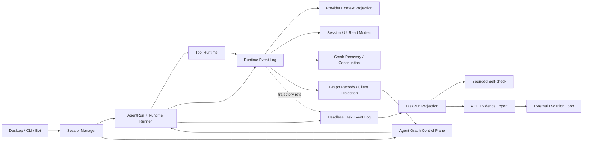

[ENGLISH](./ARCHITECTURE.md)

# Maka Backend Architecture

> 这是 Maka Agent 后端架构的总入口。它不重复每篇专题文章，而是先给出系统主线，再帮助读者按问题快速找到对应章节。当前系列聚焦 Runtime、工具与上下文、Headless 长程任务、Self-check、AHE 自迭代边界、建立在 child Session 之上的 Graph 调度，以及 crash-safe Runtime continuation。

## 一句话架构

Maka 是一个 **log-first、projection-driven** 的 Agent Runtime：运行事实进入 append-only log；Session、模型上下文、TaskRun、Self-check 和演化证据都是这些事实面向不同消费者的投影。

从左向右读：入口把用户意图交给 Runtime；模型和工具执行产生事实；同一组事实随后被投影成模型上下文、交互界面、崩溃恢复判定、Graph 调度输入、长程任务状态和演化证据。Graph 从持久 schedule metadata 协调 child Session，但执行仍回到同一套 Runtime。图中省略了 provider、具体存储实现和 UI 组件，只保留本系列文档共同解释的后端主线。

## 四层心智模型

### 1. 运行事实层

一次 Agent Run 产生模型消息、Tool Call、Tool Result、权限和终止事实。除 hosted permission answer 外，Runtime Event Log 是这些交互语义的 canonical source；hosted permission answer 以 InteractionStore 为 canonical authority，Runtime ledger 只保存 answer identity 与 audit fact。embedded/legacy 路径保留既有的 decision-event 语义。上下文裁剪与 Compaction 可以改变模型下一次看到什么，但不能反向改写已经发生的事实。

对应章节：第一章、第二章、第三章、第八章。

### 2. Agent work 协调层

当相互依赖的 Agent work 需要动态 topology 时，Graph 把 child Session 视为 operator 容器，把 Session-inline AgentRun 视为 activation，把已提交 RuntimeEvent 视为 reference-only record。SQLite 拥有 schedule、topology、admission 与 supervisor wake metadata，Runtime 继续拥有 execution authority。主 Agent 始终在图旁观察、干预和综合，但不阻塞正常 record delivery。

对应章节：第七章。

### 3. 长程任务层

当任务长于一次 Turn 或一个进程时，Headless 通过独立的 Task identity、Task Event Log 和 TaskRun projection 保存跨 Attempt 的进度。Self-check 在这个任务循环内提供一次受限反馈，但不拥有最终事实 authority。

对应章节：第四章、第五章。

### 4. 演化层

AHE 把多次 TaskRun 的结果和 trace 组织成带 target identity 的演化证据。它位于交互 Runtime 外部，通过受限 change surface、可证伪 manifest、candidate evaluation 和 rollback lineage 推进系统改进。

对应章节：第六章。

## 八章索引

| 章节 | 核心问题 | 实现状态 | 阅读 |
|---|---|---|---|
| 1. Log Is the Runtime | Maka 如何保存并回放一次 Agent Run 的状态空间？ | Current | [中文](./docs/architecture/runtime-core-architecture-draft.zh-CN.md) · [English](./docs/architecture/runtime-core-architecture-draft.md) |
| 2. Evidence Before Compression | 巨大的 Tool Result 如何留下 Turn 级证据，又不拖垮当前上下文？ | Current + Target | [中文](./docs/architecture/turn-evidence-tools-active-prune-draft.zh-CN.md) · [English](./docs/architecture/turn-evidence-tools-active-prune-draft.md) |
| 3. Compaction Is a Projection | LLM 如何忘记旧上下文，同时不丢失历史事实？ | Current | [中文](./docs/architecture/llm-compaction-events-log-projection-draft.zh-CN.md) · [English](./docs/architecture/llm-compaction-events-log-projection-draft.md) |
| 4. The Durable Task Loop | 一个任务长于 Turn、Run 和进程时，Maka 如何持续推进？ | Current + Target | [中文](./docs/architecture/durable-task-loop-headless-draft.zh-CN.md) · [English](./docs/architecture/durable-task-loop-headless-draft.md) |
| 5. Self-Check Is Not Self-Trust | Agent 如何检查和修复自己的工作，而不把自述变成 authority？ | Current + Target | [中文](./docs/architecture/self-check-bounded-feedback-loop-draft.zh-CN.md) · [English](./docs/architecture/self-check-bounded-feedback-loop-draft.md) |
| 6. Self-Iteration Happens Outside the Runtime | Maka 如何把运行经验变成可证伪、可回滚的系统改进？ | Current + Target | [中文](./docs/architecture/ahe-self-iteration-boundary-draft.zh-CN.md) · [English](./docs/architecture/ahe-self-iteration-boundary-draft.md) |
| 7. Graph Is a Schedule, Not a Second Runtime | Maka 如何协调动态依赖的 Agent work，同时让主 Agent 始终在 data path 旁监督？ | Current | [中文](./docs/architecture/agent-graph-stream-scheduling-draft.zh-CN.md) · [English](./docs/architecture/agent-graph-stream-scheduling-draft.md) |
| 8. Resume Is Not Retry | Maka 如何恢复 crash facts、避免重复副作用，并建立一个可证明安全的新执行？ | Current + Target | [中文](./docs/architecture/runtime-resume-architecture.zh-CN.md) · [English](./docs/architecture/runtime-resume-architecture.md) |

这里的 **Current + Target** 表示文章同时记录已验证实现与明确标注的目标方向，不表示 Target 部分已经落地。每篇文章 front matter 中的 `implementation_status` 和 `last_verified` 是更细的状态来源。

## 按问题选择阅读路径

### 第一次进入 Runtime

按 `1 → 2 → 3 → 8` 阅读。先理解事实日志，再理解恢复会消费的工具证据和上下文投影，最后进入崩溃修复与安全续跑。

### 修改 Tool、Context 或 Compaction

先读 `1` 建立 canonical fact 边界，再读 `2 → 3`。如果改动涉及 T1/T2、恢复或 continuation，再补 `8`；如果影响长程任务的证据消费，再补 `4`。

### 修改 crash recovery、durable Tool boundary 或 workspace continuity

按 `1 → 8` 阅读。第一章建立 RuntimeEvent 与 AgentRun authority；第八章解释 startup repair、T1/T2、RecoveryResolver、safe-boundary continuation 和 Phase 3–4 workspace 路线。如果涉及 Headless Attempt recovery，再补 `4`；如果恢复会影响 Graph activation 或 supervisor wake，再补 `7`。

### 修改 Headless 或任务恢复

按 `1 → 8 → 4 → 5` 阅读。第八章区分 Runtime continuation、Attempt retry 和 workspace restore；第四章解释 durability，第三章可以补充上下文恢复，第二章可以补充 Tool Result 的证据边界。

### 修改 Self-check 或完成条件

按 `4 → 5` 阅读，再回看 `2` 中“证据不能被上下文裁剪删除”的原则。

### 修改 AHE 或自迭代流程

按 `1 → 4 → 5 → 6` 阅读。第六章依赖前面建立的 Event Log、TaskRun projection 和 authority 边界。

### 修改 Graph、child Session 或 multi-Agent scheduling

按 `1 → 7` 阅读。第一章建立 RuntimeEvent 与 AgentRun authority；第七章解释 Graph 如何把这些事实投影成 record、把 operator 绑定到 child Session、在 SQLite 中 linearize schedule 与 admission，并把控制权交还 root supervisor Agent。如果改动涉及 child output 的读取或 compaction，再补 `2 → 3`。

## 代码边界

| 区域 | 主要职责 |
|---|---|
| `packages/core` | Session、Runtime Event、AgentRun、permission 等纯 contract |
| `packages/storage` | Session、settings、run ledger 与 SQLite metadata control plane 等持久 store |
| `packages/runtime` | SessionManager、AgentRun、模型适配、工具执行、上下文、恢复与 Graph reconciliation |
| `packages/headless` | TaskRun、Autonomous Loop、Self-check、结果导出与 AHE protocol |
| `apps/desktop/src/main` | Electron main-process composition、IPC 与产品入口适配 |

专题文章中的“代码地图”是定位实现的首选入口。更早的设计和演进材料仍保留在：

- [`docs/archive/runtime-kernel.md`](./docs/archive/runtime-kernel.md)
- [`docs/archive/runtime-v2-architecture-evolution.md`](./docs/archive/runtime-v2-architecture-evolution.md)
- [`docs/archive/runtime-v2-implementation-notes.md`](./docs/archive/runtime-v2-implementation-notes.md)

这些文档提供历史设计背景和实现笔记；本页索引的八章是当前后端机制的叙事入口。

## 文档目录约定

`docs/architecture/` 当前保持扁平结构：一项机制对应一个稳定 slug，默认 `.md` 为英文，`.zh-CN.md` 为中文。在专题数量仍可快速浏览时，不增加 `chapters/` 层级，避免链接无谓变深。

维护规则：

- 新专题必须有稳定 `doc_id`、实现状态、验证日期和 owner；
- 中英文 counterpart 必须保持 scope、Current/Target 边界、图表和限制一致；
- 本页只保存一句话问题和入口，机制细节留在专题文章中；
- 新增、重命名或发布专题时，同时更新中英文总索引；
- 文件名中的 `-draft` 与 front matter 的 `document_status` 一致；正式发布时应在同一次变更中移除该后缀并修正所有索引链接。
