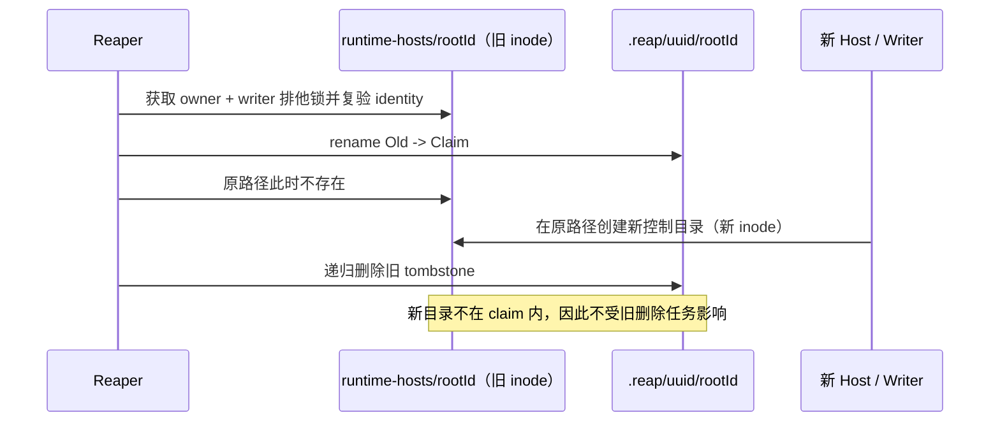
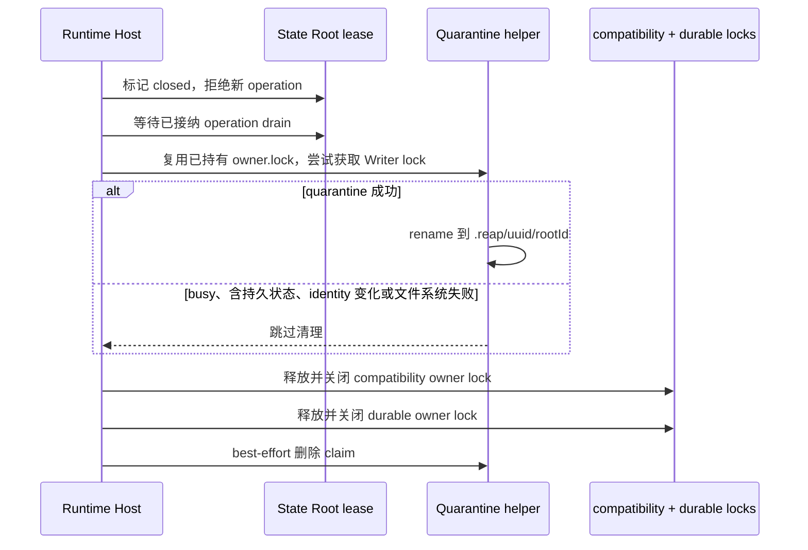

<!--
  Licensed to the Apache Software Foundation (ASF) under one
  or more contributor license agreements.  See the NOTICE file
  distributed with this work for additional information
  regarding copyright ownership.  The ASF licenses this file
  to you under the Apache License, Version 2.0 (the
  "License"); you may not use this file except in compliance
  with the License.  You may obtain a copy of the License at

      http://www.apache.org/licenses/LICENSE-2.0

  Unless required by applicable law or agreed to in writing,
  software distributed under the License is distributed on an
  "AS IS" BASIS, WITHOUT WARRANTIES OR CONDITIONS OF ANY
  KIND, either express or implied.  See the License for the
  specific language governing permissions and limitations
  under the License.
-->

# Runtime Host 控制目录回收

本文回答一个问题：如何回收 `runtime-hosts/<rootId>` 中已经无人使用的控制面目录，同时不误删活跃 Runtime Host、Root Reader 或 Artifact Writer 正在使用的目录，也不让历史目录扫描延迟 Host ready。

本文面向维护 Storage authority、Runtime Host lifecycle 和 Artifact Store 的开发者，描述当前 review 分支已经实现的协议。它不改变 State Root 的持久数据、Host 选主协议或 `state-root-owners` durable lock 的生命周期。

关联问题：[apache/maka#4712](https://github.com/apache/maka/issues/4712)。Runtime Host、State Root 和 Host Epoch 的上层关系见 [Runtime Host 架构](./runtime-host-architecture.zh-CN.md)。

## 1. 结论与主要不变量

`runtime-hosts/<rootId>` 同时保存临时控制文件和持久的访问、插件状态。只有顶层条目全部属于已知临时文件时，write owner 正常关闭或后续 Host 的后台 reaper 才隔离并回收整个目录；存在持久或未知条目时保留目录。

实现必须保持以下不变量：

1. 删除前必须同时证明 `owner.lock` 和 `.maka-artifact-writer.lock` 可被当前清理者独占。
2. 目录或任一锁的文件系统 identity 在验证期间发生变化时，当前清理必须放弃。
3. 原始 `<rootId>` 路径绝不直接递归删除；它只能先被原子 rename 到 `.reap` 下的唯一 claim。
4. rename 后只删除 claim。并发创建的新 `<rootId>` 路径不属于旧 claim，不能被旧清理任务删除。
5. 正常关闭中的控制目录清理是 best effort；清理失败不能阻止 compatibility owner lock 和 durable owner lock 的释放。
6. reaper 不被 Host ready 等待，且单轮使用有界、流式、顺序扫描。
7. `state-root-owners/<rootId>.lock` 不创建、不 rename、不删除，现有 durable 选主模型保持不变。
8. 目录中出现任何非已知临时条目时禁止整目录 quarantine，避免把访问凭据或插件状态当作缓存删除。

## 2. 被回收的对象是什么

State Root 和 Runtime Host 控制目录不是同一个对象：

```text
<state-root>/
  .maka-storage-root.json       # 持久 root identity
  ...                           # Session、Runtime、Artifact 等持久数据

<cache>/maka/runtime-hosts/
  <rootId>/                     # 混合目录，仅全为已知临时条目时回收
    owner.lock                  # Host/Root Reader compatibility lock
    .maka-artifact-writer.lock  # 独立 Artifact Writer lock
    registration.json
    diagnostics...
    runtime-host-access.json    # 持久凭据、授权与撤销状态
    plugin-composition-v2.json  # 持久插件组合
    plugin-packages-v2/         # 持久可信插件包
    plugin-generations-v1/      # 持久插件代际
    plugin-data/                # 持久插件数据
  .reap/
    <claimUuid>/
      .claim.lock              # 清理者之间互斥，rename 前即持有
      <rootId>/                 # rename 后的 tombstone

<durable-data>/Maka/state-root-owners/
  <rootId>.lock                 # 不属于本文的回收范围
```

不同平台上的 `<cache>` 和 `<durable-data>` 由 `resolveRootControlNamespace()` 与 `resolveRootOwnershipNamespace()` 决定。本文不依赖它们的具体绝对路径。

`registration.json`、启动诊断、凭据传递文件、`bundle-imports-v1/` 和两个锁是已知临时条目。当前实现只有在目录完全由这些条目构成时才整目录删除；否则保留整个目录，包括其中的临时文件。这个保守边界保护现存与未来未识别的持久状态，但仍需后续把临时文件迁入独立子目录，才能完整回收混合目录中的残留控制文件。

## 3. 为什么需要两个锁

只检查 `owner.lock` 不足以证明目录空闲。

| 使用者 | `owner.lock` | Artifact Writer lock | 清理结论 |
| --- | --- | --- | --- |
| 活跃 Runtime Host write owner | 排他持有 | 可能空闲 | `owner.lock` 冲突，保留 |
| 活跃 shared Root Reader | 共享持有 | 可能空闲 | reaper 无法排他获取，保留 |
| 独立 Artifact Writer | 可能无人持有 | 排他持有 | Writer lock 冲突，保留 |
| 无活跃使用者 | reaper 可排他获取 | reaper 可排他获取 | 可以进入 identity 复验与 quarantine |

Artifact Writer 可以在没有 Runtime Host write owner 的情况下工作。因此 quarantine 必须依次非阻塞获取两个排他锁，缺少任一证明都不能删除。

正常关闭路径已经持有 write owner 的 `owner.lock`。该路径复用并重新验证已有 handle，只额外获取 Writer lock；它不会再次打开同一个 owner lock 与自己竞争。后台 reaper 没有预持有锁，因此自行获取两个锁。

## 4. Quarantine 协议

### 4.1 算法

所有普通目录回收复用同一套内部协议：

```text
validate <rootId> direct child
  -> capture directory dev/ino
  -> exclusively lock owner.lock without waiting
  -> exclusively lock .maka-artifact-writer.lock without waiting
  -> revalidate directory dev/ino
  -> confirm every top-level entry is disposable
  -> capture directory mtime after the reaper's own lock-file creation
  -> revalidate both lock handle/path identities
  -> mkdir runtime-hosts/.reap/<claimUuid>
  -> exclusively lock claim/.claim.lock
  -> revalidate source directory, both locks and disposable entries again
  -> if directory mtime changed during claim allocation and is inside grace, skip
  -> rename <rootId> to .reap/<claimUuid>/<rootId>
  -> release and close acquired locks
  -> stream deletion of <claimUuid> while holding claim lock
```

具体检查包括：

- 名称必须匹配 64 位小写十六进制 `rootId`；
- 目标必须是 `runtime-hosts` 的直接子目录；
- 目标、`.reap` 和 claim 不得是 symlink；
- 目录在获取锁前后的 `dev/ino` 必须相同；
- 两个锁都必须是 handle 与当前路径指向同一 `dev/ino` 的普通文件；
- 缺失的锁文件允许以私有权限创建，然后立即尝试非阻塞排他锁；
- claim 分配期间若目录 mtime 被其他活动刷新且重新落入 grace，放弃本次 quarantine；基线在 reaper 创建锁文件后采集，避免把自身写入误判成 Host 活动；
- 任何未知顶层文件或目录都使本轮跳过，不会进入 claim 删除；
- claim 使用 UUID v4；`mkdir` 遇到 `EEXIST` 时重新生成，最多尝试 3 次。

### 4.2 rename 后的名字

假设：

```text
rootId = aaaa...aaaa  # 64 hex
claimUuid = 5f732912-3e6d-43e6-a02c-8aad3185e31f
```

rename 前后的路径为：

```text
runtime-hosts/aaaa...aaaa
  -> runtime-hosts/.reap/5f732912-3e6d-43e6-a02c-8aad3185e31f/aaaa...aaaa
```

claim UUID 通过排他 `mkdir` 占位。发生 UUID 碰撞时不会复用已有目录，而是生成新 UUID；连续 3 次碰撞或其他创建错误会放弃本次清理。

### 4.3 为什么不能直接 `rm(<rootId>, recursive)`

目的不是让递归删除更快，而是固定删除对象的 identity 边界。

下图说明 rename 如何隔离旧目录和并发重建的新目录。图中省略 durable owner lock，因为它不参与目录回收。



如果对原路径直接递归删除，安全校验结束到递归遍历之间出现的新目录可能被错误纳入旧清理任务。claim 让删除目标从“一个可被重建的名字”变成“本轮已经取得的唯一 tombstone”。

## 5. 正常关闭路径

Runtime Host Kernel 仍按原顺序关闭 composition、listener、access authority 和 registration，最后才调用 State Root owner 的 `close()`。

write owner 内部顺序为：



清理异常被隔离在 shutdown 的 best-effort 分支内。原有锁关闭错误仍然按照既有行为聚合并报告，不能被目录清理错误掩盖。

Candidate 在取得 owner 后启动失败时，owner 可能先清除只有临时条目的目录。随后启动诊断写入会验证 rootId，并重建私有的诊断父目录，避免因 `ENOENT` 丢失失败原因。

正常关闭的 tombstone 删除同样受 1,024 个工作事件 / 500ms 协作式预算限制。超过预算时释放 claim lock，保留部分 tombstone，后续回收继续处理。成功隔离后原始 `<rootId>` 已经移走。包含持久状态或未知条目、quarantine 失败或 Writer 活跃时，原目录会保留。

shared Root Reader 的 `close()` 只释放 reader lock，不主动回收目录。原因是 reader close 没有必要把正常 shutdown 变成目录所有权转移；空闲目录会由后续 reaper 使用相同双锁协议处理。

## 6. 崩溃遗留 Reaper

`@maka/storage/root-authority` 导出两个入口：`reapStaleRootControlDirectories()` 执行单个有界批次；`reapRootControlDirectoryBatches()` 是保留遍历位置的异步生成器，生产 Host 使用后者完成一轮扫描。单批入口退出时关闭迭代器并释放锁，不保存跨调用游标。

### 6.1 默认策略

| 参数 | 默认值 | 含义 |
| --- | ---: | --- |
| `graceMs` | 24 小时 | 跳过刚创建或刚修改的目录；不能替代锁判活 |
| `maxEntries` | 1,024 | 单批工作事件上限，包括扫描、分类与 tombstone 删除项；不等于必定扫描 1,024 个目录 |
| `maxDurationMs` | 500ms | 单轮协作式时间预算 |

实现使用 `opendir()` 流式、顺序遍历，不构造完整目录数组，也不为每个 entry 创建 Promise。因此目录数量从 1,000 增长到 100,000 时，扫描器自身的内存占用保持常量级。

先处理 `.reap`，再处理普通目录。批次之间保留 `opendir()` 迭代器，不从同一批 busy/非法目录重新开始，避免永久前缀造成饥饿。不保留跨进程游标，进程反复过早退出仍可能延迟后部目录回收。

时间预算使用单调时钟，在工作事件边界检查，批次恢复时重新计时。删除采用流式逐项 `unlink/rmdir`，不调用无界递归 `rm`；目录深度限制为 64，过深目录保留并报告失败。它仍不是对单次文件系统调用的强制中断，慢 I/O 可以使批次超过 500ms。

删除 claim 前验证控制根、`.reap`、claim 的私有目录身份；遍历时复验祖先及当前目录身份。目录内 symlink 只 unlink，不跟随。`.claim.lock` 在 rename 前获取并一直保持到删除结束，防止其他 reaper 删除正在隔离或暂停删除的 claim。中断释放锁，残留 claim 在满足 grace 后可重新接管。

### 6.2 ready 后启动

`startInteractiveRuntimeHostCandidate()` 只有在 `RuntimeHostKernel.start()` 成功返回 ready Host 后才注册 `setImmediate` 回调。调用者先取得 winner Host，reaper 在后续事件循环阶段启动。

模块级 single-flight 保证同一进程最多运行一轮完整 sweep，每批之间通过 `setImmediate` 让出事件循环。多个 Host 同时 ready 时复用当前运行；本进程已无登记 Host 时在批次边界停止。当前轮结束后，未来 Host ready 可以触发新一轮。

因此“不会阻塞 Host ready”的准确含义是：

- 不是把 10 万项清理并行化；
- 是 ready 返回不等待扫描；
- 后台扫描仍是顺序、有限预算的，以控制 I/O 和 Promise 数量。

## 7. 并发行为

| 并发场景 | 结果 |
| --- | --- |
| reaper 与活跃 Host | reaper 无法排他获取 `owner.lock`，目录保留 |
| reaper 与 shared Reader | shared lock 阻止 reaper 的排他 owner lock，目录保留 |
| reaper 与独立 Artifact Writer | Writer lock 冲突，目录保留 |
| 目录含访问凭据、插件数据或未知条目 | 跳过整目录 quarantine，目录及其内容保留 |
| 两个跨进程 reaper 处理同一目录 | 最多一个取得双锁并 rename；另一个得到 contention、identity 变化或 `ENOENT` |
| rename 后新 Host 重建 `<rootId>` | 新 Host 使用新目录；旧 reaper 只删除 claim |
| 启动方已打开旧 `owner.lock` inode | stable-path 校验发现 identity 改变；启动方在仍持有 durable owner lock 时重建目录并重试一次 compatibility lock |
| reaper 在 rename 后、rm 前崩溃 | 原路径可立即重用；旧 claim 在后续轮次超过 grace 后删除 |

Reaper 不通过 PID、heartbeat 或目录 mtime 判断进程是否存活。mtime 只承担 grace period；双锁才是在线使用证明。

## 8. 失败与统计语义

API 返回：

```ts
interface RootControlDirectoryReapSummary {
  scanned: number;
  eligible: number;
  reaped: number;
  busy: number;
  skipped: number;
  failed: number;
  budgetExhausted: boolean;
}
```

| 字段 | 含义 |
| --- | --- |
| `scanned` | 已消费的普通目录 entry 与 claim entry 数量 |
| `eligible` | 已通过年龄与基本形状检查、进入回收判断的对象数量 |
| `reaped` | claim 已成功递归删除的数量，包含本轮新 claim 与旧 tombstone |
| `busy` | 锁冲突，或平台拒绝持锁 rename 的数量 |
| `skipped` | 名称/类型非法、处于 grace、identity 变化、并发消失等安全跳过数量 |
| `failed` | 单项出现未分类 I/O 或删除失败的数量 |
| `budgetExhausted` | entry 或协作式时间预算使本轮提前停止 |

`eligible` 与后续结果字段会重叠，它不是与 `busy/skipped/reaped/failed` 相加后等于 `scanned` 的互斥分区。

单项失败只增加 `failed` 并继续扫描。调用方在一轮结束后最多记录一次失败汇总。控制根本身无法打开或安全验证属于顶层失败，由 Runtime Host 后台调用方记录一次错误。

### 8.1 失败矩阵

| 失败点 | 行为 | 是否影响 Host shutdown |
| --- | --- | --- |
| rootId 非法、目标非目录或 symlink | skip | 否 |
| 目录在 grace period 内 | skip | 否 |
| owner 或 Writer lock busy | 保留源目录 | 否 |
| 锁路径不是 stable regular file | skip，外部目标不修改 | 否 |
| 目录或锁 identity 变化 | skip | 否 |
| claim UUID `EEXIST` | 换 UUID，最多 3 次 | 否 |
| rename `ENOENT` | 视为并发已处理，skip | 否 |
| rename `EBUSY/EPERM` | busy，保留源目录 | 否 |
| rename 后递归删除失败 | 保留 `.reap` tombstone | 否 |
| 正常关闭 quarantine 发生其他异常 | 继续释放现有 owner/durable locks | 否 |

## 9. Windows 平台边界

协议禁止为了提高回收率而执行“先关闭锁，再删除原路径”。这个降级会在锁释放和删除之间打开竞争窗口，使新 Host 或 Writer 创建的目录可能被旧清理任务删除。

当前原生 Windows 文件系统实测在目录内存在已打开锁句柄时拒绝 rename，并返回 `EPERM` 或 `EBUSY`。当前实现会：

1. 释放本轮取得的临时锁；
2. 保留原 `<rootId>` 目录；
3. 把本项计为 `busy`；
4. 不执行 close-then-delete。

因此，当前 review 分支在 WSL/Linux 上满足正常关闭和 crash 目录实际回收；原生 Windows 满足“不误删”的安全不变量，但可能无法回收控制目录。这是显式的平台能力限制，不应描述为跨平台回收成功。

如果未来需要在原生 Windows 提供实际回收，必须先找到同时满足以下条件的文件系统/锁协议：

- rename 时仍持有两个有效排他锁；
- 不释放 durable owner lock 的安全语义；
- 不引入原路径 close-then-delete 窗口；
- 有真实跨进程 Windows 集成测试，而不是只依赖 mock。

## 10. 不采用的方案

| 方案 | 不采用原因 |
| --- | --- |
| 对 `<rootId>` 直接递归删除 | 无法隔离并发重建的同名新目录 |
| 只获取 `owner.lock` | 独立 Artifact Writer 可能没有 Host owner |
| 先关锁再 rename/delete | 打开误删新使用者的竞争窗口 |
| 使用 PID 或 heartbeat 判活 | 复制一套可能陈旧的生命状态，仍不能替代内核锁 |
| 启动时同步扫描所有目录 | 目录规模直接进入 Host ready 延迟 |
| 为所有 entry 并发创建 Promise | 10 万级目录产生无界内存和 I/O 压力 |
| 顺便清理 durable owner lock | 改变现有选主安全模型，超出本问题范围 |
| 引入 SQLite GC ledger | 当前 rename claim 已提供足够的崩溃收敛边界，V1 不需要额外 durable state |

## 11. 代码与测试锚点

实现：

- [`packages/storage/src/root-authority.ts`](../../packages/storage/src/root-authority.ts)：reaper API、双锁 quarantine、正常 write owner close 和 tombstone 清理。
- [`packages/runtime-host/src/server/candidate.ts`](../../packages/runtime-host/src/server/candidate.ts)：Host ready 后调度与进程内 single-flight。
- [`packages/storage/src/artifact-writer-lock.ts`](../../packages/storage/src/artifact-writer-lock.ts)：Artifact Writer 的 stable-path 复验语义。
- [`packages/runtime-host/src/server/host-kernel.ts`](../../packages/runtime-host/src/server/host-kernel.ts)：Runtime Host 资源关闭顺序。

测试：

- [`packages/storage/src/__tests__/root-authority.test.ts`](../../packages/storage/src/__tests__/root-authority.test.ts)：正常关闭、活跃 owner/reader/writer、grace、完整目录删除、symlink/非法锁、预算、tombstone、新路径重建、跨进程 reaper 和 Windows 安全退化。
- [`packages/storage/src/__tests__/fixtures/root-control-reaper.ts`](../../packages/storage/src/__tests__/fixtures/root-control-reaper.ts)：跨进程 reaper fixture。
- [`packages/runtime-host/src/__tests__/host-kernel.test.ts`](../../packages/runtime-host/src/__tests__/host-kernel.test.ts)：Host shutdown 后目录消失，以及 ready 不等待被阻塞的后台 reaper。

截至 2026-09-13 的验证证据：

- Storage 与 Runtime Host TypeScript typecheck 通过；
- 相关文件 Biome check 通过；
- WSL/Linux Storage stress suite：48 passed、2 skipped（Windows 专项和 opt-in 基准）；
- 原生 Windows 定向安全测试：7 passed；
- Runtime Host 正常关闭与 ready 非阻塞定向用例通过。

新增覆盖 `.reap` symlink/junction、claim 内嵌 symlink、busy 前缀遍历进度、大 tombstone 分批与取消恢复、暂停期间 claim 互斥、rename 后真实新 owner 重建以及 claim 创建期间锁 inode 被替换。测试通过独立临时账号控制目录隔离；fork/spawn 子进程继承测试 preload，不扫描真实用户缓存。

真实 100,000 个年轻目录的 WSL opt-in 基准：扫描 100,000 项，196 批，总扫描 17.20s，批次 P95 92.45ms；含目录构造/清理的测试约 49.37s，观测 heap 增长约 23.58MB。这是单次合成测试，不是前后对比，也不是固定 RSS 的证明。内存有界性来自流式扫描与深度上限。ready 非阻塞由独立的阻塞 reaper 测试验证，不能把两项证据描述成“真实 10 万目录端到端 Host 启动基准”。

真实进程在 rename 后被杀死的故障注入已于 2026-09-14 补充，见下文 §11.3。

### 11.1 四项 Host 子进程失败归因（2026-09-13）

结论：原先观察到的三个连接失败和一个 replacement-root 退出失败均可由本环境启动超过测试等待窗口解释，没有发现必须修改回收协议的证据。原始时间限制下的测试仍不能记为通过。

环境：Node v24.20.0、WSL；代码与依赖位于 `/mnt/c` 的 9p 挂载。基线为本地 HEAD `c86da40d76af21600b780def8dbda4aa403f86d0`，不是上游最新提交。对照通过临时 Node load hook 加载 HEAD 的 `root-authority.ts`、`candidate.ts`、`host-kernel.test.ts`，其余依赖和构建产物与当前分支一致；两组均使用相同临时目录隔离。该方法是相关变更的受控回退实验，不是全新 checkout 全量重建。

| 实验 | 结果 |
| --- | --- |
| 当前分支，原等待窗口 | 0/4；三个 `unavailable`，一个进程未退出 |
| HEAD 对照，原等待窗口 | 0/4；相同失败位置和类型 |
| 当前分支，仅诊断性延长启动等待 | 4/4；前三项约 25.3–25.5s，replacement-root 约 3.69s |
| HEAD 对照，仅诊断性延长启动等待 | 首轮 3/4；剩余项已连接，但在杀死 launcher 后的退出等待失败；单独重跑该项通过，约 26.37s |

诊断性调整仅存在于临时加载层：连接重试总窗口从 5s 改为 120s，replacement-root 退出窗口从 2s 改为 120s；断言、生产代码及其他退出等待不变。生产 Candidate 入口单独执行无效参数到报错实测 22.17s，因此即使没有进入 Host ready 和 reaper，也足以超过连接测试窗口。replacement-root 仍通过“不创建 marker、不占用错误 root”等原断言。

已证实的是启动等待预算不足；9p 上模块加载开销是待进一步测量的环境因素，尚未通过迁移到 Linux 原生文件系统的 A/B 实验单独证实。HEAD 对照还暴露一次启动之后的退出时序波动，重跑通过不能证明其稳定性。两组长窗口实验曾同时运行，耗时不应当作为严格性能对比。

建议先在 WSL 原生 Linux 文件系统下以原始窗口复验，再决定是否为集成测试引入合理的环境超时倍率。本次归因不修改正式测试阈值，不把诊断性 120s 当作修复，也不宣称全量回归通过。

### 11.2 WSL ext4 复验（2026-09-14）

将当前代码、构建产物和同一份依赖复制到 `/home/administrator/maka-gc-verification.xifP4Q`，确认位于 `/dev/sdd` 的 ext4 文件系统。Node 仍为 v24.20.0，workspace 依赖链接解析到副本内，不经过 `/mnt/c`。复制后 `rsync -ani` 未报告差异，另对两个修改的生产模块、Host kernel 测试构建文件及 lockfile 做逐字节比较，均一致。没有重装依赖、修改生产代码、改变断言或延长测试超时。

四项原失败用例连续三轮运行，12/12 通过：

| 用例 | 三轮耗时范围 |
| --- | --- |
| launcher-owned detached Host 随 launcher 退出 | 1.16–1.83s |
| authority-supervised Candidate 随 launch owner 退出 | 1.20–1.29s |
| committed Candidate 接纳 ordinary Clients | 0.72–0.77s |
| replacement-root 拒绝且不初始化/占用错误 root | 0.182–0.184s |

随后运行完整 `host-kernel.test.js`：71 passed、0 failed、0 skipped，总计 27.86s；四个目标用例在完整文件中也全部通过。命令为在副本目录执行 `node --test packages/runtime-host/dist/__tests__/host-kernel.test.js`，定向三轮使用原测试名称过滤，无超时覆盖或诊断 preload。

结合上一节的基线复现与延长等待实验，四项原始失败可归因为 Windows 挂载盘环境下的启动超时，不需要为此修改回收协议或放宽测试。该对照未区分 9p、宿主文件系统与安全软件等具体开销来源，也不是整仓库全量回归或原生 Windows 回收验收。建议后续 Linux 测试在 WSL 原生文件系统工作副本运行。副本保留以便复测，磁盘用量约 1.4G，不是新的 Git worktree，后续源码变更需先同步。

### 11.3 真实 SIGKILL 崩溃恢复（2026-09-14）

新增 Storage stress 用例：测试子进程执行真实 quarantine rename 后，在释放双锁与 claim lock 之前通过 IPC 报告目标路径并暂停。父进程在原路径获取新的真实 write owner 并写入新数据，然后对旧 reaper 发送 SIGKILL，确认其确实以该信号退出且 tombstone 尚在。再启动独立 reaper 进程（测试 grace 为 0），验证旧 claim 消失、新 owner 的目录和数据保留、竞争 write owner 仍无法取得所有权。

故障注入仅在测试 fixture 内包装真实 `rename`，不修改生产实现；子进程有超时和强制退出清理。该用例使用隔离控制目录，按 `MAKA_STORAGE_STRESS=1` 启用，原生 Windows 跳过。在 WSL ext4 上定向测试通过；完整 root-authority stress 测试为 49 passed、0 failed、2 skipped（Windows 专项及 opt-in 10 万目录基准），Storage 构建、相关 Biome 检查和 `git diff --check` 通过。

### 11.4 10 万目录与真实 Candidate 启动（2026-09-14）

新增 opt-in Host kernel 用例，以 `MAKA_REAPER_BENCHMARK=1` 启用。在隔离的账号控制目录中预先创建 100,000 个合法、处于 grace 的真实目录，再启动真实 Candidate。通过现有 reaper 测试依赖入口包装真实 `reapRootControlDirectoryBatches()`，使用默认预算并在批次间 `setImmediate`，记录统计；不是模拟扫描，也未修改生产代码。该包装复现生产扫描循环，但不覆盖生产 single-flight/取消逻辑。

断言 ready 返回时后台函数尚未启动、扫描计数为 0；随后完整扫描至少 100,000 项，每批 scanned 不超过 1,024、无失败，并确认 Host 仍 ready。WSL ext4 单次结果：ready 18.10ms，扫描 16,359.77ms，100,001 项（含当前 Host）、196 批；包含构造及清理的测试进程约 29.36s。该数据不是跨机器性能承诺，也不代表 10 万个过期目录全部删除的耗时。

后续完整 Host kernel 文件：71 passed、0 failed、1 skipped（本 opt-in 基准已单独通过）。相关 Artifact Writer/store/composition 四个测试文件：64 passed、1 failed、2 skipped。失败用例为 `public mutation through a retargeted alias stays bound to its verified canonical root`，单独重跑仍失败；错误表现为准备控制目录或打开 Writer lock 时 `ENOENT`。现有流程中 owner 关闭会回收目录，而等待 bootstrap 的 Writer 尚未持有 Writer lock，准备路径与取得锁之间存在需要处理的竞争窗口。此项尚未完成修复和基线对照，不得标记完整回归通过；不能通过削弱原测试断言掩盖。

### 11.5 Writer 准备阶段与回收的竞争修复（2026-09-14）

§11.4 的 Writer 失败已修复：public Writer 在持有 bootstrap lock 后、取得 Writer lock 前，旧 owner 可以合法地关闭并 quarantine 控制目录。双锁保护的是已持锁使用者，不保证尚在准备路径的操作不会遇到目录消失。

`artifact-writer-lock.ts` 为 public Writer 增加最多三次 acquisition 尝试。仅对控制目录准备阶段包装的 `control_io_failed` / `ENOENT`，以及开锁/复验阶段的路径消失或普通锁 inode 变化重建 acquisition 状态。每次重新验证最初捕获的 bootstrap root，并从原 canonical path 准备 authority，不重新跟随调用者的 alias。symlink、非普通文件和其他错误仍拒绝；连续竞争超过上限仍报错。

重试不包容实际 mutation：一旦 operation 被接纳，其任何异常（包括 ENOENT）直接透传，不能重复执行有副作用的写入。lease-bound Writer 不增加重试，仍受原有 lease 与 State Root identity 验证约束。双锁 quarantine 和 durable owner lock 协议不变。

新增确定性测试覆盖：开锁前触发真实 owner.close 并确认目录消失后恢复；已接纳 operation 抛 ENOENT 仅执行一次；持续开锁 ENOENT 最多三次且不执行 operation。WSL ext4 验证：Storage authority stress 52 passed、0 failed、2 skipped；Artifact Writer/store/composition 四文件 65 passed、0 failed、2 skipped，原 alias 竞争用例通过。Storage 构建、相关 Biome 与差异空白检查通过。

## 12. Review 重点与重新评估条件

Review 时建议优先确认：

1. `runtime-hosts/<rootId>` 中是否还有持久或未知条目；当前策略会保留整目录，后续应隔离临时控制文件以继续回收。
2. 原生 Windows“安全但不回收”是否可以接受；如果不可接受，本方案需要新的 Windows 锁/rename primitive，而不是放宽失败策略。
3. 24 小时 grace、1,024 entry 和 500ms 协作式预算是否符合实际控制目录增长速度。
4. 正常关闭最多一个协作式删除批次是否符合退出延迟要求；慢文件系统调用仍可超时。
5. `console.error` 的单轮汇总是否满足可观测性要求；如果需要长期容量治理，应增加结构化指标，而不是逐目录日志。

以下情况应触发设计重新评估：

- 新增不持有 `owner.lock` 或 Writer lock 的控制目录使用者；
- 实际观测到持续超过预算、目录回收速度低于增长速度；
- 临时文件与持久状态完成目录拆分，需要调整当前保守的整目录准入规则；
- 原生 Windows 必须提供与 POSIX 相同的回收保证；
- 单个 tombstone 的递归删除经常显著超过时间预算；
- 需要跨进程退出保持公平扫描游标；目前游标仅在一次后台 sweep 内保留。

在这些条件出现前，V1 不增加配置项、PID 判活、heartbeat、SQLite migration 或 durable lock GC。
