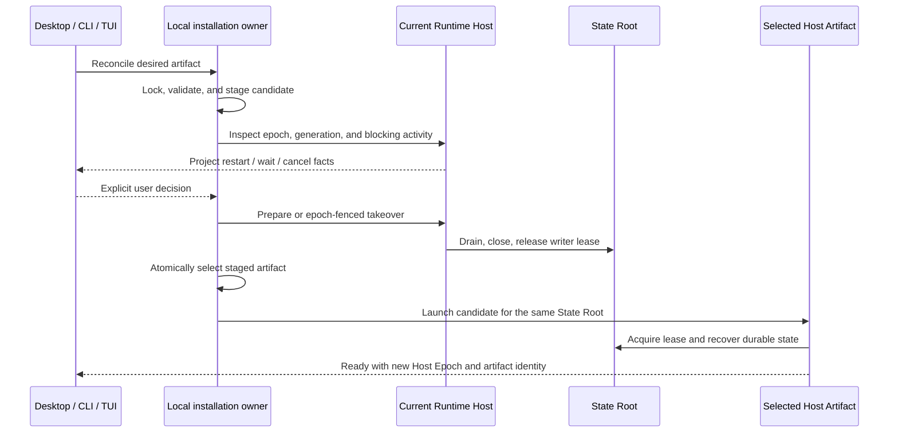

# Runtime Host installation and update lifecycle

> Core question: when Desktop, an installed CLI, or an `npx` invocation changes independently while a local Runtime Host still owns durable work, which component chooses the Host artifact, which component retires the old process, and how does Maka avoid either losing work or leaving the user unable to start?

This draft extends the stable [Runtime Host architecture](./runtime-host-architecture.md). It defines an ownership model for #3231 and its CLI, `npx`, and TUI children. It does not turn a package manager into a Runtime authority, and it does not make a remote service Client-updatable.

## Status language

- **Current** describes behavior implemented in the referenced source on 2026-08-19.
- **Planned** describes the proposed shared contract needed by the tracking issue.
- **Exploratory** identifies a product or compatibility decision that is not settled by this draft.

## The problem in one concrete upgrade

Assume an epoch-24 CLI started a local Host and a durable Scheduled Task keeps that Host resident. The user then installs an epoch-25 CLI and starts it.

The old and new processes answer four different questions:

| Value | Question it answers | It must not mean |
|---|---|---|
| `compatibilityEpoch` | Can this Client and Host safely speak the Domain contract? | Which installed package should own the next Host process |
| Host Epoch | Which process currently holds the State Root writer lease? | Product or package version |
| Host Generation | Which exact local-owner artifact requested this Host process? | General compatibility for every connected Surface |
| Package release | What version did npm or Desktop distribute? | A protocol guarantee or a live-process identity |

If the compatibility epochs differ, the new Client cannot operate the old Host. That is not permission to kill it. The old Host may still own recoverable work or an external effect whose result is unknown. The user must be able to choose among retiring now, waiting, or canceling. After retirement, only one validated artifact may acquire the same State Root lease.

If the compatibility epochs match but generations differ, ordinary compatible Surfaces may still share the Host. A local installation owner may request replacement because the selected Host implementation changed. Product version skew alone is not a rejection rule.

## Current system

### Runtime Host is already the process authority

**Current.** The Host Kernel owns the State Root writer lease, active connections and operations, residencies, drain, close, and recovery. A Surface disconnect releases connection-scoped resources; it does not cancel admitted work. The stable architecture already distinguishes an ephemeral local Host from an operator-owned service Host and defines Host Generation separately from protocol compatibility.

The protocol already carries optional Client `generation` and epoch-fenced takeover intent. The Kernel can report blocking activity and can retire an ephemeral Host through its single drain path. `host.upgrade.prepare` provides a compatible, authenticated pre-update retirement path. A generation mismatch discovered during connection provides the post-update startup path.

### Desktop owns one local update adapter

**Current.** Packaged Desktop uses `app.getVersion()` as its requested Host Generation. Its manager projects restart, wait, and cancel choices for a restartable local conflict. Before Electron installs a downloaded update, Desktop calls `host.upgrade.prepare`, waits for Host exit, and then delegates installation to Electron's updater.

This is a Desktop adapter, not a machine-wide installation authority. It does not coordinate an independently installed CLI or an `npx` artifact.

### CLI startup now has a bounded post-install reconciliation path

**Current.** `runtime-host-installation-context.ts` resolves the running CLI package once and supplies its package root, display version, installation scope, and artifact generation. The resolver distinguishes release and development provenance internally: a released package uses `maka-agent@<version>`, while each development process receives an explicit process-scoped generation. `cli-core.ts` and Runtime Host candidate selection consume the same immutable context.

`connect-or-spawn.ts` now distinguishes two facts:

- `generation` is an exact Host generation required by this connection;
- `candidateGeneration` is used only if this process wins the election and launches a new Host.

An ordinary compatible CLI omits exact `generation`, so same-epoch build skew still connects without replacement. If no Host exists, its candidate publishes the CLI artifact generation. On an incompatible local ephemeral Host, TUI probes with the exact installed generation to obtain authoritative activity, then offers restart, wait, or cancel. Restart uses an exact observed Host Epoch takeover; wait drops the replacement request and re-observes after a bounded delay; cancel leaves the Host unchanged.

This is only the post-install startup slice. `/exit` and `/quit` remain Surface disconnects, and `cli-core.ts` still has no `update` or `upgrade` command.

### Remote setup already stages an exact package

**Current.** `runtime-host-managed-deployment.ts` validates a self-contained release, copies it into a versioned managed directory, atomically renames the staging directory, and retains rollback behavior. Remote setup records exact Node and CLI paths for the service. Direct service installation rejects a CLI inside npm's temporary `_npx` cache.

Remote Clients do not stop or silently upgrade that service. Its operator owns deployment policy.

### Observed released-artifact evidence

**Current, observed on 2026-08-19.** npm still maps `next` to `0.1.0-beta.1`, whose inspected artifact uses compatibility epoch 24. This worktree uses epoch 26.

A real epoch-24 Host was started on an isolated State Root with zero Surface connections and one `scheduled-task` residency. The epoch-26 TUI reported the exact PID, epoch, generation, connection/operation counts, and residency. The three paths were then driven through a real pseudo-terminal:

- **restart** retired only the observed epoch-24 Host and launched one epoch-26 successor with a new Host Epoch and the current CLI artifact generation;
- **cancel** exited the CLI and left the old Host and residency running;
- **wait** re-observed after two seconds and presented the decision again without stopping the Host or launching another writer.

A same-epoch integration probe also confirmed that `candidateGeneration` does not reject a compatible existing Host generation, while a newly elected Host publishes the candidate generation. These probes establish the compatibility/generation and one-writer boundaries. They do not yet prove recovery of a real persisted Scheduled Task, storage downgrade, npm global package switching, or cross-platform replacement.

## Proposed authority model

**Planned.** Add one local installation-management plane outside the Runtime Host Domain. It coordinates artifacts; it does not own Runtime work.

| Owner | Exclusive responsibility | Explicitly does not own |
|---|---|---|
| Package manager | Fetch or install a requested Maka release | Host drain, State Root recovery, or task safety |
| Local installation owner | Validate/stage Host artifacts, select the active local artifact, serialize cutover, and retain the previous artifact | Runtime state, Scheduled Tasks, external-effect settlement, or protocol compatibility |
| Runtime Host Kernel | Decide whether it can drain, stop admission, recover durable work, close, and release the writer lease | npm resolution, release download, or UI prompts |
| Surface adapter | Explain Host facts and collect the user's restart/wait/cancel decision | A second lifecycle state machine or direct process kill |
| Remote operator | Install and replace an explicitly configured service Host | Automatic updates initiated by a remote Surface |

The local installation owner is machine/profile-local Client-side authority. Its minimal selection state belongs under Maka's Client data location, not inside a State Root, because one installation may serve multiple roots and the active Host must not mutate the selector for its own executable. Whether it becomes a class, a service, or a set of deep modules governed by one lock and record remains an implementation detail.

### P1 convergence: one owner flow, not three Surface flows

**Planned.** #3243 requires one installation-owner flow. It constrains artifact resolution, safe staging, and Host reconciliation to four stages inside one authority boundary:

1. **Resolve** one immutable installation context: provenance, artifact identity, validated entrypoint, and display version.
2. **Stage** the artifact through one reusable validate/copy/atomic-publish transaction.
3. **Reconcile** the selected artifact with the observed Host and return a typed connect/restart/wait/cancel/operator-required outcome.
4. **Cut over** only after explicit consent: fence retirement by Host Epoch, atomically select, launch, and verify Ready.

Only reconciliation and cutover make installation decisions. Resolution and staging are internal fact/transaction mechanisms, not additional authorities. Desktop, TUI, and CLI keep presentation adapters; the remote operator path may reuse staging but never the local auto-selection policy. P1 commits to this one owner flow and contract, not to a particular class or resident manager process.

### One artifact identity

**Current foundation.** CLI uses one `artifactGeneration` for candidate launch and explicit takeover. Released packages use their immutable npm name/version identity; development processes add a UUID so separate source processes do not pretend to be one artifact. The installation context retains only the package root, display version, artifact generation, and temporary `_npx` scope needed by current consumers; provenance participates in identity construction only inside the resolver.

**Planned strengthening.** The identity must eventually distinguish a verified runnable payload, not merely a package version. A published npm package can add verified integrity; a bundled Desktop or managed artifact needs an equivalent build identity.

Do not add parallel `releaseId`, `buildId`, `installedVersion`, and generation values that can disagree. Package version remains display and package-manager metadata. The installation record maps the artifact identity to an immutable validated entrypoint.

The exact manifest encoding and integrity source remain **Exploratory**. The contract only requires stable equality, validation before selection, and enough metadata for a useful diagnostic.

## One cutover protocol

The planned local flow is:

Read the diagram from left to right as responsibility, not as a promise that every step is one protocol request. It intentionally omits package download and Domain-specific recovery details. Package download finishes before staging; recovery remains owned by the Host Composition.

The invariants are:

1. Validate and stage before asking the old Host to retire.
2. Fence retirement by the observed Host Epoch; a stale updater cannot retire a replacement.
3. Never run two writer Hosts for one State Root.
4. Do not select an artifact until it is complete and runnable.
5. Keep the previous artifact until the replacement is verified Ready.
6. Do not infer that an interrupted external effect is safe to replay.
7. Serialize local selection changes with one installation lock.

### Pre-update and post-update entry paths

**Mixed.** Both paths converge on the same Host retirement authority:

- **Pre-update:** a compatible running Client stages the candidate, asks `host.upgrade.prepare`, and presents blocking activity before the package switch.
- **Post-update, Current for an incompatible persistent local CLI:** startup first performs ordinary compatibility admission, then requests the installed generation only to assess replacement. A mismatch returns observed Host facts. After explicit consent, an epoch-fenced takeover retires the old ephemeral Host and startup launches the current package candidate.

These are not two update state machines. They are two discovery points around one cutover. Internally, the Kernel's prepare operation and handshake takeover should share retirement eligibility, drain, and outcome classification.

**Current limitation.** Handshake takeover only becomes restartable when the old ephemeral Host has no accepted Client connections. The first delivery must not promise interruption of other connected Surfaces. They must disconnect, or a later protocol must explicitly define how the owner asks those Clients to leave.

## Surface behavior

### Desktop

**Planned.** Keep Electron download/install state in the Desktop updater, but replace `app.getVersion()` as an isolated Host-selection rule with the shared artifact identity and installation record. Desktop remains responsible for native dialogs and restart presentation.

Closing the window, quitting Maka, and installing an update remain different user actions:

- closing a Surface may leave resident Host work running;
- quitting requests graceful Host retirement when policy allows it;
- updating stages the replacement first, retires the old Host, then launches the selected artifact.

### Installed CLI and TUI

**Current first slice.** Local CLI candidate launch carries the resolved artifact generation. An incompatible local ephemeral Host enters the TUI restart/wait/cancel adapter. A compatible Host remains usable even when its generation differs. Remote profiles never accept a local generation or takeover request.

**Planned.** Extend reconciliation to explicit same-epoch owner actions, package switching, and every CLI entry point. This makes correctness independent of whether npm installation happened inside or outside Maka.

Candidate TUI commands are adapters over the same coordinator:

- `/exit`: disconnect only this Surface;
- `/host status`: show Host Epoch, artifact identity, compatibility, and bounded blocking activity;
- `/host stop` or `/host restart`: request a fenced graceful action and present restart/wait/cancel choices;
- `/update`: optionally invoke the package-manager adapter, then run the same reconciliation path.

Command spelling is **Exploratory**. The ownership and `/exit` semantics are the planned contract.

### What `maka update` may do

**Exploratory.** npm should remain the release installation authority. Maka should not maintain a second release registry, semver resolver, or package database. A future `maka update` can be a thin package-manager adapter that:

1. identifies the current installation provenance;
2. asks npm to install an explicit release or dist-tag through a supported command;
3. validates and stages the resulting Host artifact;
4. enters the same cutover protocol.

If reliable self-replacement cannot be supported for a provenance or platform, the command should print the exact external npm command and let the next CLI startup reconcile. Startup reconciliation is required; a self-update command is optional.

### `npx`

**Current guard plus Exploratory ownership decision.** The CLI recognizes package roots under npm's temporary `_npx` cache. Such an invocation may identify the generation used for a new candidate, but it cannot turn Host facts into local replacement authority: TUI offers wait/cancel, never restart.

#3244 must still select one public durability contract:

1. invocation-owned: the Host cannot outlive the `npx` invocation;
2. managed artifact: the invocation copies the exact validated package into Maka-managed storage before starting durable Host work;
3. connect-only: `npx` may connect to an existing managed Host but cannot become its durable owner.

If Scheduled Tasks or Goals are promised to outlive an `npx` Surface, the managed-artifact model is the coherent choice. The current guard prevents `npx` from replacing a persistent Host, but existing candidate launch can still create a Host from the cache; #3244 must remove that remaining ambiguous ownership.

## Remote Host boundary

**Current and retained.** A service Host is operator-owned. A Desktop or TUI connecting over an authenticated remote profile may report incompatibility, but it may not update, stop, or replace the service. #3203 was completed by #3246: the remote connector retains bounded handshake facts, emits the stable `RUNTIME_HOST_REMOTE_INCOMPATIBLE` diagnostic, and directs the operator to use compatible builds and restart the service after updating it. This remote error path remains separate from the local takeover adapter.

Remote setup can reuse the same artifact validation/staging primitive and retirement result vocabulary. It must not share the local auto-selection policy. The operator chooses when to stage, drain, switch the exact service entrypoint, verify readiness, and roll back.

## Failure and recovery contract

| Failure point | Required outcome |
|---|---|
| Download or staging fails | Old selection and running Host remain unchanged |
| Candidate validation fails | Candidate is quarantined or removed; it cannot become selected |
| User cancels retirement | Old Host continues; staged artifact may remain reusable |
| User waits | Client removes exact replacement pressure, re-observes after a bounded delay, and continues automatically when the observed Host exits |
| Observed Host Epoch changes | Reject stale takeover and inspect the replacement again |
| Active connections block takeover | Name the bounded blocker; do not kill the Host |
| Old Host releases the lease but selection fails | Launch the previously selected retained artifact and report degraded recovery |
| New Host fails before Ready | Keep the failed artifact unselected, retry the previous artifact, and preserve the State Root |
| Durable task is recoverable | New Host recovery decides continuation; the installer does not replay it |
| External result is unknown | Preserve result-unknown state; never claim exactly-once execution |
| Concurrent updater starts | One installation lock elects the writer; the loser rereads the selected record |
| State storage cannot be opened by the candidate | Stop before mutation where possible; use #3227 storage preflight and do not claim downgrade safety without evidence |

The installation record is not a universal update journal. It should contain only the selected artifact, retained fallback, artifact metadata, and atomic transition facts needed to recover an interrupted cutover. Runtime and task state stays in the State Root.

## Delivery order

1. **Current P1a:** installation context, candidate generation, incompatible-startup activity assessment, and epoch-fenced TUI restart/wait/cancel for persistent local CLI packages.
2. **Planned P1b:** converge reusable artifact staging, atomic package selection, same-epoch explicit owner actions, replacement verification, and failure recovery into one installation-owner flow.
3. **Planned:** adapt Desktop and explicit TUI commands to the same owner contract without moving Host authority into either Surface.
4. **Exploratory:** add a thin npm update helper where provenance and self-replacement are reliable.
5. **Exploratory:** implement the chosen `npx` ownership contract.
6. **Planned for remote, separately operated:** reuse staging primitives without enabling remote Client auto-update.

## Verification matrix

Tests must use released or packed artifacts, not only two source checkouts that happen to share dependencies.

| Old owner | New Surface | Compatibility | Residency/connections | Expected result |
|---|---|---|---|---|
| installed CLI N | installed CLI N+1 | same epoch | idle | explicit replacement succeeds; durable state recovers |
| installed CLI N | TUI N+1 | same epoch | Scheduled Task residency | restart/wait/cancel; wait does not keep Host alive |
| Desktop N | installed CLI N+1 | same epoch | Desktop still connected | compatible Surface may connect; owner replacement is blocked, not forced |
| CLI epoch N | CLI epoch N+1 | different epoch | idle | explicit fenced handoff, then new Host Ready |
| CLI epoch N | CLI epoch N+1 | different epoch | active external work | no automatic kill; interruption warning preserves result-unknown semantics |
| installed CLI | external `npm install` then startup | either | durable residency | startup reconciliation works without prior `maka update` |
| `npx` | later installed CLI | either | Host outlives invocation | behavior matches the selected #3244 contract |
| remote service N | Desktop N+1 | either | any | no Client-side update; exact operator guidance |
| selected artifact N | failed artifact N+1 | either | old Host retired | retained N restarts without mutating durable state |

Include Windows process replacement, npm global installation, npm cache cleanup, macOS packaged Desktop, Linux local IPC, and remote service fixtures. Record the release version, compatibility epoch, artifact identity, State Root identity, and observed Host Epoch in every failure diagnostic.

## Open decisions

1. Which #3244 ownership model is the product promise for `npx`?
2. Is `maka update` supported on every npm installation provenance, or is external npm plus startup reconciliation the baseline?
3. What verified digest or build identity forms the opaque generation for npm, Desktop bundles, and development builds?
4. May an installation owner ever ask other connected local Surfaces to disconnect, or must replacement always wait for zero connections?
5. What storage compatibility and preflight contract from #3227 is required before selecting a candidate, and is downgrade ever supported?
6. How long must the previous artifact be retained, and what disk-pressure policy may remove it?

## Source anchors

- Stable authority and Host identity: `docs/architecture/runtime-host-architecture.md`
- Remote operator workflow: `docs/runtime-host-remote-access.md`
- CLI candidate selection: `packages/cli/src/runtime-host-cli-context.ts`
- TUI conflict projection: `packages/cli/src/runtime-host-tui-command.ts`
- CLI command registration: `packages/cli/src/cli-core.ts`
- Desktop generation and updater: `apps/desktop/src/main/runtime-host-boot.ts`, `apps/desktop/src/main/runtime-host-desktop-manager.ts`, `apps/desktop/src/main/app-update-service.ts`
- Host retirement authority: `packages/runtime-host/src/server/host-kernel.ts`
- Generation and takeover handshake: `packages/runtime-host/src/client/connection.ts`, `packages/runtime-host/src/client/connect-or-spawn.ts`, `packages/runtime-host/src/protocol/index.ts`
- Existing exact-package staging: `packages/cli/src/runtime-host-managed-deployment.ts`
- Persistent-service and `_npx` guard: `packages/cli/src/runtime-host-service-manager.ts`

## Glossary

| Term | Meaning in this draft |
|---|---|
| Surface | Desktop, TUI, CLI, or another Client presentation |
| Local installation owner | The one Client-side coordinator selecting a durable local Host artifact |
| Artifact identity | Opaque, validated identity used as Host Generation |
| Reconciliation | Comparing selected artifact, observed Host, and compatibility before connecting or replacing |
| Retirement | Host-owned drain and close ending with writer-lease release |
| Cutover | Staging, explicit retirement decision, atomic selection, launch, recovery, and readiness verification |
