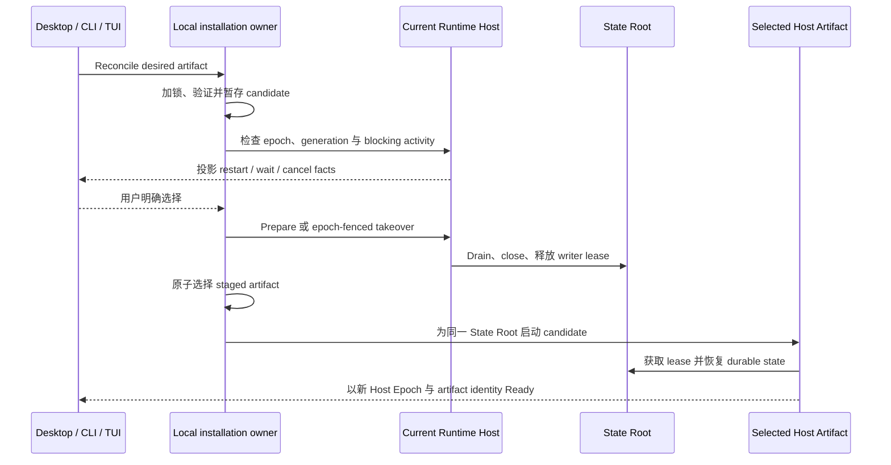

# Runtime Host 安装与更新生命周期

> 核心问题：当 Desktop、已安装的 CLI 或一次 `npx` 调用各自更新，而本地 Runtime Host 仍持有持久工作时，谁选择 Host 产物、谁让旧进程退出，以及 Maka 如何同时避免工作丢失和“升级后无法启动”？

本文是稳定版 [Runtime Host 架构](./runtime-host-architecture.zh-CN.md)的扩展草案，为 #3231 及其 CLI、`npx`、TUI 子 Issue 定义 ownership model。它不会把 package manager 变成 Runtime authority，也不会允许 remote Client 更新 service Host。

## 状态用语

- **Current（当前）**：2026-08-19 时，引用源码已经实现的行为。
- **Planned（计划）**：Tracking Issue 所需的共享 contract 提案。
- **Exploratory（探索）**：本文无法单独确定、仍需产品或兼容性决策的内容。

## 用一次具体升级说明问题

假设 epoch 24 的 CLI 启动了本地 Host，一项持久 Scheduled Task 让 Host 保持 resident。之后用户安装 epoch 25 的 CLI 并启动它。

新旧进程涉及四个不同问题：

| 值 | 它回答什么 | 不能把它理解成什么 |
|---|---|---|
| `compatibilityEpoch` | Client 与 Host 能否安全使用同一套 Domain contract？ | 下一次应该由哪个已安装包拥有 Host 进程 |
| Host Epoch | 当前是哪个进程持有 State Root writer lease？ | 产品版本或 package version |
| Host Generation | 哪一个确切的 local-owner artifact 请求了这个 Host 进程？ | 所有已连接 Surface 的通用兼容规则 |
| Package release | npm 或 Desktop 分发的是哪个版本？ | protocol 保证或存活进程 identity |

如果 compatibility epoch 不同，新 Client 不能操作旧 Host，但这不等于它有权杀掉旧 Host。旧 Host 可能仍拥有可恢复工作，也可能有结果未知的外部 effect。用户必须可以选择立即退出、等待或取消。旧 Host 退出后，只能有一个经过验证的 artifact 获得同一 State Root lease。

如果 compatibility epoch 相同但 generation 不同，普通兼容 Surface 仍可以共用 Host。local installation owner 可以因为所选 Host implementation 已改变而请求 replacement，但不能仅凭 product version 不同就拒绝连接。

## 当前系统

### Runtime Host 已经是进程 authority

**Current。** Host Kernel 拥有 State Root writer lease、active connections 与 operations、residencies、drain、close 和 recovery。Surface disconnect 只释放 connection-scoped resources，不会取消已经 admit 的工作。稳定架构已经区分 ephemeral local Host 与 operator-owned service Host，也已把 Host Generation 和 protocol compatibility 分开。

Protocol 已支持可选的 Client `generation` 与由 Host Epoch fencing 的 takeover intent。Kernel 可以报告 blocking activity，并通过唯一 drain path 退出 ephemeral Host。`host.upgrade.prepare` 是“更新前、仍兼容”的 authenticated retirement path；连接时发现 generation mismatch 则构成“外部已经更新后再启动”的入口。

### Desktop 已拥有一个本地更新 adapter

**Current。** Packaged Desktop 使用 `app.getVersion()` 作为请求的 Host Generation。其 manager 会在 restartable local conflict 时投影 restart、wait、cancel 选项。Electron 安装已下载更新前，Desktop 调用 `host.upgrade.prepare`，等待 Host 退出，再把安装交给 Electron updater。

这只是 Desktop adapter，不是整台机器的 installation authority。它无法协调独立安装的 CLI 或 `npx` artifact。

### CLI startup 已有一条有界的“安装后 reconciliation”路径

**Current。** `runtime-host-installation-context.ts` 只解析一次当前 CLI package，提供 package root、展示版本、installation scope 与 artifact generation。Resolver 在内部区分 release/development provenance：发布 package 使用 `maka-agent@<version>`；每个 development process 使用明确的 process-scoped generation。`cli-core.ts` 与 Runtime Host candidate selection 共用这一个 immutable context。

`connect-or-spawn.ts` 现在区分两个事实：

- `generation`：本次连接要求的精确 Host generation；
- `candidateGeneration`：仅当本进程赢得 election 并新建 Host 时使用。

普通兼容 CLI 不发送精确 `generation`，所以 same-epoch build skew 仍可连接，不会强制 replacement。没有 Host 时，新 candidate 会发布 CLI artifact generation。遇到不兼容的本地 ephemeral Host 时，TUI 再用 installed generation 探测权威 activity，并提供 restart、wait、cancel。Restart 使用观察到的精确 Host Epoch takeover；wait 会撤掉 replacement request，在有界延时后重新观察；cancel 保持 Host 不变。

这只是“外部已经安装新 CLI 后再启动”的切片。`/exit` 与 `/quit` 仍然只断开 Surface，`cli-core.ts` 仍没有 `update` 或 `upgrade` command。

### Remote setup 已经会暂存确切 package

**Current。** `runtime-host-managed-deployment.ts` 会验证 self-contained release，把它复制进带版本的 managed directory，通过 atomic rename 发布 staging directory，并保留 rollback 行为。Remote setup 会为 service 记录确切的 Node 与 CLI path。直接安装 service 时会拒绝 npm 临时 `_npx` cache 中的 CLI。

Remote Client 不会停止或偷偷更新该 service；deployment policy 属于 remote operator。

### 已观察的 released-artifact 证据

**Current，观察日期 2026-08-19。** npm `next` 仍指向 `0.1.0-beta.1`，检查到的该 artifact 使用 compatibility epoch 24；当前 worktree 使用 epoch 26。

在隔离 State Root 上启动真实 epoch-24 Host，保持零个 Surface connection，并持有一个 `scheduled-task` residency。epoch-26 TUI 展示了精确 PID、epoch、generation、connection/operation count 与 residency。随后通过真实 pseudo-terminal 驱动三条路径：

- **restart：** 只让观察到的 epoch-24 Host 退出；epoch-26 successor 使用新的 Host Epoch 与当前 CLI artifact generation 成为唯一 writer；
- **cancel：** CLI 退出，旧 Host 与 residency 保持运行；
- **wait：** 两秒后重新观察并再次显示选择，不停止旧 Host，也不启动第二个 writer。

Same-epoch integration probe 也证明了 `candidateGeneration` 不会拒绝 generation 不同但兼容的 existing Host；新选出的 Host 会发布 candidate generation。这些实验验证了 compatibility/generation 与单 writer 边界，但尚未证明真实持久化 Scheduled Task 的恢复、storage downgrade、npm global package switch 或跨平台 replacement。

## 提议的 authority model

**Planned。** 在 Runtime Host Domain 外增加唯一的 local installation-management plane。它协调 artifact，不拥有 Runtime work。

| Owner | 唯一职责 | 明确不负责 |
|---|---|---|
| Package manager | 获取或安装用户指定的 Maka release | Host drain、State Root recovery、task safety |
| Local installation owner | 验证/暂存 Host artifact、选择 active local artifact、串行化 cutover、保留上一个 artifact | Runtime state、Scheduled Tasks、external-effect settlement、protocol compatibility |
| Runtime Host Kernel | 决定能否 drain，停止 admission，恢复持久工作，close 并释放 writer lease | npm resolution、release download、UI prompt |
| Surface adapter | 解释 Host facts，收集用户的 restart/wait/cancel 决定 | 第二套 lifecycle state machine 或直接 kill process |
| Remote operator | 安装和替换明确配置的 service Host | 由 remote Surface 发起自动更新 |

Local installation owner 是 machine/profile-local 的 Client-side authority，应把最小 selection state 放在 Maka 的 Client data location，而不是 State Root 内：同一 installation 可能服务多个 root，active Host 也不应修改指向自己 executable 的 selector。它最终是一个 class、service 还是一组受同一 lock/record 约束的深模块，仍是 implementation detail。

### P1 收敛：一条 owner flow，而不是三个 Surface flow

**Planned。** #3243 已要求一条 installation-owner flow。它把 artifact resolution、safe staging 和 Host reconciliation 约束为同一个 authority boundary 的四个阶段：

1. **Resolve：** 一次生成 immutable installation context，包括 provenance、artifact identity、validated entrypoint 与 display version。
2. **Stage：** 通过唯一、可复用的 validate/copy/atomic-publish transaction 暂存 artifact。
3. **Reconcile：** 对比 selected artifact 与 observed Host，返回 typed connect/restart/wait/cancel/operator-required outcome。
4. **Cut over：** 只在用户明确同意后执行：用 Host Epoch fence retirement，atomic select、launch，并验证 Ready。

只有 reconciliation 与 cutover 作 installation decision。Resolution 与 staging 只是内部事实/事务机制，不是额外 authority。Desktop、TUI、CLI 保留 presentation adapter；remote operator path 可以复用 staging，但不能复用 local auto-selection policy。P1 承诺的是这一条 owner flow 与 contract，不预先承诺一个特定 class 或常驻 manager process。

### 一个 artifact identity

**Current foundation。** CLI 使用一个 `artifactGeneration` 完成 candidate launch 与明确 takeover。发布 package 使用 immutable npm name/version identity；development process 加 UUID，避免两个 source process 冒充同一 artifact。Installation context 只保留现有消费者需要的 package root、展示版本、artifact generation，以及 package 是否位于临时 `_npx` cache；provenance 只在 resolver 内参与 identity 生成。

**Planned strengthening。** Identity 最终必须区分经过验证的 runnable payload，而不能只依赖 package version。发布 npm package 可以增加 verified integrity；bundled Desktop 与 managed artifact 需要等价 build identity。

不要同时增加可能互相矛盾的 `releaseId`、`buildId`、`installedVersion` 和 generation。Package version 继续作为展示和 package-manager metadata；installation record 把 artifact identity 映射到 immutable、已验证的 entrypoint。

具体 manifest 编码和 integrity 来源仍是 **Exploratory**。Contract 只要求 identity 能稳定比较、选择前完成验证，并包含足够的诊断 metadata。

## 一套 cutover protocol

计划中的本地流程如下：

图中从左到右表示 responsibility，而不是承诺每一步都对应一次 protocol request。图中故意省略 package download 与 Domain-specific recovery：下载必须在 staging 前完成，恢复仍由 Host Composition 拥有。

必须保持以下 invariant：

1. 请求旧 Host 退出前，先验证并暂存新 artifact。
2. 使用观察到的 Host Epoch fence retirement；过期 updater 不能让 replacement 退出。
3. 一个 State Root 永远不能同时运行两个 writer Host。
4. Artifact 未完整、不可运行时，不能把它设为 selected。
5. Replacement 验证 Ready 前保留 previous artifact。
6. 不得推断被中断的 external effect 可以安全 replay。
7. 使用唯一 installation lock 串行化 local selection change。

### 更新前与更新后的两个入口

**Mixed。** 两个入口最终汇入同一个 Host retirement authority：

- **更新前：** 仍兼容的 Client 先 stage candidate，调用 `host.upgrade.prepare`，并在 package switch 前展示 blocking activity。
- **更新后（persistent local CLI 遇到不兼容 Host 时已是 Current）：** startup 先执行普通 compatibility admission，随后只为评估 replacement 请求 installed generation。Mismatch 返回观察到的 Host facts；用户明确同意后，通过 epoch-fenced takeover 让旧 ephemeral Host 退出，再启动当前 package candidate。

这不是两套 update state machine，而是同一次 cutover 前后的两个 discovery point。Kernel 内部的 prepare operation 与 handshake takeover 应共享 retirement eligibility、drain 和 outcome classification。

**当前限制。** Handshake takeover 只有在旧 ephemeral Host 没有 accepted Client connection 时才 restartable。第一期不能承诺强行中断其他已连接 Surface；它们必须先断开，或者由未来 protocol 明确定义 owner 如何请求这些 Client 离开。

## Surface 行为

### Desktop

**Planned。** Electron download/install state 继续属于 Desktop updater，但不再把 `app.getVersion()` 当作孤立的 Host-selection rule，而应使用共享 artifact identity 与 installation record。Desktop 仍负责 native dialog 与 restart presentation。

关闭 window、退出 Maka、安装 update 是三个不同 user action：

- 关闭一个 Surface 可以让有 resident work 的 Host 继续运行；
- 退出 Maka 会在 policy 允许时请求 graceful Host retirement；
- 更新先 stage replacement，再退出旧 Host，最后启动 selected artifact。

### 已安装 CLI 与 TUI

**Current first slice。** Local CLI candidate launch 会携带解析后的 artifact generation。不兼容的本地 ephemeral Host 会进入 TUI restart/wait/cancel adapter。兼容 Host 即使 generation 不同仍可继续使用。Remote profile 永远不接受 local generation 或 takeover request。

**Planned。** 把 reconciliation 扩展到 same-epoch 显式 owner action、package switch 与所有 CLI entry point，使 correctness 不依赖 npm installation 是在 Maka 内还是外部完成。

候选 TUI commands 只是共享 coordinator 的 adapters：

- `/exit`：只断开当前 Surface；
- `/host status`：显示 Host Epoch、artifact identity、compatibility 与有界 blocking activity；
- `/host stop` 或 `/host restart`：请求 fenced graceful action，并展示 restart/wait/cancel；
- `/update`：可选地调用 package-manager adapter，然后进入同一 reconciliation path。

Command 命名仍是 **Exploratory**；ownership 与 `/exit` 语义属于 planned contract。

### `maka update` 可以做什么

**Exploratory。** npm 应继续拥有 release installation authority。Maka 不应维护第二份 release registry、semver resolver 或 package database。未来的 `maka update` 可以只是一个薄 package-manager adapter：

1. 识别当前 installation provenance；
2. 通过受支持的 npm command 安装明确 release 或 dist-tag；
3. 验证并 stage 得到的 Host artifact；
4. 进入同一 cutover protocol。

如果某种 provenance 或 platform 无法可靠 self-replace，该 command 应输出确切的外部 npm command，并让下一次 CLI startup 做 reconciliation。Startup reconciliation 是必需能力；self-update command 是可选能力。

### `npx`

**Current guard + Exploratory ownership decision。** CLI 会识别位于 npm 临时 `_npx` cache 下的 package root。这种 invocation 可以标识新 candidate 使用的 generation，但不能把 Host facts 变成本地 replacement authority：TUI 只提供 wait/cancel，不提供 restart。

#3244 仍必须选择一个公开 durability contract：

1. invocation-owned：Host 不能比这次 `npx` invocation 活得更久；
2. managed artifact：开始 durable Host work 前，把确切、已验证 package 复制到 Maka-managed storage；
3. connect-only：`npx` 只能连接已有 managed Host，不能成为 durable owner。

如果产品承诺 Scheduled Tasks 或 Goals 在 `npx` Surface 退出后继续运行，managed-artifact model 是一致的选择。当前 guard 已阻止 `npx` 替换 persistent Host，但现有 candidate launch 仍可能从 cache 创建 Host；#3244 必须消除这最后一处 ownership 模糊。

## Remote Host 边界

**Current，并继续保持。** Service Host 由 operator 拥有。通过 authenticated remote profile 连接的 Desktop 或 TUI 可以报告 incompatibility，但不能 update、stop 或 replace 该 service。#3203 已由 #3246 完成：remote connector 会保留经过收敛的 handshake facts，输出稳定的 `RUNTIME_HOST_REMOTE_INCOMPATIBLE` 诊断，并引导 operator 使用兼容 build、更新后重启 service。这个 remote error path 与 local takeover adapter 保持分离。

Remote setup 可以复用相同 artifact validation/staging primitive 与 retirement result vocabulary，但不能共享 local auto-selection policy。Operator 自己决定何时 stage、drain、切换确切 service entrypoint、验证 readiness 和 rollback。

## 失败与恢复 contract

| 失败点 | 必须得到的结果 |
|---|---|
| Download 或 staging 失败 | 旧 selection 和运行中的 Host 不变 |
| Candidate validation 失败 | Candidate 被隔离或删除，不能设为 selected |
| 用户取消 retirement | 旧 Host 继续运行；staged artifact 可以保留供复用 |
| 用户选择等待 | Client 撤掉精确 replacement pressure，在有界延时后重新观察，并在观察到的 Host 退出后自动继续 |
| 观察到的 Host Epoch 改变 | 拒绝 stale takeover，重新检查 replacement |
| Active connections 阻止 takeover | 显示有界 blocker，不能 kill Host |
| 旧 Host 已释放 lease，但 selection 失败 | 启动保留的 previous selected artifact，并报告 degraded recovery |
| 新 Host 在 Ready 前失败 | 保持 failed artifact 为 unselected，重试 previous artifact，保留 State Root |
| Durable task 可恢复 | 由新 Host recovery 决定 continuation；installer 不 replay task |
| External result unknown | 保留 result-unknown state；不能声称 exactly-once execution |
| 并发 updater 启动 | 一把 installation lock 选出 writer；失败方重读 selected record |
| Candidate 无法打开 State storage | 尽可能在 mutation 前停止；使用 #3227 storage preflight，没有证据时不能声称支持 downgrade |

Installation record 不是通用 update journal。它只应保存 selected artifact、retained fallback、artifact metadata，以及恢复中断 cutover 所需的原子 transition facts。Runtime 与 task state 仍在 State Root。

## 交付顺序

1. **Current P1a：** installation context、candidate generation、不兼容 startup 的 activity assessment，以及 persistent local CLI 的 epoch-fenced TUI restart/wait/cancel。
2. **Planned P1b：** 把 reusable artifact staging、atomic package selection、same-epoch 显式 owner action、replacement verification 与 failure recovery 收敛到一条 installation-owner flow。
3. **Planned：** 把 Desktop 与显式 TUI command 接到同一个 owner contract，不把 Host authority 移进任一 Surface。
4. **Exploratory：** 在 provenance 与 self-replacement 可靠的平台增加薄 npm update helper。
5. **Exploratory：** 实现选定的 `npx` ownership contract。
6. **Remote 单独运营的 Planned：** 复用 staging primitives，但不允许 remote Client auto-update。

## 验证矩阵

测试必须使用已发布或 `npm pack` 得到的 artifact，不能只用两份恰好共享 dependencies 的 source checkout。

| 旧 owner | 新 Surface | Compatibility | Residency/connections | 预期结果 |
|---|---|---|---|---|
| installed CLI N | installed CLI N+1 | same epoch | idle | 明确 replacement 成功；durable state 恢复 |
| installed CLI N | TUI N+1 | same epoch | Scheduled Task residency | restart/wait/cancel；wait 不让 Host 因 Client 而继续存活 |
| Desktop N | installed CLI N+1 | same epoch | Desktop 仍连接 | 兼容 Surface 可以连接；owner replacement 被阻止而非强制执行 |
| CLI epoch N | CLI epoch N+1 | different epoch | idle | 显式 fenced handoff 后，新 Host Ready |
| CLI epoch N | CLI epoch N+1 | different epoch | active external work | 不自动 kill；interruption warning 保留 result-unknown 语义 |
| installed CLI | 外部 `npm install` 后 startup | 任意 | durable residency | 即使未先运行 `maka update`，startup reconciliation 也能工作 |
| `npx` | 后续 installed CLI | 任意 | Host 超过 invocation 生命周期 | 行为符合选定的 #3244 contract |
| remote service N | Desktop N+1 | 任意 | 任意 | Client 不更新；显示确切 operator guidance |
| selected artifact N | 失败的 artifact N+1 | 任意 | 旧 Host 已退出 | retained N 重启，且不修改 durable state |

覆盖 Windows process replacement、npm global installation、npm cache cleanup、macOS packaged Desktop、Linux local IPC 与 remote service fixtures。每条失败诊断必须记录 release version、compatibility epoch、artifact identity、State Root identity 与观察到的 Host Epoch。

## 尚未决定的问题

1. `npx` 的产品承诺选择 #3244 中哪种 ownership model？
2. 所有 npm installation provenance 都支持 `maka update`，还是把外部 npm 加 startup reconciliation 作为 baseline？
3. npm、Desktop bundle、development build 分别使用什么 verified digest/build identity 构成 opaque generation？
4. Installation owner 是否可以请求其他已连接 local Surface 断开，还是 replacement 必须永远等待 connection 数为零？
5. 选择 candidate 前需要 #3227 提供怎样的 storage compatibility/preflight contract，是否支持 downgrade？
6. Previous artifact 至少保留多久，disk-pressure policy 可以在何时删除它？

## 源码锚点

- 稳定 authority 与 Host identity：`docs/architecture/runtime-host-architecture.zh-CN.md`
- Remote operator workflow：`docs/runtime-host-remote-access.md`
- CLI candidate selection：`packages/cli/src/runtime-host-cli-context.ts`
- TUI conflict projection：`packages/cli/src/runtime-host-tui-command.ts`
- CLI command registration：`packages/cli/src/cli-core.ts`
- Desktop generation 与 updater：`apps/desktop/src/main/runtime-host-boot.ts`、`apps/desktop/src/main/runtime-host-desktop-manager.ts`、`apps/desktop/src/main/app-update-service.ts`
- Host retirement authority：`packages/runtime-host/src/server/host-kernel.ts`
- Generation 与 takeover handshake：`packages/runtime-host/src/client/connection.ts`、`packages/runtime-host/src/client/connect-or-spawn.ts`、`packages/runtime-host/src/protocol/index.ts`
- 已有 exact-package staging：`packages/cli/src/runtime-host-managed-deployment.ts`
- Persistent-service 与 `_npx` guard：`packages/cli/src/runtime-host-service-manager.ts`

## 术语表

| 术语 | 本文含义 |
|---|---|
| Surface | Desktop、TUI、CLI 或其他 Client presentation |
| Local installation owner | 选择 durable local Host artifact 的唯一 Client-side coordinator |
| Artifact identity | 作为 Host Generation 使用的 opaque、validated identity |
| Reconciliation | 连接或替换前，对比 selected artifact、observed Host 与 compatibility |
| Retirement | Host-owned drain 与 close，最终释放 writer lease |
| Cutover | Staging、明确 retirement decision、atomic selection、launch、recovery 与 readiness verification |
