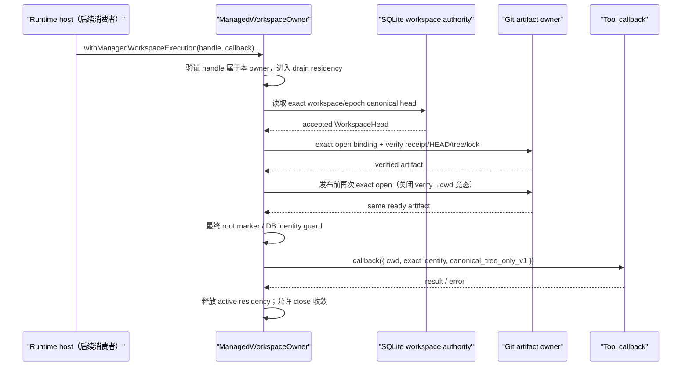

# Managed Workspace Execution Admission v1：M1.1 cwd 发布门

- 状态：实现中
- 更新日期：2026-08-04
- 主要不变量：工具只能由同一个 `ManagedWorkspaceOwner` 消费其亲自签发的进程内 execution handle，并在
  每次执行前重新证明 exact SQLite workspace head 与 exact Git artifact 后，才能在受 drain 管理的 callback
  内短暂取得 managed cwd
- lifecycle / admission owner：`ManagedWorkspaceOwner`
- durable truth：SQLite immutable workspace RuntimeEvents
- artifact evidence：Maka-owned Git binding、baseline receipt、HEAD/tree 与 ownership lock

## 1. 本切片交付什么

M0 已经能创建或 exact-adopt 一个 managed baseline，并把 Git receipt 与 SQLite canonical head 组合接受。
但如果 M0 直接返回 `worktreePath`，调用者可以永久缓存 cwd，绕过 owner close、后续 revalidation 和未来
workspace version 变化。因此 M1.1 把 executable path 改成不可伪造、不可持久化、绑定具体 owner 实例的
execution handle。

```ts
const accepted = await owner.openManagedWorkspaceBaseline(store, identity);

await owner.withManagedWorkspaceExecution(accepted.executionHandle, async (context) => {
  // 只有这个 callback 内可以把 context.cwd 交给受控工具执行层。
});
```

`openManagedWorkspaceBaseline(...)` 不再公开 raw binding、receipt 或 `worktreePath`。handle 的内部证据保存在
未从 package root 导出的模块中，并使用 `WeakMap` 与 owner token 绑定；复制相同字段或使用另一个 owner 的
handle 都不能获得 cwd。

本切片没有接入 Desktop、CLI 或 ToolRuntime。它只建立 host 后续接线必须消费的唯一准入 API，不同时跨越
runtime protocol、host lifecycle 与工具 I/O 三个边界。

## 2. Owner、原子性边界、失败状态与回滚

| 项目 | 决策 |
|---|---|
| execution admission owner | 只有签发 handle 的同一个 `ManagedWorkspaceOwner` 可以消费它 |
| durable authority | handle 不是 durable fact；每次调用都重新读取 SQLite canonical head，并验证 durable Git receipt |
| 原子性边界 | 不虚构 Git 与 SQLite 之外的新事务；在 owner/root lease residency 内完成“读 head → 验 Git → 最终 reopen/revalidate → 发布 cwd callback” |
| 执行期间 | callback 计入 owner active operation；`close()` 等它 drain，新 admission 在 closing 后被拒绝 |
| invalid handle | `managed_workspace_execution_handle_invalid`；不读取或发布 cwd |
| canonical head 漂移/缺失 | fail closed；旧 handle 不能自行选择新 head |
| artifact drift | 不发布 cwd；可证明的外部 drift 按 Git owner 协议 quarantine |
| verification 后竞态 | cwd 发布前再次 exact-open；该窗口出现 drift 时 quarantine，而不是使用旧验证结果 |
| 回滚 | 无新增 schema 或 durable admission row；停止调用 API 即回滚能力，已接受的 baseline history 与 artifact 不变 |

## 3. 每次执行的时序



这不是 filesystem transaction。M1.1 保证的是“未经重新证明的 cwd 永不发布”；M2 才负责 mutating tool
产生 successor candidate 并由 SQLite 接受新 workspace version。

## 4. Provisioning 与实际可用性边界

本切片唯一合法 provisioning 值是 `canonical_tree_only_v1`。它明确表示 cwd 只包含 accepted Git tree：

- 不复制 source checkout 的 ignored/untracked 文件；
- 不复制 `.env`、credential、`node_modules` 或 build cache；
- 不自动运行安装命令；
- 不把 scratch/build output 偷偷写入 canonical baseline；
- 不从 managed profile 静默 fallback 到 attached checkout。

因此 M1.1 可用于验证纯 tracked-tree 读取和后续受控工具接线，但还不宣称一般开发任务已经可用。
ignored dependency、secret 与 scratch overlay 必须作为独立 M1 provisioning 切片，写明数据来源、生命周期、
泄露边界和清理方式后才能接入。

## 5. Crash、并发与外部 drift 矩阵

| 场景 | 必须结果 |
|---|---|
| baseline 已接受，签发 handle 前崩溃 | 重启后从 canonical head 与 receipt 重新签发新 handle |
| execution verification 中崩溃 | 没有 durable “half admission”；旧 handle 随进程消失 |
| verification 后、cwd callback 前 drift | 最终 exact-open 检测并 quarantine；callback 不执行 |
| callback 运行时 owner close | close 等 callback drain；不取消已 admission operation |
| closing 后新 execution 请求 | `managed_workspace_owner_closing` |
| forged / cross-owner handle | `managed_workspace_execution_handle_invalid` |
| 用户直接编辑 Maka-owned worktree | 系统不能物理阻止；下一次 admission 检测 drift 并 fail closed/quarantine |
| 重启后恢复 | 新 root owner、新 managed owner、新 handle；不可恢复旧进程内 capability |

production-shaped 测试使用真实 pinned Git、真实 SQLite、真实子进程和 `SIGKILL`，证明 execution artifact
verification 中断后，重启只能经完整 reopen/revalidate 获得新 cwd authority。

## 6. 平台能力矩阵

| 能力 | Linux | macOS | Windows |
|---|---|---|---|
| owner-bound opaque handle | 支持 | 支持 | 支持 |
| exact SQLite/Git/head/tree revalidation | 支持 | 支持 | 支持 |
| callback drain | 支持 | 支持 | 支持 |
| process crash 后重新准入 | 支持 | 支持 | 支持（进程级；不宣称断电 durability） |
| external drift quarantine | 支持 | 支持 | 有限支持，沿用 Git artifact owner 的 Windows 保证 |
| power-loss durability | 不承诺 | 不承诺 | 不承诺 |

## 7. 后续切片

1. M1.2：runtime-host lifecycle 组合与 managed/attached typed profile；只允许 host 在 callback 内向 worker
   传递 cwd，关闭顺序为 tool operations → managed owner → root owner。
2. M1.3：显式 dependency/secret/scratch provisioning；首版若无法安全提供则保持
   `canonical_tree_only_v1`，不能 silent fallback。
3. M2：mutation candidate capture/accept；T1 前冻结 profile/base version，SQLite 原子接受 tool outcome
   与 successor workspace version。

在 M1.2 出现真实生产消费者前，本切片不默认开启 managed execution，也不改变 attached mode。
