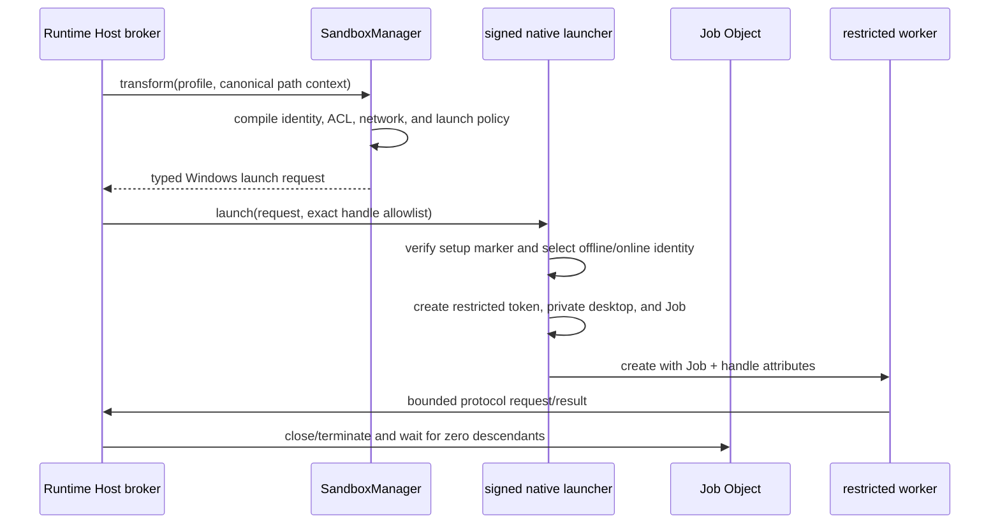

# Windows sandbox backend RFC v1

- Status: proposed security architecture; W0 feasibility gates remain open
- Tracking: Windows Phase 4 in [issue #2142](https://github.com/maka-agent/maka-agent/issues/2142)
- Updated: 2026-08-13
- Owners: `@maka/runtime` sandbox boundary and Runtime Host execution composition
- Chinese version: [windows-sandbox-rfc-v1.zh-CN.md](./windows-sandbox-rfc-v1.zh-CN.md)

## 1. Scope and design status

This RFC defines the threat model, required guarantees, proposed native architecture, alternatives,
delivery slices, and release evidence for a Windows sandbox. It is the complete Phase 4 security
design baseline, but not yet a frozen implementation specification.

Three implementation decisions remain explicit W0 gates:

1. whether the Apache-2.0 Codex Windows sandbox crate can be extracted or adapted without importing
   its product-specific protocol and setup model;
2. the exact schema and crash protocol for sandbox identities, ACL grants, upgrades, and uninstall;
3. whether network denial uses direct WFP filters, verified Windows Firewall rules, or a combination.

W0 must resolve these gates with executable Windows evidence and update this RFC before W1 merges.
Until then, restricted Windows profiles continue to fail closed. This document does not claim that
Windows sandboxing is implemented or supported.

## 2. Research basis

The design was checked against primary sources on 2026-08-13. Repository observations are pinned
to the reviewed commits so later upstream changes cannot silently rewrite this rationale.

This is a representative, not exhaustive, survey. Projects were selected because they either ship
an agent-oriented native Windows sandbox (Codex and Gemini CLI), define a mature Windows process
sandbox (Chromium), or document a widely used agent's Windows isolation boundary (Claude Code and
OpenCode). Projects without a public implementation or an explicit Windows contract are not treated
as evidence. W0 must repeat the comparison if a materially stronger maintained implementation is
identified before the architecture freezes.

| Source | Reviewed evidence | What Maka takes from it | What Maka does not assume |
| --- | --- | --- | --- |
| Microsoft Windows APIs | AppContainer isolation, restricted tokens, process attribute lists, Job Objects, Windows Sandbox, WSL2 | Kernel primitives and their documented boundaries | An API existing is not capability proof |
| OpenAI Codex `902bd9e06b3e` | `windows-sandbox-rs`, setup, ACL state, private desktop, restricted token, Job Object, firewall/WFP, smoke tests | Closest agent-specific reference: dedicated offline/online identities, persistent state reconciliation, explicit handle/job assignment, fail-closed policy checks | Direct source reuse, full contract equivalence, or correctness of unreviewed code |
| Gemini CLI `1ac337739586` | `WindowsSandboxManager.ts`, `GeminiSandbox.cs`, sandbox docs | Environment scrubbing, restricted-token launch, suspended Job assignment, explicit documentation of persistent low-integrity labels | Its network throttle or best-effort ACL behavior is sufficient for Maka |
| Chromium `024a2d21125b` | Windows broker/target design, restricted token, Job, alternate desktop, integrity levels, mitigations, AppContainer support | Layered defense, explicit broker boundary, private desktop, handle allowlist, process mitigations | Browser renderer policy can be copied unchanged to arbitrary developer tools |
| Claude Code public docs and `992381936817` examples | filesystem/network sandbox contract, proxy controls, escalation flow; Windows uses WSL2 | Separate filesystem and network guarantees; never infer native support from a generic sandbox setting | Closed-source implementation details |
| OpenCode `cc4b45612974` | official Windows documentation recommends WSL | WSL is a viable explicit external environment | WSL provides Maka's native Windows backend |

Codex and Gemini were not available as references in the first draft. Their reviewed implementations
change the recommendation: AppContainer is no longer the selected default. The proposed baseline is
a dedicated sandbox identity plus a restricted token, Job Object, private desktop, explicit handles,
ACL reconciliation, and identity-scoped network policy. AppContainer remains a W0 comparison target.

## 3. Decision

Maka should implement a small signed native launcher and setup helper. Runtime Host remains the
broker and launches each restricted command under a dedicated sandbox identity with layered Windows
controls:

- a restricted primary token derived from the selected sandbox identity;
- a Job Object attached atomically at process creation and configured to kill the tree on close;
- an explicit inherited-handle allowlist;
- a private desktop for non-interactive execution;
- identity-scoped filesystem ACLs owned and reconciled by Maka;
- an offline identity with fail-closed outbound network policy for `network.restricted`;
- a separate online identity only when a restricted filesystem profile explicitly enables network;
- a scrubbed, allowlisted environment and exact runtime executable roots.

The first production slice is the managed read-only filesystem worker used by Read, Glob, and Grep.
General Shell, PowerShell, cmd, Write, Edit, and Format execution remains unavailable on restricted
Windows profiles until W2 proves the stronger filesystem, executable-discovery, and process contracts.

Windows Sandbox and WSL2 may later be exposed as explicit external profiles. They are not substitutes
for a native per-command backend. Restricted tokens, low integrity, Job Objects, or AppContainer used
alone are also insufficient to represent the complete `PermissionProfile` contract.

## 4. Existing Maka contract

The platform-neutral authorities remain `PermissionProfile` and the active session
`ExecutionBoundary`. Windows consumes the same normalized command and path context as macOS Seatbelt
and Linux bubblewrap; it must not introduce a second permission language.

- `SandboxManager` selects a backend and transforms a command; it never retries unsandboxed.
- The caller owns canonical cwd, workspace roots, runtime roots, and boundary expansion approval.
- The backend owns profile compilation, enforceability checks, and a typed launch request.
- The process runner owns launch, cancellation, output collection, and lifecycle settlement.
- Runtime Host owns composition and refuses managed I/O when the backend is unavailable.

Windows cannot be represented honestly as an argv wrapper. Token creation, logon identity selection,
handle filtering, private desktop selection, and atomic Job assignment require a typed native launch
request in `SandboxExecRequest`.

## 5. Threat model

The attacker controls command arguments, scripts, child processes, filesystem contents inside
approved roots, and data parsed by sandboxed helpers. Protected assets include:

- files outside approved roots and protected metadata inside writable roots;
- host credentials, environment secrets, registry data, DPAPI material, and user profiles;
- host network access, loopback services, SMB/UNC channels, and inherited sockets;
- processes, windows, handles, devices, and IPC objects outside the sandbox boundary;
- Maka's sandbox setup records, ACL ownership ledger, executable, and broker protocol.

The Windows kernel, signed Maka binaries, Runtime Host, and the parent user session are trusted. The
boundary does not defend against an administrator, kernel compromise, or an already-compromised
same-user process outside Maka. Sandboxed code is treated as malicious after its first instruction.

Paths are hostile. Reparse points, junctions, symlinks, hard links, alternate data streams, device
paths, UNC paths, case aliases, 8.3 names, mount points, and replacement races must not widen access.
Lexical prefix checks are never authorization evidence.

## 6. Required guarantees

### 6.1 Filesystem

- Default deny: no read or write outside roots admitted by the exact profile.
- Read and write grants remain distinct.
- `.git`, `.agents`, and `.codex` deny-write applies at every nested occurrence unless an exact
  platform-neutral grant overrides it.
- Runtime and executable roots are minimal and read-only.
- Per-invocation temporary storage is removed only after the process tree drains.
- NTFS/ReFS are capability-probed; filesystems that cannot enforce the required descriptors fail
  closed. FAT-family volumes are not supported for restricted profiles.
- Maka-owned ACL changes are idempotent, attributed to a stable sandbox principal, recorded in a
  versioned state file, applied new-before-revoke-old, and reconciled at startup.
- Setup, upgrade, uninstall, or a changed profile cannot leave an unknown usable grant. Corrupt or
  missing ownership state fails readiness rather than guessing which ACE is safe to remove.
- Canonical target and lexical alias are both considered when a reparse point exists.

### 6.2 Network

- `network.restricted` cannot create outbound or inbound network channels.
- Denial covers TCP, UDP, DNS, loopback, listeners, SMB/UNC, and inherited sockets.
- Named pipes are denied by default except the exact broker protocol pipe, whose DACL admits only the
  selected sandbox principal and broker.
- If Windows reports that local firewall policy is ineffective, partially applied, or overridden by
  group policy, the offline backend is unavailable.
- Future domain allowlists must use a Maka-owned proxy; they must not compile DNS answers into a
  durable direct-address allowlist.

### 6.3 Process, desktop, handles, and environment

- The child is placed in the Job Object through `PROC_THREAD_ATTRIBUTE_JOB_LIST` at creation time;
  there is no runnable pre-assignment window.
- The Job kills all descendants when its owner closes and does not permit breakaway.
- Only declared stdio/protocol handles are inherited through `PROC_THREAD_ATTRIBUTE_HANDLE_LIST`.
- Non-interactive workers use a private desktop and cannot read the clipboard, broadcast window
  messages, install global hooks, or interact with the user's desktop.
- The token removes privileges and uses restricting SIDs; low integrity is defense in depth, not the
  filesystem policy by itself.
- The child receives an allowlisted environment. Credentials, tokens, proxy variables, shell startup
  hooks, user-specific executable search paths, and loader injection variables are not inherited.
- Elevation, service creation, scheduled tasks, COM activation outside an explicit allowlist, shell
  association launch, debugger attach, and parent-token/process-handle access are denied.
- Supported process mitigations are selected explicitly and compatibility-tested with Node,
  PowerShell, cmd, Git, and packaged Electron resources before W2.

### 6.4 Capability and failure

- Readiness launches a real probe under the production identity, token, Job, desktop, handles,
  filesystem policy, and offline network policy. OS version checks alone are insufficient.
- Launcher signature, version, and digest are verified against packaged metadata.
- Missing setup, identity drift, ACL-state corruption, ineffective network policy, unsupported
  filesystem, helper mismatch, or a failed probe returns a stable typed unavailable reason.
- `auto` and `require` never fall back to host execution for a restricted managed profile.
- Diagnostics expose the backend, setup version, and failure stage without paths, SIDs, credentials,
  environment values, or firewall details.

## 7. Proposed architecture

### 7.1 Setup and durable state

An explicit elevated setup creates versioned sandbox identities, installs the signed launcher,
configures identity-scoped network rules, grants minimum runtime read/execute access, and publishes a
signed/versioned readiness marker only after verification. Setup is idempotent.

Dynamic workspace grants are owned by a stable sandbox SID and a versioned ledger under Maka's
storage root. Reconciliation applies desired grants before revoking stale owned grants. Uninstall
must remove only Maka-owned ACEs, identities, firewall/WFP objects, private resources, and state. It
must not rewrite unrelated ACL entries. Upgrade tests cover both forward migration and rollback from
a failed setup before the new readiness marker is published.

W0 must decide whether separate local user accounts are mandatory or whether a capability-SID design
can provide equivalent logon, filesystem, network, and cleanup guarantees. The Codex design is the
reference baseline; an AppContainer prototype must beat it on both compatibility and state recovery,
not only on network denial.

### 7.2 Broker and protocol

The native launcher is not a general privileged service. It accepts a closed, versioned request from
its parent Runtime Host, validates canonical paths and exact executable identity, and never accepts
arbitrary ACL mutations from the child. The child receives one authenticated protocol channel.
Unknown fields, methods, identities, or profile revisions fail closed.

The first read-only worker may use broker-mediated file opens to minimize workspace ACL grants. If
direct Node filesystem access is required, W1 must use the same ledger and recovery protocol as the
general backend; temporary best-effort ACL edits are prohibited.

## 8. Alternatives and project comparison

| Option | Evidence | Decision |
| --- | --- | --- |
| Dedicated sandbox identities + restricted token + Job + private desktop + ACL ledger + WFP/firewall | Codex demonstrates this agent-oriented shape, including setup and adversarial tests | Proposed baseline; freeze after W0 extraction/compatibility spike |
| AppContainer/LPAC + Job + broker | Microsoft and Chromium show strong default-deny/network properties | W0 comparison target; arbitrary developer-tool compatibility and persistent file grants remain unresolved |
| Current-user restricted token + Job | Useful process hardening | Rejected alone: existing user ACLs remain readable |
| Low integrity ACL + Job | Gemini implements this lightweight path | Rejected for Maka's strong tier: persistent labels, best-effort ACL failures, and network throttling do not meet fail-closed policy |
| Chromium sandbox library | Mature broker/target, hooks, mitigations, AppContainer support | Reference only: large C++ integration and renderer assumptions do not match one-shot arbitrary tools |
| Windows Sandbox | Strong VM boundary | Future external profile: optional feature and coarse per-command lifecycle |
| WSL2 | Used/recommended by Claude Code and OpenCode for Windows workflows | Future external profile; not native Windows semantics |
| Docker/Hyper-V container | Stronger environment boundary when available | Optional external profile, not a universal native prerequisite |

## 9. Delivery plan and gates

### W0: feasibility and frozen implementation spec

- build a minimal signed Rust or C++ launcher with reproducible MSVC CI;
- prototype dedicated identity and AppContainer variants against Node filesystem worker, PowerShell,
  cmd, Git, ConPTY, cancellation, and packaging;
- prove atomic Job assignment, exact handle inheritance, private desktop, and offline network denial;
- define setup/ledger/protocol schemas and upgrade/uninstall recovery;
- decide extraction/adaptation versus a Maka-owned implementation;
- update this RFC with the selected APIs, structs, error taxonomy, and sequence diagrams.

W0 does not enable restricted Windows execution.

### W1: managed read-only filesystem worker

- launch Read/Glob/Grep under the frozen backend;
- provide admitted read roots and no writable workspace roots;
- deny network, protected metadata mutation, ambient handles, and descendant escape;
- compose it into Runtime Host managed execution;
- add real cancellation, parent-death, concurrent-identity, and residual-state tests.

This is the first user-visible milestone. Shell and mutation tools remain fail closed.

### W2: workspace-write and general commands

- enforce write roots and nested protected metadata;
- support exact executable discovery without ambient PATH/startup scripts;
- prove PowerShell, cmd, Git, native executables, ConPTY, and descendants;
- integrate setup, upgrade, rollback, uninstall, and signed packaging;
- preserve path-free run-trace enforcement evidence.

### W3: adversarial review and support declaration

- run the release-blocking matrix on all supported Windows versions/filesystems;
- complete independent security review and resolve every high/critical finding;
- document unsupported environments and recovery;
- only then mark Phase 4 complete or advertise restricted profiles as supported.

## 10. Required release evidence

The Windows sandbox job must execute positive and negative child-process tests for:

- allowed-root read/write and denied outside/read-only/protected-metadata access;
- junction, symlink, mount point, hard link, 8.3 alias, case alias, ADS, UNC, device-path, and
  replacement-race escape;
- TCP/UDP/DNS/loopback/listener/SMB/named-pipe/inherited-socket escape;
- child/grandchild, detached process, breakaway, shell association, COM, scheduled task, and service;
- environment, registry, credential store, DPAPI, parent process/token, clipboard, and user profile;
- normal exit, timeout, cancellation, launcher crash, Runtime Host crash, desktop crash, and reboot;
- concurrent sandboxes with disjoint identities and roots;
- every durable setup, ACL, firewall/WFP, and marker publication failpoint;
- installer/upgrade/uninstall verification of the exact signed launcher and complete state cleanup.

Generated flags and unit tests are necessary but are not security evidence. A passing test must show
that the denied operation fails in a real child and that no process or unknown durable authorization
remains.

## 11. Estimate and completion criteria

For one experienced engineer, after RFC review:

- W0: 1-2 weeks;
- W1: 2-3 weeks;
- W2: 3-5 weeks;
- W3 and remediation: 1-2 weeks.

The realistic Phase 4 range is 7-12 weeks, not including external review scheduling. Two engineers
can overlap native setup/launcher work with Runtime integration and test harnesses, but the security
review and architecture gates remain sequential. The read-only W1 milestone can land in roughly
3-5 weeks if W0 confirms the Codex-shaped approach and packaging toolchain.

Phase 4 is complete only when W0-W3 evidence is release-blocking, setup and uninstall recover cleanly,
restricted profiles never silently degrade, and the security review has no unresolved high or
critical findings.

## 12. Primary references

- [Microsoft AppContainer isolation](https://learn.microsoft.com/windows/win32/secauthz/appcontainer-isolation)
- [Microsoft UpdateProcThreadAttribute](https://learn.microsoft.com/windows/win32/api/processthreadsapi/nf-processthreadsapi-updateprocthreadattribute)
- [Microsoft SetInformationJobObject](https://learn.microsoft.com/windows/win32/api/jobapi2/nf-jobapi2-setinformationjobobject)
- [Microsoft CreateRestrictedToken](https://learn.microsoft.com/windows/win32/api/securitybaseapi/nf-securitybaseapi-createrestrictedtoken)
- [OpenAI Codex Windows sandbox crate](https://github.com/openai/codex/tree/902bd9e06b3ecb32cbf7f8e64cd23b956be3e7fe/codex-rs/windows-sandbox-rs)
- [Gemini CLI Windows sandbox](https://github.com/google-gemini/gemini-cli/tree/1ac3377395868295e128b96726d605a900b5946b/packages/core/src/sandbox/windows)
- [Chromium sandbox design](https://github.com/chromium/chromium/blob/024a2d21125b57ffbb41f6e635294966b0d5eba4/docs/design/sandbox.md)
- [Claude Code sandboxing](https://code.claude.com/docs/en/sandboxing)
- [OpenCode Windows/WSL guidance](https://github.com/anomalyco/opencode/blob/cc4b45612974f735ddec46009ede07729511fba4/packages/web/src/content/docs/windows-wsl.mdx)
