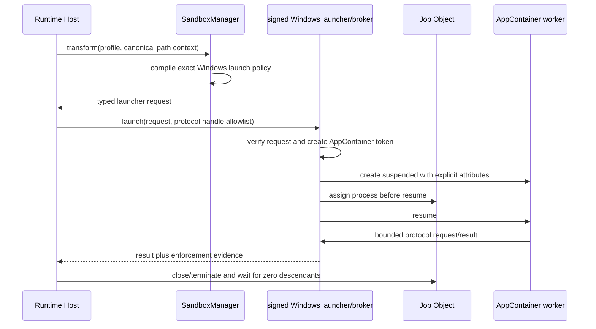

# Windows sandbox backend RFC v1

- Status: proposed for Windows Phase 4 in [issue #2142](https://github.com/maka-agent/maka-agent/issues/2142)
- Updated: 2026-08-13
- Owners: `@maka/runtime` sandbox boundary and Runtime Host execution composition
- Security posture: fail closed until capability probes and adversarial Windows evidence pass

## 1. Decision

Maka should implement its native Windows sandbox as a small, signed launcher/broker that creates
the worker in an AppContainer security context and assigns the complete process tree to a Job
Object before untrusted work begins.

The first production slice is the managed, read-only filesystem worker used by Read, Glob, and
Grep. General Shell, Bash, PowerShell, Write, Edit, and Format execution remains unavailable on
Windows restricted profiles until the same backend can prove the stronger filesystem and process
contracts in section 4.

Windows Sandbox and WSL2 are not the native backend. They may later be exposed as explicit
external execution profiles, but their availability, lifecycle, path semantics, and startup model
do not satisfy the current per-command `SandboxBackend` contract.

Restricted tokens alone are also insufficient. Removing privileges and SIDs does not create the
default-deny filesystem namespace represented by `PermissionProfile`. A Windows backend must not
claim enforcement merely because a child has a restricted token or low integrity level.

## 2. Existing contract

The platform-neutral authority remains `PermissionProfile` and the active session
`ExecutionBoundary`. The Windows implementation must consume the same normalized command and path
context as the macOS Seatbelt and Linux bubblewrap backends. It must not introduce a second policy
language.

The existing runtime split remains:

- `SandboxManager` selects a backend and transforms a command; it never retries unsandboxed.
- the caller owns canonical cwd, workspace roots, runtime roots, and approval of boundary changes;
- the backend owns enforceability checks and creation of a launch request;
- the process runner owns launch, cancellation, output collection, and lifecycle settlement;
- Runtime Host owns composition and refuses managed I/O when the required backend is unavailable.

The Windows backend requires an execution seam beyond an argv wrapper. AppContainer token setup,
inheritable handle restriction, suspended process creation, and Job Object assignment cannot be
represented honestly as `argv` alone. A later implementation PR must extend `SandboxExecRequest`
with a typed launcher request instead of hiding security-sensitive behavior in a shell command.

## 3. Threat model

The protected assets are files outside approved roots, protected metadata inside writable roots,
host credentials and environment secrets, host network access, and processes outside the sandbox
job. The attacker controls command arguments, scripts, child processes, filesystem contents inside
approved roots, and data parsed by sandboxed helpers.

The initial boundary assumes the Windows kernel, the signed Maka launcher/broker, Runtime Host, and
the parent user session are trusted. It does not defend against an administrator, kernel compromise,
or a separate process already running as the same user outside Maka. The sandbox must still prevent
the launched workload from recovering the parent token, inheriting ambient handles, escaping its
Job Object, or using broker requests outside the admitted profile.

The backend must treat path replacement, reparse points, junctions, symlinks, hard links, alternate
data streams, device paths, UNC paths, and case-insensitive aliases as hostile inputs. A lexical path
prefix check is never authorization evidence.

## 4. Required guarantees

### Filesystem

- Default deny: no read or write outside roots admitted by the exact profile.
- Read and write grants stay distinct; an allowed parent must not authorize a replaced descendant.
- `.git`, `.agents`, and `.codex` deny-write policy is enforced at every nested occurrence unless an
  explicit path grant overrides it under the platform-neutral contract.
- Reparse-point traversal, mount points, hard-link aliases, 8.3 names, UNC/device spellings, case
  aliases, and alternate data streams cannot widen access.
- Runtime-readable and executable roots are minimal and read-only.
- Temporary storage is per invocation and removed only after the process tree has drained.
- Any access-control change made to a user file or directory has an owner, journaled rollback, and
  crash recovery. A stale access-control entry is a failed security test, not harmless cleanup.

### Network

- `network.restricted` cannot create outbound or inbound network channels.
- Loopback, named pipes, inherited sockets, SMB/UNC, WinHTTP proxy discovery, and broker IPC are
  explicitly tested; blocking only internet-routable addresses is insufficient.
- The launcher passes only the one protocol channel required by the worker. Unknown broker methods
  and malformed messages fail closed.

### Process and environment

- The child starts suspended, with an explicit handle allowlist, before it is assigned to a Job
  Object configured to terminate the tree when the owner closes.
- Breakaway is disabled. Descendants remain in the same containment and resource policy.
- The child receives a scrubbed environment assembled from an allowlist. Parent credentials,
  tokens, proxy variables, shell startup hooks, and user-specific executable search paths are not
  inherited implicitly.
- The AppContainer receives no capabilities beyond those required by the selected profile.
- Elevation, COM activation, scheduled tasks, services, shell association launch, debugger attach,
  and access to parent process handles are denied or covered by explicit negative evidence.
- Cancellation and parent death converge to zero live descendants before the operation settles.

### Capability and failure

- Capability detection launches a real probe under the same token, Job Object, handle, filesystem,
  and network configuration used in production. OS version checks alone are not capability proof.
- A missing launcher, unsigned or mismatched launcher, unavailable AppContainer API, unsupported
  filesystem, policy compilation error, ACL rollback debt, or failed probe reports a typed
  unavailable result.
- `auto` and `require` never fall back to host execution for a restricted managed profile.
- Diagnostics expose the backend and stable failure stage without publishing paths, SIDs, tokens,
  or environment values.

## 5. Architecture

The launcher/broker is a narrow native component, not a general privileged service. It runs as the
same user, accepts one authenticated parent-owned channel, validates a closed request schema, and
dies with Runtime Host. It must not accept arbitrary executable paths or ACL mutations from an
untrusted child.

For the first read-only worker slice, prefer handle- or broker-mediated reads so arbitrary workspace
ACLs do not become ambient durable authorization for an AppContainer SID. If performance or Node
filesystem APIs force direct path access, the implementation must first deliver a transactional ACL
grant ledger with startup recovery and prove that a crash at every grant/revoke failpoint leaves no
usable stale grant. Direct ACL mutation is not an implementation shortcut.

The general command slice may need a different materialization strategy, such as an owned workspace
projection, because arbitrary developer tools expect ordinary paths. That choice must preserve
Maka's canonical workspace authority and must not silently run against the attached checkout.

## 6. Alternatives

| Option | Strengths | Blocking mismatch | Decision |
| --- | --- | --- | --- |
| AppContainer + Job Object + narrow broker | Native default-deny identity, capability model, process-tree control | Needs native launcher and a safe filesystem grant/materialization design | Selected |
| Restricted token + Job Object | Mature APIs; useful defense in depth | Does not express the required default-deny filesystem namespace by itself | Defense in depth only |
| Windows Sandbox | Strong VM boundary | Optional OS feature, coarse lifecycle, slow per-command startup, no current backend contract fit | Future explicit external profile |
| WSL2 | Reuses Linux bubblewrap model | Optional distribution, VM boundary and Windows path/identity semantics differ | Future explicit external profile |
| ACL allow/deny changes around a normal process | Ordinary Windows paths | Persistent authorization, crash rollback, same-user bypass, alias/reparse complexity | Rejected as standalone backend |
| Low integrity only | Simple launch restriction | Integrity labels are not the Maka filesystem/network policy | Rejected |

## 7. Delivery slices

### W0: contract and probes

- add `windows-appcontainer` to the typed sandbox surface;
- define a typed native launch request and path-free diagnostics;
- add a launcher identity/version check and a production-shaped capability probe;
- retain the current fail-closed result when the native component is absent;
- add unit tests on every platform and probe tests on `windows-latest`.

This slice does not make restricted Windows execution available.

### W1: managed read-only filesystem worker

- launch the one-shot Read/Glob/Grep worker inside AppContainer + Job Object;
- provide only the admitted read roots and protocol channel;
- deny network, writes, protected metadata mutation, ambient handles, and descendant escape;
- compose it into Runtime Host managed execution on Windows;
- add real process, cancellation, parent-death, and residual-process tests.

This is the first user-visible Windows sandbox milestone. Write/Edit/Format/Shell remain fail closed.

### W2: workspace-write and general commands

- select and document the owned projection or transactional grant design;
- support write roots while retaining nested protected-metadata denial;
- support shell/tool executable discovery without inheriting the user's ambient PATH or startup
  scripts;
- prove PowerShell, cmd, native executable, and descendant behavior;
- preserve exact run-trace enforcement evidence.

### W3: adversarial review and support declaration

- run the matrix in section 8 on supported Windows versions and filesystems;
- complete independent security review and resolve all high/critical findings;
- document unsupported environments and recovery procedures;
- only then mark Phase 4 complete or advertise restricted profiles as supported on Windows.

## 8. Required evidence

The release-blocking Windows sandbox job must include positive and negative real-process tests for:

- read allowed root; read outside root denied;
- write allowed root; write read-only/outside/protected metadata denied;
- junction, symlink, mount point, hard link, 8.3 alias, case alias, ADS, UNC, and device-path escape;
- outbound TCP/UDP, DNS, loopback, listener, SMB, named-pipe, and inherited-handle escape;
- child/grandchild, detached process, breakaway flags, shell association, COM, scheduled task, and
  service attempts;
- environment, credential store, parent token/process handle, clipboard, and user-profile access;
- normal exit, timeout, cancellation, launcher crash, Runtime Host crash, and desktop crash;
- concurrent sandboxes with disjoint roots and identities;
- every ACL/materialization publication failpoint, when that mechanism is used;
- installer/upgrade verification of the exact signed native launcher consumed by Runtime Host.

A unit test that only inspects generated flags is necessary but not security evidence. A green smoke
test must demonstrate the denied operation really fails in a child process and that no residual
process or durable authorization remains.

## 9. Rollout and rollback

The backend ships behind capability detection, not a silent feature flag fallback. Unsupported
machines continue to receive the existing typed refusal for restricted profiles. Enabling W1 is
limited to the managed read-only worker; enabling W2 is a separate rollout decision.

Rollback means disabling backend registration and removing the native launcher from packaging. It
must not require repairing user workspaces. If the chosen implementation mutates ACLs or publishes
owned projections, its recovery and removal protocol must be implemented and tested before rollout.

## 10. External references

- [AppContainer isolation](https://learn.microsoft.com/windows/win32/secauthz/appcontainer-isolation)
- [UpdateProcThreadAttribute](https://learn.microsoft.com/windows/win32/api/processthreadsapi/nf-processthreadsapi-updateprocthreadattribute)
- [SetInformationJobObject](https://learn.microsoft.com/windows/win32/api/jobapi2/nf-jobapi2-setinformationjobobject)
- [CreateRestrictedToken](https://learn.microsoft.com/windows/win32/api/securitybaseapi/nf-securitybaseapi-createrestrictedtoken)
- [Windows Sandbox overview](https://learn.microsoft.com/windows/security/application-security/application-isolation/windows-sandbox/windows-sandbox-overview)
- [Compare WSL versions](https://learn.microsoft.com/windows/wsl/compare-versions)
