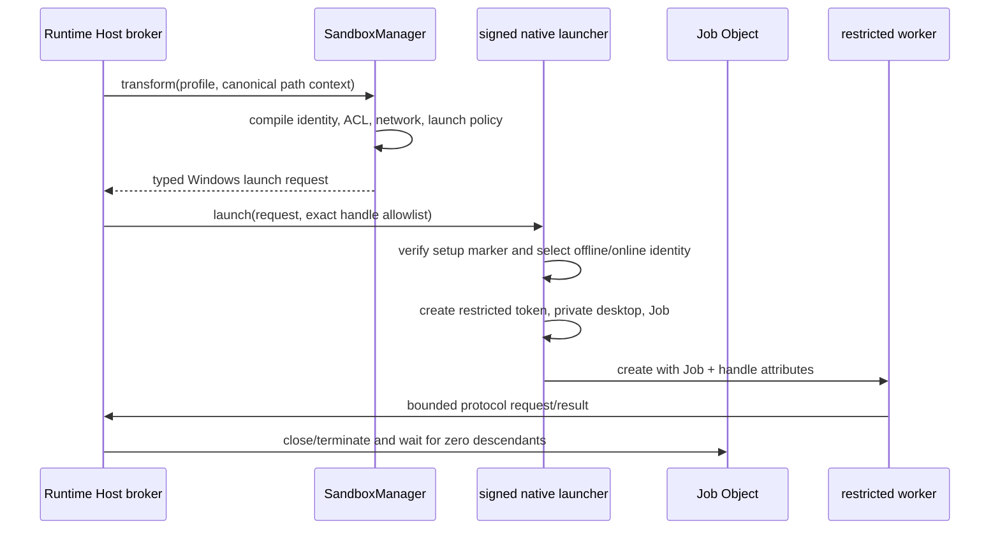

# Windows 沙箱后端 RFC v1

- 状态：拟议安全架构；W0 可行性门仍未关闭
- 跟踪：[Issue #2142](https://github.com/maka-agent/maka-agent/issues/2142) Windows Phase 4
- 更新日期：2026-08-13
- Owner：`@maka/runtime` sandbox boundary 与 Runtime Host execution composition
- 英文版：[windows-sandbox-rfc-v1.md](./windows-sandbox-rfc-v1.md)

## 1. 范围与设计状态

本文定义 Windows 沙箱的威胁模型、强制保证、拟议原生架构、替代方案、交付切片与发布证据。它是
Phase 4 完整的安全设计基线，但还不是已经冻结的实现规格。

以下三项实现决策仍是显式 W0 gate：

1. 能否抽取或适配 Apache-2.0 的 Codex Windows sandbox crate，而不引入其产品专用协议和 setup 模型；
2. sandbox identity、ACL grant、升级和卸载的精确 schema 与 crash protocol；
3. 网络拒绝最终采用直接 WFP filter、已验证的 Windows Firewall rule，还是二者组合。

W0 必须用真实 Windows 可执行证据关闭这些 gate，并在 W1 合并前更新本文。在此之前，Windows restricted
profile 继续 fail closed。本文不宣称 Windows 沙箱已经实现或受支持。

## 2. 调研依据

本设计在 2026-08-13 对照了一手资料。仓库证据固定到已审查 commit，避免上游后续变化悄悄改写论据。

这是代表性调研，不是声称穷尽所有项目。选择标准是：已经交付面向 Agent 的原生 Windows 沙箱（Codex、
Gemini CLI）、拥有成熟 Windows 进程沙箱（Chromium），或明确公开主流 Agent 的 Windows 隔离边界
（Claude Code、OpenCode）。没有公开实现或明确 Windows 合同的项目不作为实现证据。架构冻结前如果出现
实质更强且持续维护的实现，W0 必须重新对比。

| 来源 | 审查证据 | Maka 借鉴内容 | Maka 不做的假设 |
| --- | --- | --- | --- |
| Microsoft Windows API | AppContainer、restricted token、process attribute、Job Object、Windows Sandbox、WSL2 | 内核机制及官方边界 | API 存在不等于能力可用 |
| OpenAI Codex `902bd9e06b3e` | `windows-sandbox-rs`、setup、ACL state、private desktop、restricted token、Job、firewall/WFP、smoke test | 最接近 Agent 场景的参考：offline/online identity、持久状态 reconcile、显式 handle/job、fail-closed policy check | 可以直接复用源码、合同完全等价或未审代码必然正确 |
| Gemini CLI `1ac337739586` | `WindowsSandboxManager.ts`、`GeminiSandbox.cs`、sandbox 文档 | 环境清理、restricted-token launch、suspended Job assignment、明确披露 low-integrity label 持久化 | 其网络 throttle 或 best-effort ACL 足以满足 Maka |
| Chromium `024a2d21125b` | Windows broker/target、restricted token、Job、alternate desktop、integrity、mitigation、AppContainer | 分层防御、broker 边界、private desktop、handle allowlist、process mitigation | renderer policy 可原样复制给任意开发工具 |
| Claude Code 官方文档与 `992381936817` 示例 | filesystem/network 双边界、proxy、升级请求；Windows 使用 WSL2 | 文件与网络分别证明，不能从通用配置推导原生支持 | 闭源实现细节 |
| OpenCode `cc4b45612974` | 官方 Windows 文档推荐 WSL | WSL 可作为显式外部环境 | WSL 就是 Maka 原生 Windows backend |

初稿没有纳入 Codex 和 Gemini 的当前实现。审查后推荐发生变化：不再默认选择 AppContainer，而以专用
sandbox identity + restricted token + Job Object + private desktop + 显式 handle + ACL reconcile +
identity-scoped network policy 为拟议基线；AppContainer 保留为 W0 对比候选。

## 3. 决策

Maka 应实现一个小型签名 native launcher 与 setup helper。Runtime Host 继续作为 broker，每个 restricted
command 在专用 sandbox identity 下启动，并叠加：

- 从 sandbox identity 派生的 restricted primary token；
- 在创建时原子附加、owner close 时终止整棵进程树的 Job Object；
- 显式继承 handle allowlist；
- 非交互执行使用 private desktop；
- 由 Maka 持有并 reconcile 的 identity-scoped filesystem ACL；
- `network.restricted` 使用具备 fail-closed 出站策略的 offline identity；
- filesystem restricted 但 network enabled 时才使用独立 online identity；
- allowlist 环境和精确 runtime executable roots。

首个生产切片只支持 managed Read/Glob/Grep 只读 filesystem worker。通用 Shell、PowerShell、cmd、Write、
Edit、Format 必须等到 W2 证明更强的文件、可执行文件发现和进程合同后才能启用。

Windows Sandbox 与 WSL2 后续可以成为显式 external profile，但不能替代 native per-command backend。
restricted token、low integrity、Job Object 或 AppContainer 单独使用，也不能表达完整 `PermissionProfile`。

## 4. Maka 现有合同

平台无关 authority 仍是 `PermissionProfile` 和 active session `ExecutionBoundary`。Windows 消费与 macOS
Seatbelt、Linux bubblewrap 相同的规范化 command/path context，不引入第二套权限语言。

- `SandboxManager` 负责选择 backend 与变换 command，绝不 unsandboxed retry；
- caller 负责 canonical cwd、workspace/runtime roots 与 boundary expansion approval；
- backend 负责 profile compilation、enforceability check 和 typed launch request；
- process runner 负责 launch、cancel、output 与 lifecycle settlement；
- Runtime Host 负责 composition，backend 不可用时拒绝 managed I/O。

Windows 不能被诚实地表达为 argv wrapper。token、logon identity、handle filter、private desktop 和原子 Job
assignment 需要在 `SandboxExecRequest` 中新增 typed native launch request。

## 5. 威胁模型

攻击者控制 command arguments、脚本、子进程、允许 root 内的文件内容，以及 sandbox helper 解析的数据。
受保护资产包括：

- 允许 root 外文件与 writable root 内 protected metadata；
- host credential、环境秘密、registry、DPAPI material 和用户 profile；
- host network、loopback service、SMB/UNC 与继承 socket；
- sandbox 外进程、窗口、handle、device 与 IPC object；
- Maka sandbox setup record、ACL ownership ledger、可执行文件与 broker protocol。

Windows kernel、签名 Maka binary、Runtime Host 和父 user session 被信任。边界不抵御管理员、内核失陷或
Maka 外已失陷的同用户进程。sandboxed code 从第一条指令开始按恶意代码处理。

路径一律按敌对输入处理：reparse point、junction、symlink、hard link、ADS、device path、UNC、大小写别名、
8.3 name、mount point 与 replacement race 都不能扩大权限。字符串前缀绝不是授权证据。

## 6. 必须保证

### 6.1 文件系统

- 默认拒绝：不得读写 exact profile 未允许的 root；
- read/write grant 保持分离；
- `.git`、`.agents`、`.codex` deny-write 覆盖所有嵌套位置，除非平台无关合同有 exact override；
- runtime/executable root 最小化且只读；
- 每次调用的 temp 只有在进程树 drain 后才能移除；
- 对 NTFS/ReFS 做 capability probe；不能兑现 descriptor 合同的文件系统 fail closed，FAT 不支持 restricted；
- Maka-owned ACL 必须幂等、归属于稳定 SID、写入版本化 state file，先 apply 新集合再 revoke 旧集合，并在
  startup reconcile；
- setup、升级、卸载、profile 变化不得留下未知可用 grant；ownership state 损坏或缺失时 readiness fail，
  禁止猜测 ACE；
- 路径存在 reparse point 时同时考虑 lexical alias 与 canonical target。

### 6.2 网络

- `network.restricted` 不能创建 inbound/outbound channel；
- 覆盖 TCP、UDP、DNS、loopback、listener、SMB/UNC 与 inherited socket；
- named pipe 默认拒绝，只有 exact broker protocol pipe 可用，DACL 仅允许选定 sandbox principal 与 broker；
- Windows 报告 local firewall policy 无效、部分生效或被 group policy 覆盖时，offline backend 不可用；
- 未来 domain allowlist 必须走 Maka-owned proxy，不把 DNS 结果编译成持久 direct-address allowlist。

### 6.3 进程、desktop、handle 与环境

- child 通过 `PROC_THREAD_ATTRIBUTE_JOB_LIST` 在创建时进入 Job，不存在可运行的 pre-assignment window；
- Job owner close 时杀死所有 descendant，禁止 breakaway；
- 仅通过 `PROC_THREAD_ATTRIBUTE_HANDLE_LIST` 继承声明的 stdio/protocol handle；
- 非交互 worker 使用 private desktop，不能读 clipboard、广播 window message、装 global hook 或操作用户桌面；
- token 移除 privilege 并使用 restricting SID；low integrity 只是 defense in depth，不是文件策略；
- child 只接收 allowlist 环境，不隐式继承 credential、token、proxy、shell startup hook、用户 PATH 或 loader
  injection variable；
- 禁止 elevation、service、scheduled task、非 allowlist COM、shell association、debugger、父 token/handle；
- W2 前逐项选择并兼容性验证 process mitigation，覆盖 Node、PowerShell、cmd、Git 与 packaged Electron resource。

### 6.4 能力与失败

- readiness 必须在生产 identity/token/Job/desktop/handle/filesystem/offline network 下启动真实 probe；
- launcher signature/version/digest 必须与 package metadata 一致；
- setup 缺失、identity drift、ACL state 损坏、网络策略无效、文件系统不支持、helper 不匹配、probe 失败都返回
  stable typed unavailable reason；
- restricted managed profile 在 `auto`/`require` 下绝不 fallback host execution；
- diagnostics 只暴露 backend、setup version 与 failure stage，不暴露 path、SID、credential、env 或 firewall detail。

## 7. 拟议架构

### 7.1 Setup 与持久状态

显式 elevated setup 创建版本化 sandbox identity、安装签名 launcher、配置 identity-scoped network rule、授予
最小 runtime read/execute 权限，并在验证后发布 signed/versioned readiness marker。setup 必须幂等。

动态 workspace grant 归属于稳定 sandbox SID 和 Maka storage root 下的版本化 ledger。reconcile 先 apply desired
grant，再 revoke stale owned grant。卸载只删除 Maka-owned ACE、identity、firewall/WFP object、private resource
与 state，不改无关 ACL。升级测试覆盖 forward migration，以及新 readiness marker 发布前 setup 失败的 rollback。

W0 必须决定是否必须使用独立 local user，或 capability-SID 方案能否提供等价 logon/filesystem/network/cleanup
保证。Codex 是参考基线；AppContainer prototype 必须在兼容性和状态恢复上同时更优，而不只是网络默认拒绝。

### 7.2 Broker 与协议

native launcher 不是通用 privileged service。它只接受父 Runtime Host 的 closed/versioned request，验证 canonical
path 与 exact executable identity，绝不接受 child 发起的任意 ACL mutation。child 只得到一个 authenticated
protocol channel。未知 field/method/identity/profile revision 一律 fail closed。

首个只读 worker 可以采用 broker-mediated file open 以减少 workspace ACL grant。如果 direct Node filesystem
不可避免，W1 必须使用与通用 backend 相同的 ledger/recovery，禁止临时 best-effort ACL。

## 8. 替代方案与项目对比

| 方案 | 证据 | 决策 |
| --- | --- | --- |
| 专用 identity + restricted token + Job + private desktop + ACL ledger + WFP/firewall | Codex 已展示 Agent 场景的 setup 与对抗测试形态 | 拟议基线；W0 完成抽取/兼容性 spike 后冻结 |
| AppContainer/LPAC + Job + broker | Microsoft/Chromium 证明其 default-deny/network 能力 | W0 对比候选；任意开发工具兼容性与持久文件 grant 未解决 |
| 当前用户 restricted token + Job | 有效进程加固 | 单独使用拒绝：当前用户既有 ACL 仍可读 |
| Low integrity ACL + Job | Gemini 实现了轻量路径 | 不用于 Maka strong tier：持久 label、best-effort ACL、network throttle 不满足 fail closed |
| Chromium sandbox library | 成熟 broker/target、hook、mitigation、AppContainer | 仅参考：大型 C++ 集成和 renderer 假设不适合 one-shot 任意工具 |
| Windows Sandbox | 强 VM 边界 | 未来 external profile；可选组件且 per-command 生命周期粗重 |
| WSL2 | Claude Code/OpenCode 用于 Windows workflow | 未来 external profile，不是 native Windows 语义 |
| Docker/Hyper-V container | 环境具备时边界更强 | 可选 external profile，不作为通用 native 前置条件 |

## 9. 交付计划与 Gate

### W0：可行性与冻结实现规格

- 建立可复现 MSVC CI 的最小签名 Rust/C++ launcher；
- 用 dedicated identity 与 AppContainer 两个 prototype 验证 Node worker、PowerShell、cmd、Git、ConPTY、cancel、
  packaging；
- 证明原子 Job assignment、exact handle inheritance、private desktop 与 offline network denial；
- 定义 setup/ledger/protocol schema 与 upgrade/uninstall recovery；
- 决定抽取/适配还是 Maka 自有实现；
- 用选定 API、struct、error taxonomy 和时序图更新本文。

W0 不启用 Windows restricted execution。

### W1：managed 只读 filesystem worker

- 在冻结 backend 下启动 Read/Glob/Grep；
- 仅提供允许 read root，不提供 writable workspace root；
- 拒绝网络、protected metadata mutation、ambient handle 与 descendant escape；
- 接入 Runtime Host managed execution；
- 增加真实 cancel、parent-death、并发 identity 与残留状态测试。

这是第一个用户可见里程碑；Shell 和 mutation tool 继续 fail closed。

### W2：workspace-write 与通用命令

- 强制 write root 与嵌套 protected metadata；
- 不依赖 ambient PATH/startup script 做 exact executable discovery；
- 证明 PowerShell、cmd、Git、native exe、ConPTY 与 descendant；
- 集成 setup、upgrade、rollback、uninstall 与 signed packaging；
- 保留 path-free run-trace enforcement evidence。

### W3：对抗审查与支持声明

- 在所有支持的 Windows/filesystem 上运行 release-blocking matrix；
- 完成独立安全审查并修复全部 high/critical；
- 文档化不支持环境与恢复方法；
- 只有此后才勾选 Phase 4 或宣称 Windows restricted profile 受支持。

## 10. 必需发布证据

Windows sandbox job 必须运行真实 child-process 正反测试：

- allowed root read/write，以及 outside/read-only/protected metadata deny；
- junction、symlink、mount、hard link、8.3、case alias、ADS、UNC、device path、replacement race；
- TCP/UDP/DNS/loopback/listener/SMB/named pipe/inherited socket；
- child/grandchild、detached、breakaway、shell association、COM、scheduled task、service；
- env、registry、credential store、DPAPI、parent process/token、clipboard、user profile；
- normal exit、timeout、cancel、launcher crash、Runtime Host crash、desktop crash、reboot；
- disjoint identity/root 的并发 sandbox；
- 每个持久 setup、ACL、firewall/WFP、marker publication failpoint；
- installer/upgrade/uninstall 对 exact signed launcher 与完整状态清理的验证。

只检查生成 flag 的 unit test 不是安全证据。绿色测试必须证明真实 child 的禁止操作失败，且没有残留进程或未知
durable authorization。

## 11. 工期与完成标准

单名有经验工程师在 RFC review 后的估算：

- W0：1-2 周；
- W1：2-3 周；
- W2：3-5 周；
- W3 与整改：1-2 周。

Phase 4 的现实区间是 7-12 周，不含外部审查排期。两名工程师可并行 native setup/launcher 与 Runtime/test
harness，但安全审查和架构 gate 仍是串行。若 W0 证明 Codex 形态和打包链可行，只读 W1 约 3-5 周可交付。

只有 W0-W3 证据成为 release-blocking、setup/uninstall 能干净恢复、restricted profile 永不 silent degrade、
安全审查没有未解决 high/critical 时，Phase 4 才完成。

## 12. 一手参考

- [Microsoft AppContainer isolation](https://learn.microsoft.com/windows/win32/secauthz/appcontainer-isolation)
- [Microsoft UpdateProcThreadAttribute](https://learn.microsoft.com/windows/win32/api/processthreadsapi/nf-processthreadsapi-updateprocthreadattribute)
- [Microsoft SetInformationJobObject](https://learn.microsoft.com/windows/win32/api/jobapi2/nf-jobapi2-setinformationjobobject)
- [Microsoft CreateRestrictedToken](https://learn.microsoft.com/windows/win32/api/securitybaseapi/nf-securitybaseapi-createrestrictedtoken)
- [OpenAI Codex Windows sandbox crate](https://github.com/openai/codex/tree/902bd9e06b3ecb32cbf7f8e64cd23b956be3e7fe/codex-rs/windows-sandbox-rs)
- [Gemini CLI Windows sandbox](https://github.com/google-gemini/gemini-cli/tree/1ac3377395868295e128b96726d605a900b5946b/packages/core/src/sandbox/windows)
- [Chromium sandbox design](https://github.com/chromium/chromium/blob/024a2d21125b57ffbb41f6e635294966b0d5eba4/docs/design/sandbox.md)
- [Claude Code sandboxing](https://code.claude.com/docs/en/sandboxing)
- [OpenCode Windows/WSL guidance](https://github.com/anomalyco/opencode/blob/cc4b45612974f735ddec46009ede07729511fba4/packages/web/src/content/docs/windows-wsl.mdx)
