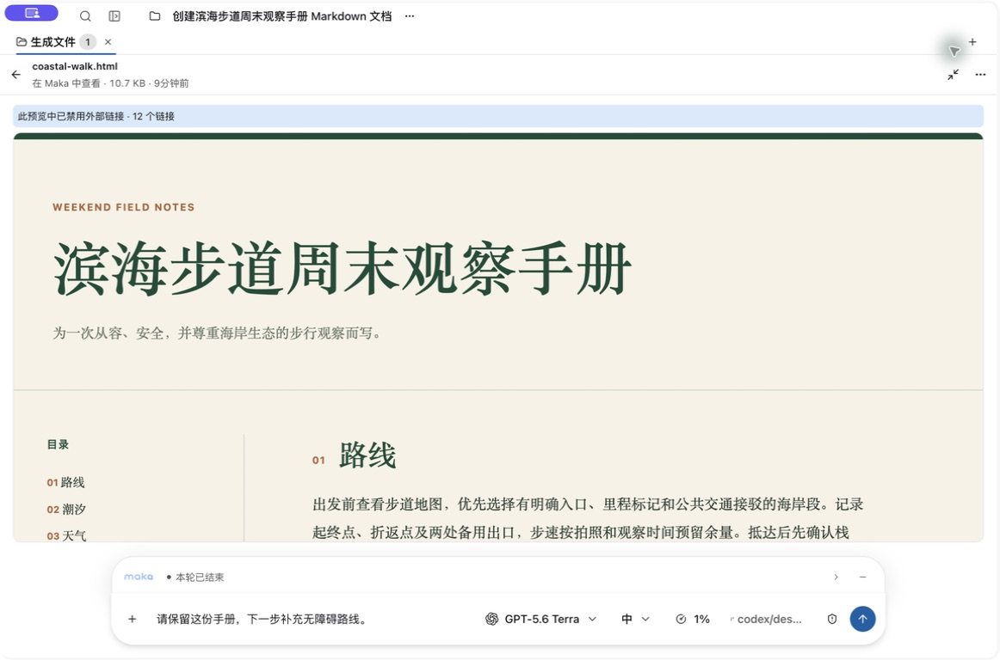
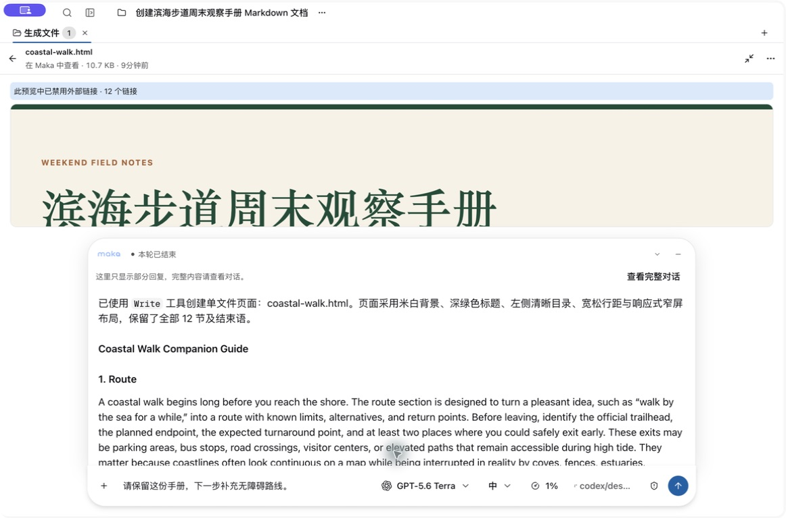
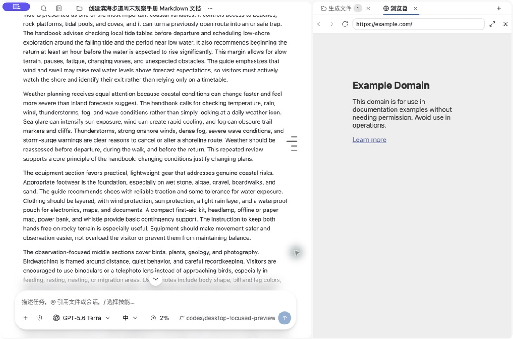
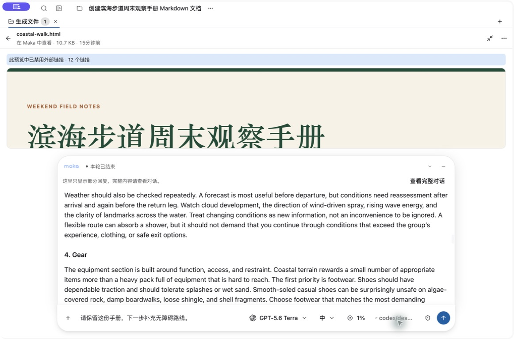
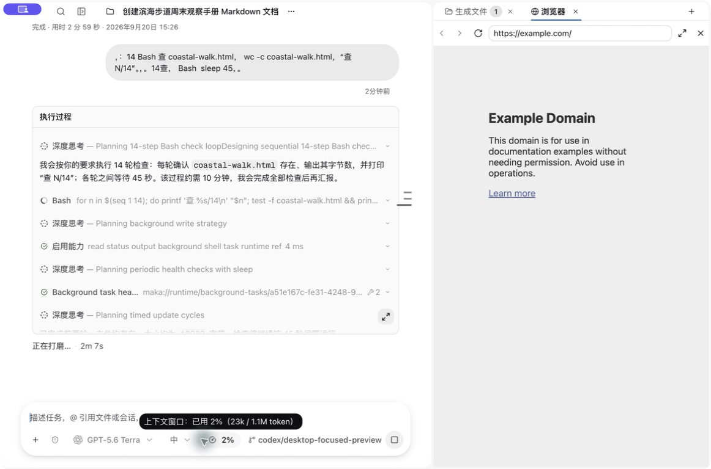
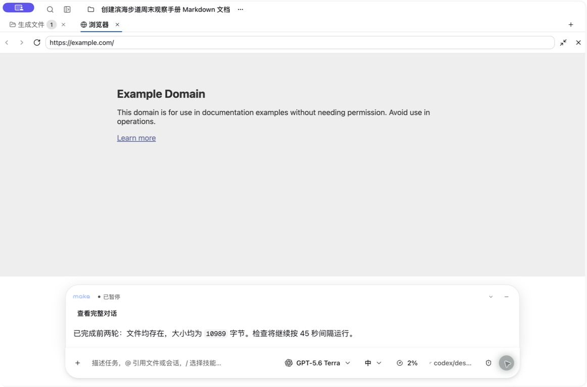
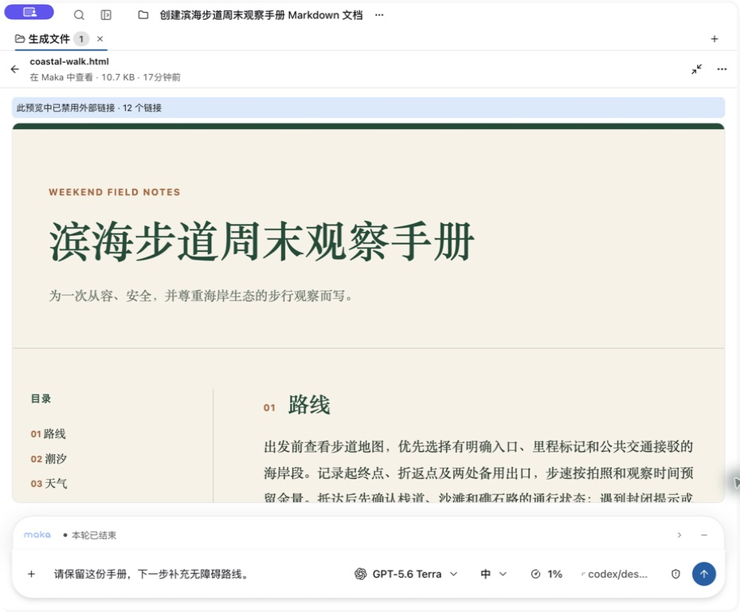
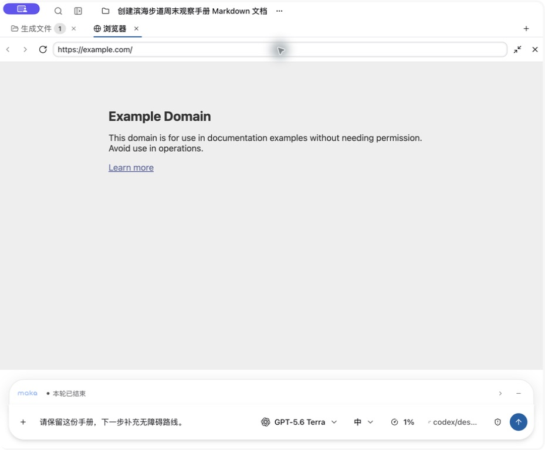
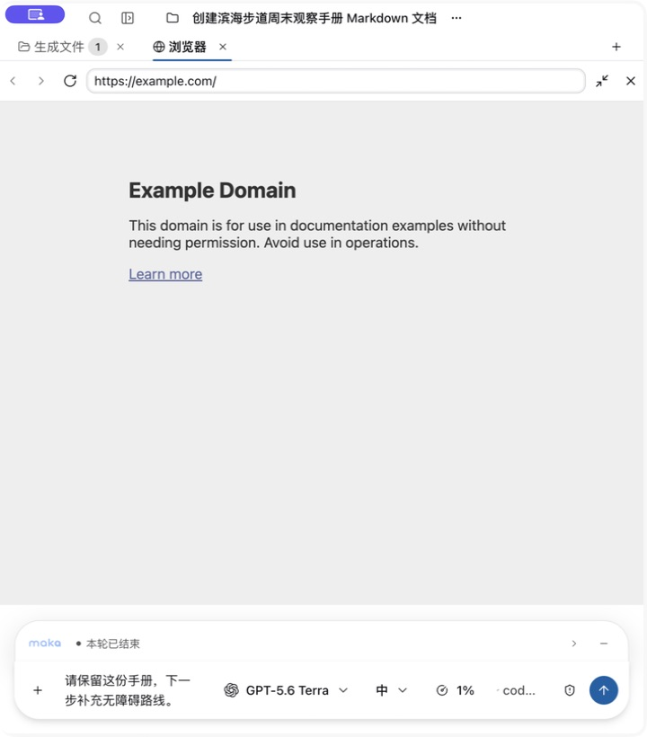

<!--
  Licensed to the Apache Software Foundation (ASF) under one
  or more contributor license agreements.  See the NOTICE file
  distributed with this work for additional information
  regarding copyright ownership.  The ASF licenses this file
  to you under the Apache License, Version 2.0 (the
  "License"); you may not use this file except in compliance
  with the License.  You may obtain a copy of the License at

      http://www.apache.org/licenses/LICENSE-2.0

  Unless required by applicable law or agreed to in writing,
  software distributed under the License is distributed on an
  "AS IS" BASIS, WITHOUT WARRANTIES OR CONDITIONS OF ANY
  KIND, either express or implied.  See the License for the
  specific language governing permissions and limitations
  under the License.
-->

# Live-provider review acceptance — September 20, 2026

These are uncomposited screenshots of the running macOS Electron application. The isolated profile uses the local Codex Responses endpoint with **gpt-5.6-terra / medium**. Credentials are not included. The prompts were sent through the actual composer; the model created `coastal-walk.html` with the real Write tool. The long reply and subsequent Bash calls also came from the live provider. No deterministic backend, seeded transcript, or Storybook rendering supplied these screenshots.

## Compact default

The document remains the primary surface. Only the status row and the same mounted composer are shown by default. The draft, model and medium reasoning selection remain visible. A long Git branch shrinks before the send control.

## Completed reply, limits and navigation

A completed reply first opens at its beginning. The real companion guide exceeded 16,000 characters, producing the visible partial-content notice. “View full conversation” restores the split and targets that reply's turn through the existing navigation path.

The same notice was also observed during a separate live-provider turn containing 14 independent Bash checks: the preview showed the final 12 visible items, including checks 10–14. The model completed all 14 checks and reported the same 10,989-byte file size.

## Preserve the reader's position

The screenshots below show the same Weather paragraph and Gear heading before and after minimizing/restoring the composer. Collapsing and expanding the reply was checked separately and preserved the same position. The unsent draft also remains.

The real test initially exposed a 240px scroll displacement. Diagnostics showed a temporary width change from 958px to 754px during restore, caused by clearing the focus attribute during measurement cleanup. Separating focus ownership from height measurement removed that transient split layout. A repeat retained a 1,640px scroll offset at the same 958px content width. Temporary diagnostic logging was removed.

## Predictable Escape and explicit Stop

With a real turn running, Escape from the composer restored the split while execution continued. Escape first dismisses the local composer menu. Stop remains an explicit button.

Clicking Stop retained received text and changed the status to Paused. A test-only background shell was separately cleaned up after the stop check.

## Continuous width and native Browser

These consecutive native resizes were verified from Electron's persisted window dimensions: 990px and 991px, both 820px high. The composer remains the same height and grows continuously instead of narrowing at the old viewport boundary.

The Browser is a real WebContentsView loading `https://example.com`. At 991px and 720px wide, its bounds leave the input region unobstructed. Pointer input returned from the webpage to the editor and sent a real model request.

## Validation and limits

- Real application: generated file, divider focus, draft retention, completed-reply first position, collapse/restore, minimize/restore, both truncation bounds, full-conversation navigation, local-menu Escape, composer Escape during execution, explicit Stop, native webpage and window resizing.
- Desktop production build, renderer and Storybook TypeScript, changed-file Biome, renderer architecture, locale hygiene and Astryx inventory checks passed.
- Regression stories were updated for these interactions. At the user's request, the final acceptance used the real application rather than a smoke run; no final Storybook smoke result is claimed.
- The full dependency build encountered four pre-existing TS7006 diagnostics in Runtime tests (three in `model-factory-thinking.test.ts`, one in `openai-responses-plaintext-reasoning.test.ts`). Those files match upstream main. Runtime JavaScript was emitted with `--noCheck` to launch the app; the desktop and changed renderer/UI code passed their own checks.
- Ablation removed duplicate status copy, the unused reading-initialization flag, and an unnecessary hidden-Markdown retention experiment. The existing composer, bounded live buffer and normal durable-reply handoff remain in use.
