<!--
  Licensed to the Apache Software Foundation (ASF) under one
  or more contributor license agreements.  See the NOTICE file
  distributed with this work for additional information
  regarding copyright ownership.  The ASF licenses this file
  to you under the Apache License, Version 2.0 (the
  "License"); you may not use this file except in compliance
  with the License.  You may obtain a copy of the License at

      http://www.apache.org/licenses/LICENSE-2.0

  Unless required by applicable law or agreed to in writing,
  software distributed under the License is distributed on an
  "AS IS" BASIS, WITHOUT WARRANTIES OR CONDITIONS OF ANY
  KIND, either express or implied.  See the License for the
  specific language governing permissions and limitations
  under the License.
-->

# Native preview interaction walkthrough

These captures come from the running macOS Electron app on this PR branch, using an isolated profile. The session was created and sent through the real composer; the Markdown artifact was seeded through the artifact store while the app was stopped. Model output comes from the deterministic E2E backend. The Browser loads `https://example.com` in a real `WebContentsView`.

The captures demonstrate renderer, input, storage and native-view integration. They do not demonstrate live-provider model quality or execution. Source changes were committed before restarting the app for acceptance; the running/stopped captures were repeated after the interrupted-turn fix.

## Files: one continuous input and reading flow

### 1. Start in split view

Open a generated Markdown file and leave an unsent draft in the conversation composer. The right column is 480px wide.

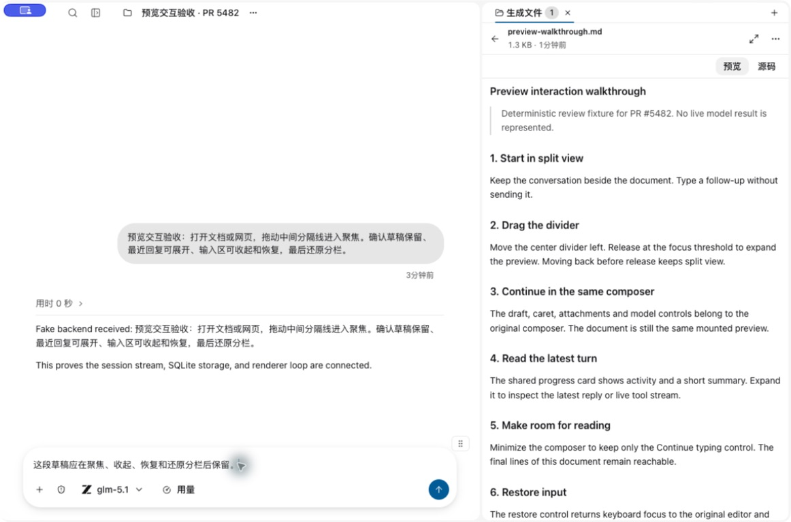

### 2. Drag the center divider left and release

The divider follows the pointer beyond the normal panel width cap. When at most 240px of conversation space remains, a release hint appears. Releasing focuses the preview and moves keyboard focus to the same editor. Moving back before release cancels the focus intent. The original split width is retained.

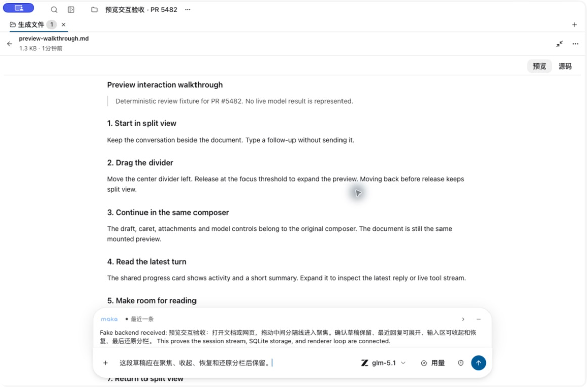

### 3. Expand the shared progress card

Click the status row to expand the latest reply. The reply and composer form a continuous surface. WorkHub and focused previews use the same `ProgressCard` presentation, with separate execution and window ownership.

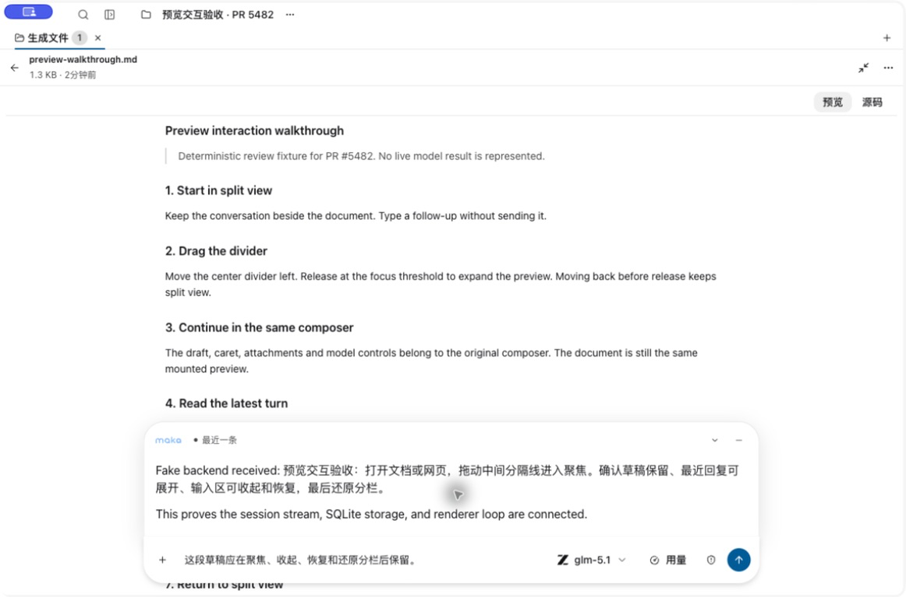

### 4. Minimize for reading

Minimize the input area and scroll to the end. The last document line remains reachable above the compact “Continue typing” control. The composer stays mounted.

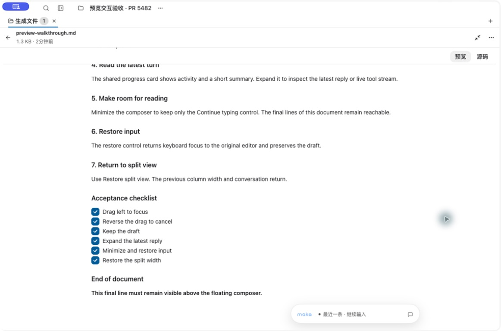

### 5. Restore input

“Continue typing” returns focus to the original editor, preserving the draft and reply expansion. After scrolling to the new bottom clearance, the final document line remains above the full floating surface.

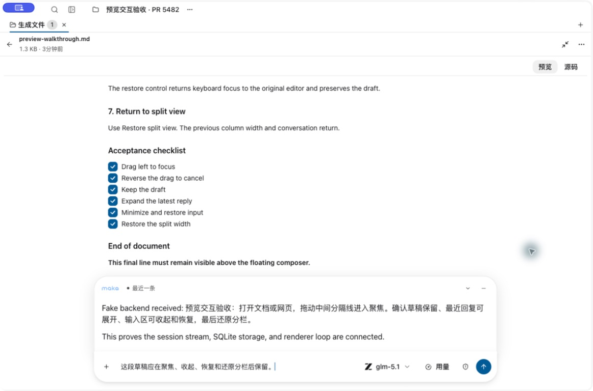

### 6. Restore split view

Use the restore button to return to the original 480px split. The conversation, selected file and unsent draft remain available.

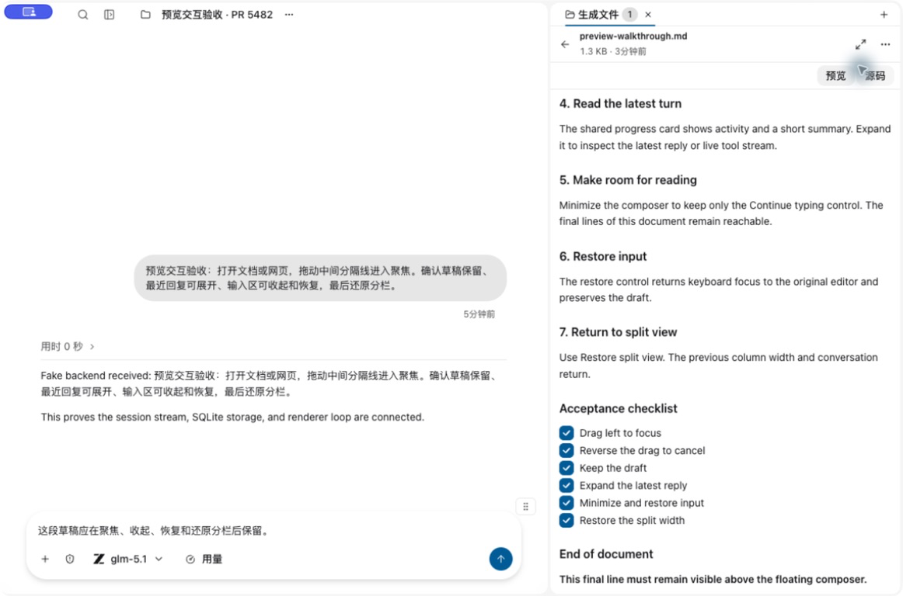

## Browser, running turns and a narrow window

### 7. Focus an empty Browser

The same divider gesture works before a page is loaded, so the user can start from the floating composer. Window controls and task identity retain their own row above the workbar tabs.

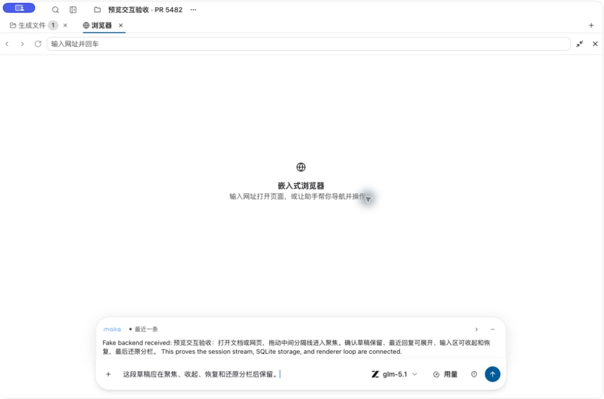

### 8. Load a real webpage

The native view is sized above the floating input region. Mouse input can move from the webpage back to the composer. An unsent address edit is cancelled with Escape; Escape from the Browser toolbar restores split view.

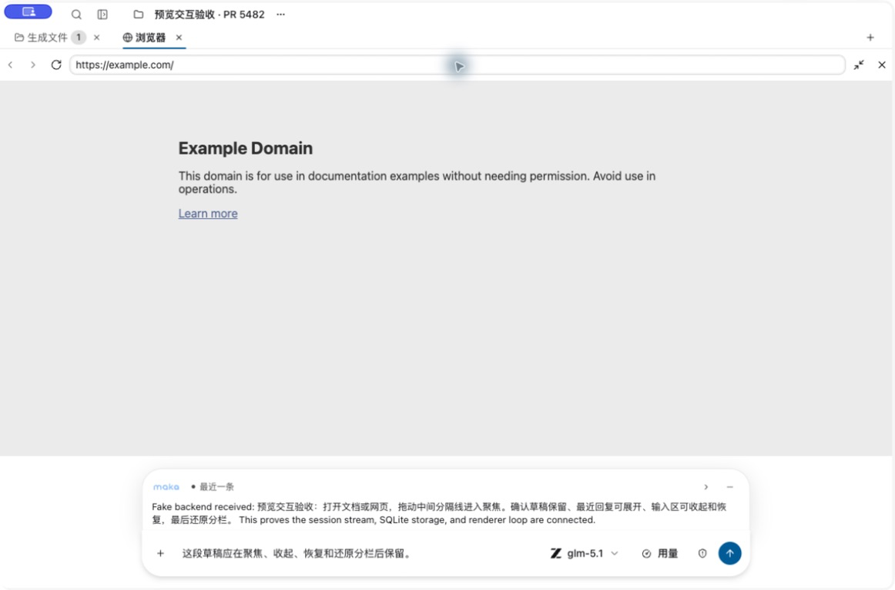

### 9. Inspect a running turn

A deterministic hold-open turn exercises the live event path. The shared card shows elapsed time and received text; the same composer exposes Stop.

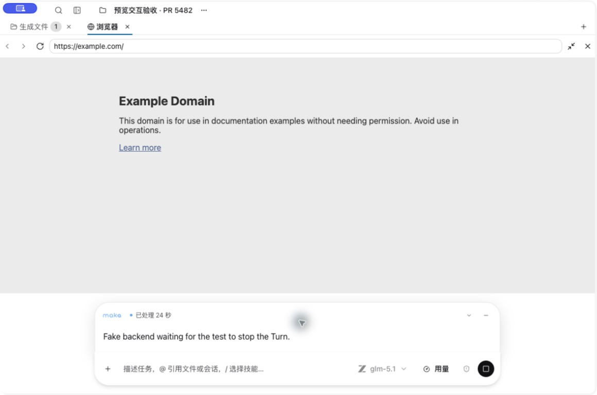

### 10. Stop without losing received text

After Stop, the card says “Turn interrupted” and keeps the received partial text. A missing persisted assistant reply no longer replaces that text with an empty-reply placeholder. The active preview keeps its bounded stream across focus/restore; this does not add a separate persisted transcript.

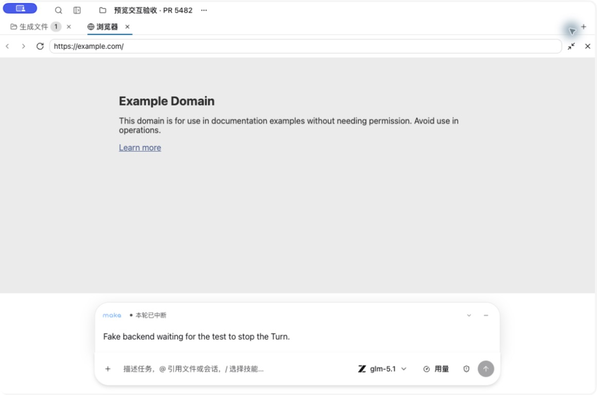

### 11. Continue in a narrower window

Resize the actual window to approximately 910px wide. The composer adapts to the available width, all controls stay reachable, and the native webpage continues to leave room for the card and editor.

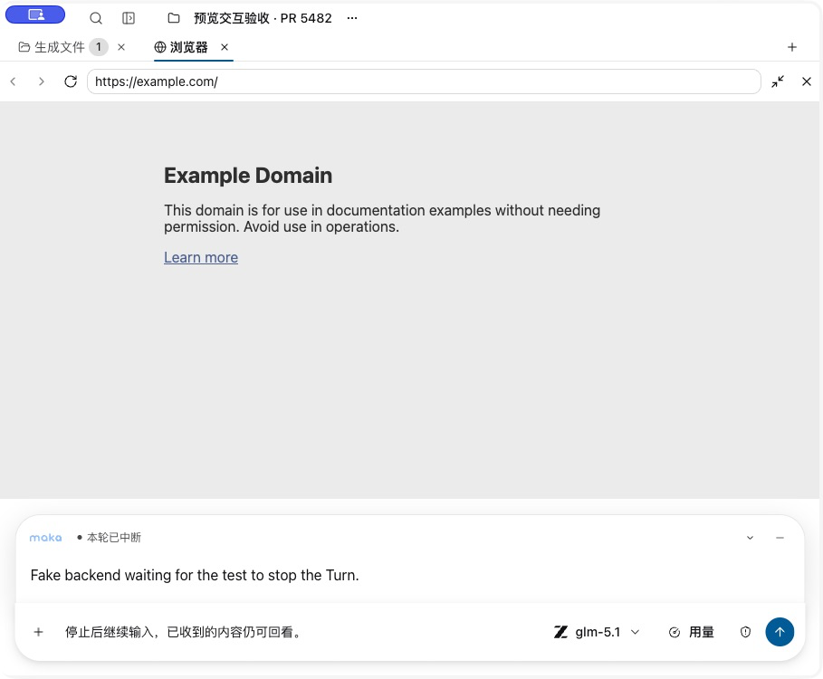

## Acceptance evidence

- Native manual pass: Files and empty/loaded Browser focus; divider drag; draft and keyboard focus; reply expansion; minimize/restore; final-line reachability; original split width; model menu over native webpage; send/stop; address cancellation; narrow window.
- Browser automation: 19 relevant Storybook stories across light and dark themes, including their `play` assertions. Coverage includes drag reversal, runtime-to-settled handoff, interrupted partial text, attachments, narrow framing and WorkHub's progress model picker.
- Renderer and Storybook type checks, the 112-test renderer architecture suite, changed-file Biome, locale hygiene and Astryx surface inventory checks passed. Storybook production build and native development startup passed.
- The full repository build and full Storybook catalog were not rerun for this acceptance pass.
