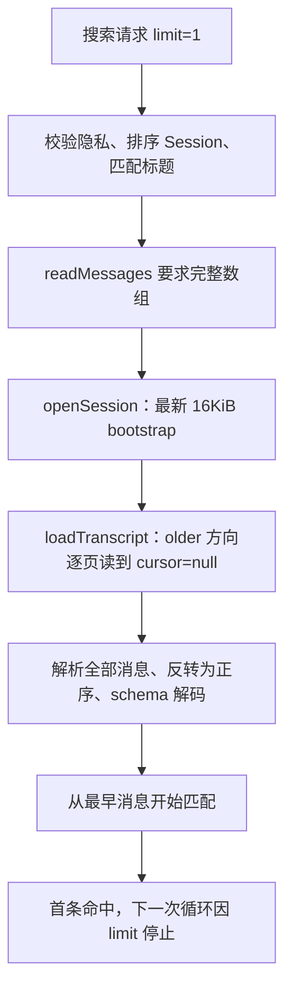

<!--
  Licensed to the Apache Software Foundation (ASF) under one
  or more contributor license agreements.  See the NOTICE file
  distributed with this work for additional information
  regarding copyright ownership.  The ASF licenses this file
  to you under the Apache License, Version 2.0 (the
  "License"); you may not use this file except in compliance
  with the License.  You may obtain a copy of the License at

      http://www.apache.org/licenses/LICENSE-2.0

  Unless required by applicable law or agreed to in writing,
  software distributed under the License is distributed on an
  "AS IS" BASIS, WITHOUT WARRANTIES OR CONDITIONS OF ANY
  KIND, either express or implied.  See the License for the
  specific language governing permissions and limitations
  under the License.
-->

**实现更新（2026-09-20）：** 历史搜索已改为消费正序 `readMessagePages`，达到结果预算后立即结束迭代。完整小会话复用 bootstrap；其他会话固定打开时的 watermark，从最早位置读起。每条结果保留源 sequence，普通读取失败撤销本 Session 的正文命中，取消和 reader 关闭语义保留。

修复后的同夹具结果见 [implementation-results.json](./history-search-diagnosis-2026-09-20/implementation-results.json)：首条命中、limit=1 时，解码 **20,000 → 256**、额外分页 **78 → 1**；前十条命中、limit=10 得到相同改善。页末命中保留 `truncated=true`。无命中仍需全扫，因保留尾部 bootstrap，当前该夹具额外分页为 79 次、原始字节约多 16KiB。下文保留实现前的诊断与基线。

**实现验证：** 新增真实 IPC → 搜索器 → subscription → Host pager/decoder 的分页回归测试，先观察到 `20000 !== 256` 失败，再验证修复通过。Desktop 搜索、分页、IPC 共 40 项测试和 UI 搜索相关 6 项测试通过；Core、Desktop、UI 类型检查通过。代码规范与需求审查均未发现实现问题，需求审查另以 8,000 个确定性场景对比新旧结果、截断及 continuation 语义。新版探针的 `--check-budget` 通过；[implementation-manifest.json](./history-search-diagnosis-2026-09-20/implementation-manifest.json) 记录修复后源文件哈希，其 commit 字段为测量时的基线 HEAD。

全仓 `npm test` 已完整运行，构建成功，测试未全绿。Shell PATH、执行器取消、peer invitation 用例独立重跑通过；Storage 子进程就绪检查受 SQLite ExperimentalWarning 干扰，使用 `NODE_NO_WARNINGS=1` 重跑通过；Eval 默认 Python 3.9 不兼容，改用 Python 3.12 后 87 项测试通过（12 项跳过）。Runtime Host 的 `production Host publishes and retires an implementation child patch` 独立重跑仍报 `Hosted real-model Turn did not become terminal`；该用例不经过本次搜索路径，留待单独排查。

发布前补验：全局 `npm run lint`、`npm run build`、`npm run typecheck` 及 Desktop/UI 两项 Knip 检查通过。`npm run format:check` 因工作区原有的 16 个未跟踪文件失败；限定全部 Git 跟踪文件的同一 Biome formatter 检查通过，本次变更的格式及提交检查均通过。问题已单独提交为 [Issue #5523](https://github.com/apache/maka/issues/5523)，关联 #2913 / #4677，不关闭这两个范围更大的跟踪项。

**实现前诊断与基线（以下保留原始记录）**

**根因是搜索的数据接口要求完整消息数组：结果数量限制只能停止匹配，无法提前停止拉页和解码。** 基线源码稳定复现“limit=1、最早一条消息命中，仍解码 20,000 条并追加请求 78 页”。现有取消有效，分页协议也已经支持正向读取；应调整搜索消费消息的方式。

原始诊断仅新增本文、探针和结果。源码基线为 `d3292393c575d2019ca406a5048099abf3399e0f`，Node v24.14.0 / macOS arm64。原始问题来自本地性能审计 `latest-code-audit-2026-09-19.zh-CN.md` 第 4 项。[manifest.json](./history-search-diagnosis-2026-09-20/manifest.json) 记录关键源码 SHA-256。

**可复现的证据**

扩展探针经过真实 Desktop `search:thread` handler、`runThreadSearch`、`ClientSessionSubscription`、`decodeStoredMessage` 和 Host pager。只有 transcript storage 与传输使用合成实现；每条消息独立 Turn，符合 16KiB bootstrap、512KiB / 256 条分页上限。直接打包 TypeScript 源码及工作区依赖，不读取旧 dist。

| 场景 | 消息数 | 结果 limit | 完整消息解码 | bootstrap 之外的请求 | 检查正文字段次数 |
| --- | ---: | ---: | ---: | ---: | ---: |
| 最早消息命中 | 2 | 1 | 2 | 0 | 1 |
| 最早消息命中 | 256 | 1 | 256 | 1 | 1 |
| 最早消息命中 | 5,000 | 1 | 5,000 | 20 | 1 |
| 最早消息命中 | 20,000 | 1 | 20,000 | 78 | 1 |
| 只有最早消息命中 | 20,000 | 10 | 20,000 | 78 | 20,000 |
| 最新消息命中 | 20,000 | 1 | 20,000 | 78 | 20,000 |
| 无命中 | 20,000 | 1 | 20,000 | 78 | 20,000 |
| 标题命中 | 20,000 | 1 | 0 | 0 | 0 |

计数重复运行一致，详见 [results.json](./history-search-diagnosis-2026-09-20/results.json)。读取第一条候选正文时，探针已记录 `decodedMessages=20000, pageRequests=78`。完整 JSON 解析数也是 20,000，不只是最后一次 schema decoder 的调用数。2 条消息就能复现多余解码；256 条已跨过 bootstrap，可以复现多余分页。

20,000 条夹具的 bootstrap 包含最新 79 条，剩余 19,921 条需要 `ceil(19921 / 256) = 78` 次顺序请求。原始消息字节合计 4,106,558（约 3.92MiB），不包含 base64 膨胀、协议 JSON、Session snapshot 或帧开销。真实大消息、同 Turn 分页边界会改变页数，78 不是固定常数。

原审计探针在本机重跑约 13–14ms，但不含真实网络、磁盘、Host RuntimeEvent 投影和 UI 绘制；扩展探针还增加了计数与真实 schema decoder，不能把两者耗时作为 A/B。可靠证据是请求量、解码量与匹配起点。若每个分页实际耗时 R，当前 78 个顺序请求还会贡献约 `78 × R` 的等待，这只是成本表达式，不是实测端到端延迟。

**调用链与根因**



1. [ThreadSearchDeps.readMessages](../../packages/core/src/thread-search.ts#L100) 返回 `Promise<StoredMessage[] | null>`。消费方必须等整个 Promise 完成，无法在某条命中后让生产方停下。
2. [Desktop adapter](../../apps/desktop/src/main/runtime-host-search-ipc-main.ts#L75) 每次为搜索打开独立 Session，调用 `session.loadTranscript()`，最后关闭。`limit` 未传入此层；加载缓存仅属于本次 handle，下一次查询会新建 handle。
3. [openSession](../../apps/desktop/src/main/runtime-host-client.ts#L1648) 请求 `transcript: { kind: 'tail', maxBytes: 16KiB }`。[loadTranscriptSource](../../packages/runtime-host/src/client/session-subscription.ts#L325) 只以 `cursor === null` 作为正常读完条件，逐页 `await`，并保留全部解码对象。
4. assembler 在 [completeCurrent](../../packages/runtime-host/src/client/session-subscription.ts#L657) 解析每条完整 JSON，在 [finish](../../packages/runtime-host/src/client/session-subscription.ts#L568) 将倒序结果反转；外层 [loadTranscript](../../packages/runtime-host/src/client/session-subscription.ts#L214) 再执行 `messages.map(decodeMessage)`。
5. [runThreadSearch](../../packages/core/src/thread-search.ts#L297) 拿到完整数组后才逐条匹配；第 307 行的 `maxResults` 检查确实能停止后续匹配，但此时读取和解码已经完成。

因此，当前命中发生在第 k 条、仅需少量结果时，单 Session 的加载仍为全量消息/字节成本，匹配才按 k 停止。保存全部消息对象使加载侧内存也随会话正文增长。`MAX_SESSIONS_SCANNED=200`、结果上限、snippet 字节上限都不能约束一段长会话的读取量。

方向是第二个约束：**Session 按 lastMessageAt 从新到旧排序，同一 Session 内按消息从旧到新匹配**，且该 Session 的标题先于正文。当前 bootstrap 从尾部出发；不能直接沿旧的 `older` cursor 逐页命中就停，否则会改变结果顺序，且最早消息仍要等最后一页。

**已排除的原因与适用范围**

- 不是 `limit` 完全失效：同一夹具 limit=1 只检查 1 条正文，limit=10 且仅 1 个命中时检查 20,000 条；两者都提前加载全量。
- 不是取消缺失：[adapter](../../apps/desktop/src/main/runtime-host-search-ipc-main.ts#L79) 把 AbortSignal 接到本次 handle.close，subscription 在在途页返回后再次检查关闭状态。探针在第一次追加请求时取消：只发出 1 页、handle 只关闭一次，返回 `aborted`；bootstrap 的 79 条 JSON 已解析，但没有继续 schema 解码或匹配。取消不能撤回已经发出的那一页，也不代表能打断一段正在执行的同步解码。
- 标题已满足 limit 时不会打开正文 Session，属于现有有效优化。
- [搜索框实际请求 limit=10](../../packages/ui/src/search-modal.tsx#L101)。limit=1 是最小反例；真实界面需要较早找到 10 条才有同类提前停止收益。无命中、只有少量命中或命中很晚，仍可能扫描全段。
- [多 Host 汇总](../../apps/desktop/src/preload/multi-host-thread-search.ts#L84) 等所有 Host 完成后再截断结果，各 Host 内仍走上述链路。这会放大等待，但不是本次 78 页的来源。

**已验证的修复方向**

现有 `session.transcript.page` 支持 `direction: 'newer'`，无需新增协议即可从最早位置开始读。以打开时的 watermark 固定本次扫描：

```ts
await session.loadTranscriptPage({
  direction: 'newer',
  throughSequence: session.transcriptBootstrap.durable.throughSequence,
  cursor: null,
  anchorSequence: null,
  maxBytes: 512 * 1024,
});
```

[Host pager](../../packages/runtime-host/src/server/session-transcript-pager.ts#L193) 对该请求从 position=0 开始。`anchorSequence: 0` 意味着从它之后开始，会跳过 sequence=0，应使用 null。后续只使用同 subscription、方向、watermark 对应的 cursor。

隔离实验保留现有打开 Session 的尾部 bootstrap，随后正向读取最早一页，将这页交给**未经修改的匹配器**：

| limit=1、最早消息命中 | 当前完整加载 | 仅正向首页的可行性实验 |
| --- | ---: | ---: |
| 额外分页请求 | 78 | 1 |
| 完整消息解码 | 20,000 | 256 |
| 原始消息字节，含 bootstrap | 4,106,558 | 67,365 |
| 首个命中 Turn / 消息位置 | turn-0 / 0 | turn-0 / 0 |
| 未读取的历史仍存在 | 否 | 是，cursor 非空 |

前十条消息均命中、limit=10 的对照也保持全部十个 Turn 的顺序，额外分页请求同样由 78 降为 1，解码由 20,000 降为 256。这验证了现有协议、assembler、匹配逻辑的组合可行性，**没有实现通用的逐页搜索，也不是生产修复后的性能数据**。实验仍支付一次尾部 bootstrap 的 I/O，但不解码它；小会话已在 bootstrap 完整呈现时，正式实现可直接复用。

建议的改动集中在 Core 搜索依赖与 Desktop adapter：让搜索器按需拉取正序消息页或消费惰性 `AsyncIterable`；每页保留“是否还有后续内容”，每条保留身份；达到结果预算就结束迭代并在 finally 关闭专用 handle。复用已有 `loadTranscriptPage` / `decodeTranscriptPage`，让正文加载成本随已扫描前缀及当前页增长，而不是总会话长度。分页大小决定最多多读一页的成本，不应把结果 limit 直接当成消息条数上限。

当前页的最后一条消息如果跨页，`decodeTranscriptPage` 会继续拉取分片来完成它。因此“只读一页、最多 256 条”是本夹具完整小消息下的数字；真实字节上界还需考虑单消息装配预算及 Host Turn 投影成本。

**实现时需要明确的边界**

- **全局预算与截断标记。** 不能简单对每页独立运行旧函数再拼接：结果数、总 snippet 字节、Session 扫描预算、标题优先级都要跨页保留。探针把唯一命中放在最早页第 256 条：原路径标记 `truncated=true`，只把首页作为完整数组的实验得到 `false`，但 Host cursor 明明还有下一页。应把页的 hasMore 纳入判断，且达到 limit 后在调用迭代器 next 之前停止，避免恰在页尾时又拉一页。
- **两种 cursor 不可混用。** Core 的 `nextCursor` 目前用于扫完 200 个 Session 后继续，绑定 query、Session ID 和时间；Host cursor 是本 subscription 的消息位置，绑定方向与 watermark。不能在关闭 handle 后把 Host cursor 作为 Core 对外 continuation 返回。
- **正文身份与数组下标。** 当前结果写 `sequence: messageIndex`，完整加载时已丢弃 assembler.identity。合成稀疏 sequence `[0,8,16]` 中第二条命中，现有返回 sequence=1，源 identity=8；真实 reader 也以 `ordinal * 8 + offset` 生成可能稀疏的坐标。逐页后不能把每页下标归零，也不能将数组下标当 Host cursor/anchor。应保留真实 identity，并明确现有结果字段的兼容语义。当前 Renderer [按 turnId 查 Turn 索引定位](../../apps/desktop/src/renderer/features/conversation/controller/transcript-reading-position.ts#L145)，本次未证明用户点击会跳错位置。
- **取消、错误和过滤。** 保留 requestId / 窗口退出取消、隐私前置校验、凭证查询拒绝、先脱敏再匹配、排除 thinking / 系统消息，以及归档与 revision 过滤。当前 adapter 读失败时整个 Session 正文返回 null；逐页累积后若后页失败，要明确是否回滚本 Session 已收集的内容结果，以保持原语义。
- **没有足够命中的最坏情况。** 增量消费消除可避免的全量预加载，不会让无索引的任意子串搜索在无命中时变成常数成本。若还要优化这一类查询，应另评估 Host 侧搜索或搜索投影；这会涉及存储与匹配语义，不是本次小范围改动的必要前提。

**验证入口**

现有 Core 单测通常直接提供完整内存数组，IPC 测试也多数 mock `loadTranscript()`，能验证结果与取消，却看不到真实分页读取量。本次探针补上 handler → matcher → pager / assembler 这一组合边界；正式修复应在此类边界用请求数与解码数做回归断言，而不只断言结果条数。

验收应覆盖：最早命中且仍有多页、界面 limit=10 的前十条命中、命中位于页末、跨消息分片、最新命中与无命中、标题先满足预算、在途页取消、稀疏 identity，以及分页失败/隐私过滤。保留现有 Session 顺序与会话内正序结果。

从仓库根目录运行：

```sh
search_diag_tmp=$(mktemp -d "${TMPDIR:-/tmp}/maka-history-search.XXXXXX")
node docs/performance/history-search-diagnosis-2026-09-20/build.mjs "$search_diag_tmp"
node docs/performance/history-search-diagnosis-2026-09-20/probe.mjs "$search_diag_tmp"
node docs/performance/history-search-diagnosis-2026-09-20/probe.mjs "$search_diag_tmp" --check-budget
```

普通运行验证夹具、命中、身份、关闭次数及正向首页能力。诊断时的 `--check-budget` 以 `decoded 20000/20000, requested 78 more pages` 失败；实现后脚本已迁移到新接口，现应通过“只解码 256 条、追加请求 1 页、页末保留截断标记”的断言。历史 [results.json](./history-search-diagnosis-2026-09-20/results.json) 保留原始基线，新的测量独立保存。
