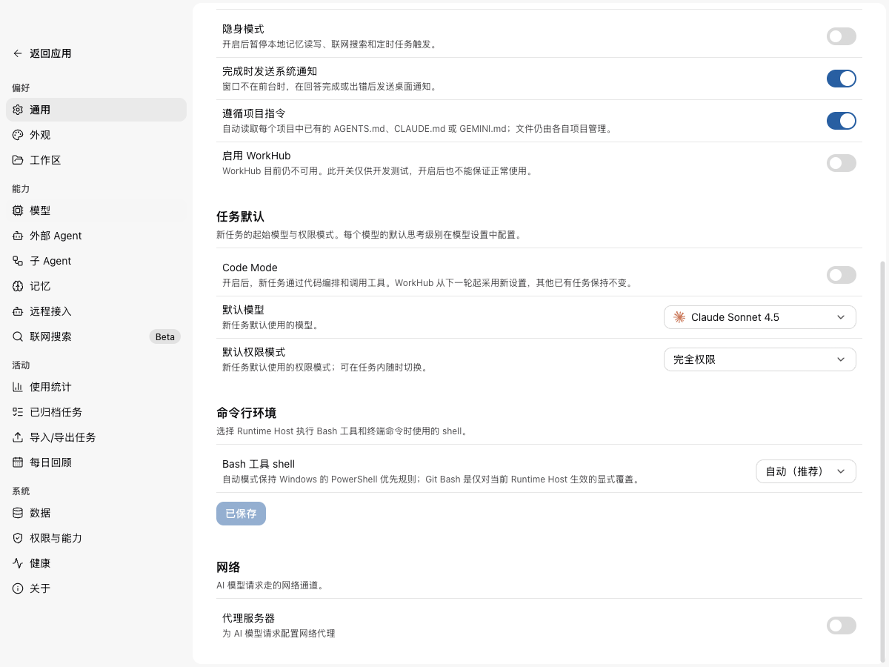
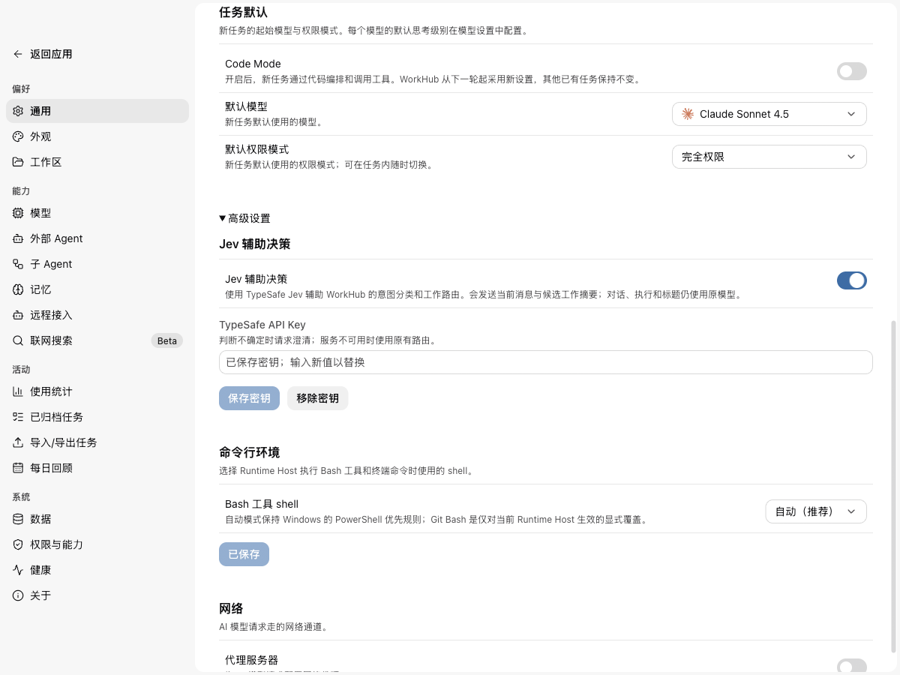

<!--
  Licensed to the Apache Software Foundation (ASF) under one
  or more contributor license agreements.  See the NOTICE file
  distributed with this work for additional information
  regarding copyright ownership.  The ASF licenses this file
  to you under the Apache License, Version 2.0 (the
  "License"); you may not use this file except in compliance
  with the License.  You may obtain a copy of the License at

      http://www.apache.org/licenses/LICENSE-2.0

  Unless required by applicable law or agreed to in writing,
  software distributed under the License is distributed on an
  "AS IS" BASIS, WITHOUT WARRANTIES OR CONDITIONS OF ANY
  KIND, either express or implied.  See the License for the
  specific language governing permissions and limitations
  under the License.
-->

# Jev settings and routing comparison — PR #5562

## Visual comparison

Real Electron screenshots at 1200 × 900, simplified Chinese, an isolated synthetic fixture profile. The model shown in screenshots is the fixture's model, not the DeepSeek benchmark configuration. No real API key is present in the screenshots.

The before image renders `GeneralSettingsPage` from base `acab16537` in the same fixture/build environment. The after images use `1c814c261`. Both are scrolled toward Task defaults; the shorter before page reaches its scroll limit earlier.

| Before | After: enabled with a synthetic key |
| --- | --- |
|  |  |

[After: advanced settings collapsed](settings-after-collapsed.png). Jev remains disabled by default; the enabled image shows an explicit user opt-in.

## Scope and method

Live TypeSafe `jev-1.13.0` and the locally saved default DeepSeek model `deepseek-v4-pro`. Twelve predeclared synthetic cases cover discussion, new work, candidate selection, ambiguity, linked controls, and contextual continuation. Each uses the same three opaque candidates and bounded input projection. Expected outcomes were written before requests.

This tests the existing split Intent/Recall model adapters (`createJevRoutingModel` and `createHostWorkHubRoutingModel`). **It does not compare the entire default production WorkHub coordination/tool loop.** No real Sessions were selected, no tools executed, and no saved settings were changed. Policy/usage stores were replaced with in-memory test adapters; model dispatch, provider options, input projection, response decoding, and routing policy are real production code.

One pass per model per condition. Initial order alternated between models per case. The budget diagnostic ran afterward and may benefit from provider cache warming. These are illustrative smoke measurements, not a statistically reliable benchmark or a general model-quality ranking. Latency includes all Intent/Recall calls, client validation, and failures; it excludes actual task execution. Jev retains its 8-second deadline; the outer test deadline is 45 seconds.

## Results

| Condition | Matches expected outcome | Errors / invalid output | Median latency | Mean latency |
| --- | ---: | ---: | ---: | ---: |
| Jev, production adapter | 10/12 | 0/12 | 0.80 s | 0.86 s |
| DPSK, unchanged split adapter (80/160 output tokens) | 0/12 | 12/12 | 1.71 s | 1.72 s |
| DPSK, diagnostic 2048-token output budget | 10/12 | 1/12 | 5.25 s | 7.35 s |

The unchanged DPSK adapter exhausted its 80-token intent budget entirely on reasoning and returned no decision JSON in all 12 cases. **The 0/12 measures an adapter/budget incompatibility, not DPSK's semantic accuracy.** A second probe with `thinkingLevel: off` still emitted no disabling option on the wire and reproduced 12/12 failures. Jev repeated at 10/12 in that probe (median 0.87 s).

The diagnostic control changes only the outgoing DPSK output-token limit to 2048; prompts, candidate projection, parser, model, and default thinking remain unchanged. It is **not** a product-code change. This makes the comparison interpretable, but one case still spends all 2048 tokens on reasoning and returns no JSON.

## Per-case comparison

DPSK below means the 2048-token diagnostic, not the failing original budget. `fallback` means no usable model decision or a thrown parser error; the harness does not execute the fallback coordination loop. Linked-control results are advisory; the test does not prove that any delegation was stopped/resumed/corrected.

| Case | User request | Expected | Jev | DPSK diagnostic | Seconds: Jev / DPSK |
| --- | --- | --- | --- | --- | --- |
| discuss | 什么是指数退避？只解释一下原理。 | answer_here | answer_here ✓ | answer_here ✓ | 0.81 / 2.62 |
| create | 新建一个任务，实现 CSV 导出功能。 | create_new | create_new ✓ | create_new ✓ | 0.84 / 1.43 |
| continue_payments | 继续 Maka 工作区的 Payments retry 工作。 | delegate_existing | delegate_existing (whc_payments) ✓ | delegate_existing (whc_payments) ✓ | 1.03 / 9.93 |
| continue_docs | 继续修正文档拼写错误，接着 Documentation spelling 那个任务做。 | delegate_existing | clarify ✗ | delegate_existing (whc_docs) ✓ | 0.78 / 12.59 |
| execute_existing | 把登录表单的校验补完整，就在已有的 Login form validation 任务里做。 | delegate_existing | delegate_existing (whc_login) ✓ | fallback ✗ | 1.17 / 27.93 |
| execute_no_match | 帮我分析火星探测器轨道数据。 | clarify | clarify ✓ | clarify ✓ | 0.79 / 6.33 |
| ambiguous | 继续那个任务。 | clarify | clarify ✓ | delegate_existing (whc_payments) ✗ | 0.66 / 7.05 |
| stop | 停止 WorkHub 刚才委派的工作。 | stop | stop ✓ | stop ✓ | 0.78 / 3.77 |
| resume | 恢复刚才被我停止的 WorkHub 委派。 | resume | resume ✓ | resume ✓ | 0.76 / 2.62 |
| correct | 纠正你刚才的委派：不要改样式，只修逻辑。 | correct | correct ✓ | correct ✓ | 0.81 / 4.19 |
| create_over_match | 不要继续 Payments retry；新建一个单独的支付重试任务。 | create_new | create_new ✓ | create_new ✓ | 0.71 / 3.37 |
| contextual_continue | 接着做吧。 | delegate_existing | clarify ✗ | delegate_existing (whc_payments) ✓ | 1.13 / 6.31 |

## What this small sample shows

- Both usable configurations matched 10/12 expectations, with different failures. Do not infer equal overall quality from twelve hand-written cases.
- Jev asked for clarification on explicit Documentation spelling continuation and contextual “接着做吧”. It made no incorrect candidate binding in this sample, but this is not a safety guarantee.
- DPSK handled those two cases, but guessed `whc_payments` for the ambiguous “继续那个任务”, where the expected behavior was clarification. Its Login form validation case exhausted the diagnostic reasoning budget.
- Jev was faster in these measurements. Cache state, provider/server load, different interfaces, reasoning budgets, and one-pass sampling prevent a general speed claim.
- The split adapter's small output budgets need separate evaluation for reasoning models. No change to the user's model configuration or main WorkHub behavior is included in this evidence update.

## Reproduce and evidence

Build the workspace first. Provide `JEV_API_KEY` and `DEEPSEEK_API_KEY` through your local process environment; never put values in source or committed command files.

```sh
node docs/pr-5562/compare-routing.mjs
DPSK_OUTPUT_BUDGET=2048 COMPARE_OUTPUT=/tmp/jev-budget-2048.json node docs/pr-5562/compare-routing.mjs
```

The replay uses a synthetic connection with the same model and the provider's default endpoint. Optional `DPSK_MODEL`, `DPSK_BASE_URL`, and `COMPARE_OUTPUT` configure reproduction. Raw evidence records model usage and typed decisions, not credential headers.

- [Initial exact-adapter measurements and all inputs](results/default.json)
- [Explicit thinking-off probe](results/thinking-off-probe.json)
- [2048-token diagnostic measurements](results/budget-2048.json)
- [Replay harness](compare-routing.mjs)
