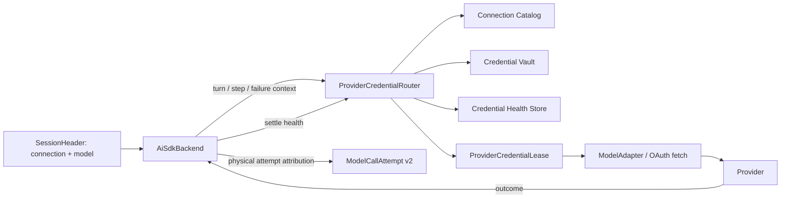
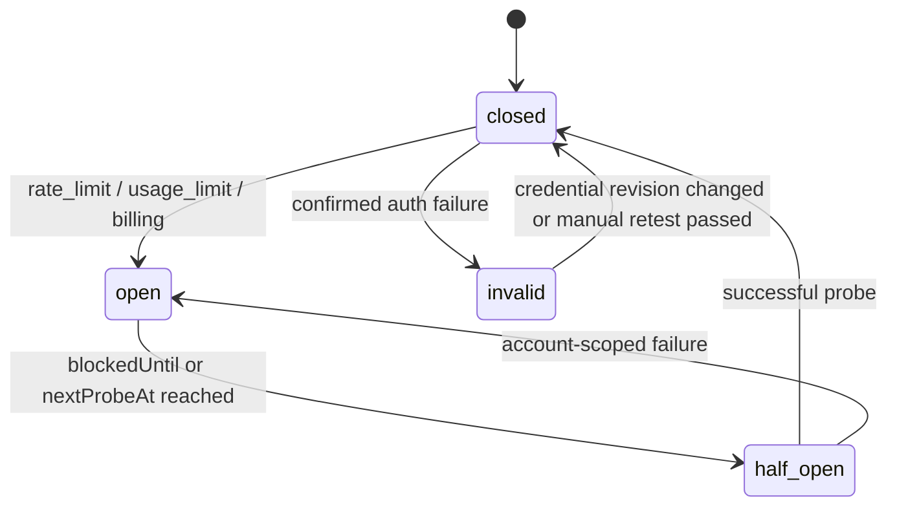

# RFC：Provider Credential Profiles 与多账号负载均衡

- 状态：Draft / Review Ready
- 目标读者：Runtime、Runtime Host、Storage、Desktop、Headless 维护者
- 设计基线：`b62462a929a7f5128e5dbe417ffdf8b34e008794`
- 基线日期：2026-08-10
- 实现方式：按本文的 PR 切片逐步实现；不建议一次性提交完整功能

## 0. 结论先行

本文建议把一个 Provider 的多个账号/API 凭据建模为同一个 `Connection` 下的多个 **Credential Profile**，而不是把多个 `Connection` 再套进一个通用连接池。

核心决策如下：

1. `SessionHeader` 继续只固定 `llmConnectionSlug + model`，不把具体账号写进 Session。
2. 一个 `Connection` 仍然代表同一个 Provider、API 协议、`baseUrl`、模型配置和请求体配置。
3. 一个 Credential Profile 代表该 Connection 下的一套独立认证身份；MVP 只支持多个 API Key，OAuth 在后续独立 PR 接入。
4. 默认按 **turn 粒度**选择 Profile，同一 turn 的多步模型调用保持粘性；下一 turn 重新参与负载均衡。
5. 默认算法为 **Smooth Weighted Round Robin（SWRR，平滑加权轮询）**。权重是用户配置的流量比例，不声称代表 Provider 的真实剩余额度。
6. 只有账号级失败、且本次模型调用尚未产生任何用户可见输出时，才允许切换 Profile。
7. 网络错误、Provider 5xx、超时等连接级故障继续走现有重试，不应轮流消耗所有账号。
8. 账号健康状态进入独立的运行态 SQLite authority；配置和密钥仍分别留在 Connection Catalog 与 Credential Vault。
9. 现有单凭据 Connection 和 `legacy_primary` 模式必须走兼容快速路径：添加/测试 Profile 本身不改变行为、请求次数和错误语义。
10. 正式启用前必须先解决错误分类、动态凭据解析和逐物理请求计量归属三个阻塞点。

设计 Review 结论是：**方案有条件通过**。满足本文第 16 节的 Gate 0～Gate 3 后，API Key MVP 才具备合并条件。

## 1. 当前代码事实与约束

本节只记录当前 `main` 的权威边界，后续方案不能绕过这些边界另造状态源。

### 1.1 Connection 和凭据是两套 authority

`packages/core/src/runtime-policy.ts` 中：

- `ConnectionConfiguration` 保存 Provider 类型、`baseUrl`、启用模型、relay model profile 和 request body overlay。
- `ConnectionCatalogEntry` 在此基础上增加 `connectionId`、revision、模型发现结果和最后一次测试结果。
- `CredentialLocator` 对 Connection 只支持一份 `api_key`、`oauth_token` 和 `request_headers`。

`packages/storage/src/runtime-policy/connection-catalog-document.ts` 与
`credential-vault-document.ts` 分别持久化非密配置和密钥。两者都有独立 revision，不是一个可原子提交的文档。

因此多账号设计必须满足：

- Profile 元数据放 Catalog，密钥放 Vault；
- 不能把 Key 数组塞进 Connection JSON；
- 不能依赖跨文档事务保证创建和删除的原子性；
- 必须定义崩溃中间态，并使中间态默认不可执行。

### 1.2 Runtime Host 当前在 backend 创建时冻结凭据

当前主链路为：

```text
SessionHeader
  -> resolveExecutionTarget()
  -> resolveExecutionConnection(connectionSlug)
  -> createHostAiSdkBackend()
  -> AiSdkBackend / ModelAdapter
  -> provider model
```

`execution-model-authority.ts` 只解析一份 API Key 或 OAuth binding；
`execution-model-composition.ts` 在 backend 创建时把 `apiKey`、`fetch` 和模型固定下来；
`ModelAdapter` 也以固定 API Key 创建模型。

这意味着只在 Storage 或 `resolveExecutionTarget()` 增加一个 Key 列表并不能完成负载均衡。真正的选择边界必须下沉到每个模型调用/物理请求能够重新解析凭据的位置，同时保持 Runtime 不直接依赖 Storage。

### 1.3 重试安全性由 AiSdkBackend 掌握

`packages/runtime/src/ai-sdk-backend.ts` 已经掌握以下关键事实：

- 一个 step 内的物理 Provider 尝试次数；
- 是否已经产生可观察输出；
- 哪些失败允许继续重试；
- 流中断后的恢复语义；
- 每个物理请求的 telemetry 和 canonical accounting。

当前 `ModelAdapter` 调用 AI SDK 时已经设置 `maxRetries: 0`，Provider 重试由 Runtime 自己拥有。这是本方案可行的重要前提：Profile failover 不需要和 AI SDK 内部的隐藏重试竞争，也必须通过回归测试防止以后重新出现双层重试。

因此 Profile 切换不能完全隐藏在 fetch wrapper 或 `ModelAdapter` 里。只有 `AiSdkBackend` 有足够信息判断“现在换账号是否安全”。

### 1.4 Session 本身已经有稳定的 turn identity

`AiSdkBackend.send()` 的输入带有 `turnId`，Runtime Host 也同时持有 `sessionId`。这允许实现 turn 粒度粘性，不需要修改 `SessionHeader`，也不需要把账号选择写入长期会话配置。

### 1.5 计量 authority 是逐物理请求记录

`ModelCallAttempt` 是 AgentRun 中每次物理模型调用的 canonical accounting 记录，`usage_model_call_attempts` 只是投影。

当前 `ModelCallAttempt` 只有 Connection/Provider/Model 归属，没有 Profile 归属；`ModelCallAccountingInput` 还是 backend 创建时的静态输入。因此动态切换前必须先让每个物理请求携带实际使用的 Profile，否则账单、排障和路由健康都会失真。

### 1.6 当前错误分类不足以驱动账号状态机

当前实现仍会把部分 `401/403` 聚合为 auth 类错误，无法稳定区分：

- 凭据无效；
- 账号无模型权限；
- 余额/计费问题；
- 用量上限；
- 短期速率限制。

社区已有对应工作：

- [Issue #2516：distinguish usage limits from authentication failures](https://github.com/maka-agent/maka-agent/issues/2516)
- [Draft PR #2521：distinguish usage limits from auth errors](https://github.com/maka-agent/maka-agent/pull/2521)

本文把该错误分类工作视作前置依赖，不在负载均衡 PR 中重复实现一套平行分类器。

### 1.7 社区重叠检查

截至 2026-08-10，以 `multiple api keys`、`multi-account`、`load balancing`、`round robin`、`credential pool/profile` 等关键词检索本仓库的 issue/PR，未检索到直接实现多凭据负载均衡的现有贡献。当前最直接的开放依赖仍是 #2516 / Draft PR #2521。

已有工作提供了本方案必须复用的基础，而不是可替代本方案的完整实现：

- [Issue #32](https://github.com/maka-agent/maka-agent/issues/32) 建立纯 Node CredentialStore 方向，并明确留下 `provider + account/profile + base_url/org/tenant` 的多账号 key shape 问题；本文沿用 Catalog/Vault 分离，不回退到 Electron-only 或 secret 数组。
- [Issue #449](https://github.com/maka-agent/maka-agent/issues/449) 建立 versioned、fail-closed、凭据显式 opt-in 的配置导入导出；本文的 config v2 必须继续该安全合同。
- [Issue #1571](https://github.com/maka-agent/maka-agent/issues/1571) / [PR #1572](https://github.com/maka-agent/maka-agent/pull/1572) 已处理 remote-first、account-specific 模型发现基础；Profile 级 model access 应扩展这条 effect 链，而不是另写发现客户端。
- [Issue #1216](https://github.com/maka-agent/maka-agent/issues/1216) 已强调 Provider failure taxonomy 必须穿过 AI SDK retry wrapper 保持不丢失；Router 应消费最终规范化结果。
- [Issue #1380](https://github.com/maka-agent/maka-agent/issues/1380) / [PR #1420](https://github.com/maka-agent/maka-agent/pull/1420) 已启用 Anthropic prompt caching；这也是本文选择 turn binding、拒绝逐请求随机 Key 的现实原因之一。

因此最合适的社区贡献切口不是再开一个模糊的 “multi-key support” 大 PR，而是先提交本文 PR 1 的 Core/Storage contracts RFC 或实现，再按依赖顺序推进。

## 2. 目标与非目标

### 2.1 目标

- 一个 Connection 可配置多套独立 API Key，并按权重分配新 turn。
- 某个账号遇到明确的账号级限制时，可安全地切换到其他健康账号。
- 同一 turn 内尽量保持账号粘性，减少 Prompt Cache 破坏和行为漂移。
- 凭据替换、OAuth refresh、删除、导入导出都保留独立 CAS/version 语义。
- 每个物理 Provider 请求都能明确归属到真实使用的 Profile。
- 健康状态可跨 Runtime Host 重启保留，但不会因旧 Key 的失败污染新 Key。
- 旧 Connection 无须迁移密钥即可继续执行。
- Desktop、Headless 和未来其他 Host 能复用同一个 Runtime 路由合同。

### 2.2 非目标

- 不做跨 Provider、跨 `baseUrl`、跨 API 协议的智能路由。
- 不在失败时自动更换模型。
- 不把本地 token/cost 估算伪装成 Provider 官方剩余额度。
- MVP 不支持 Profile 级独立 request headers、proxy 或 request body overlay。
- MVP 不实现按价格、延迟、质量动态选路。
- MVP 不保证多进程间严格的 SWRR 序列；当前 Runtime Host authority 下只要求进程内选择串行化。
- 路由与 health scope 跟随现有 Runtime Policy storage root；不协调复制到其他 root/设备的相同 Provider Key。
- 不把旧 Session 绑定到某个永久账号。
- 不在产生可见输出后静默换账号重放整个请求。

## 3. 备选方案与取舍

### 3.1 方案 A：一个 Connection 内包含多个 Credential Profile（采用）

```text
Connection(openai-prod)
  providerType = openai
  baseUrl      = https://api.openai.com/v1
  model config = [...]
  profiles:
    - primary / key-A / weight 2
    - backup  / key-B / weight 1
```

优点：

- 保留现有 Session target 和默认模型语义；
- Profile 之间天然共享 Provider、endpoint 和模型协议；
- 变更集中在认证解析和 Provider dispatch；
- UI 上也符合“同一个 Provider 连接下有多个账号”的直觉。

限制：

- 如果两个账号必须使用不同 `baseUrl` 或不同组织级 headers，它们不能放进同一个 MVP pool；
- 不负责做通用 AI Gateway。

### 3.2 方案 B：多个 Connection 再组成 Connection Pool（拒绝）

该方案表面上复用现有单凭据 Connection，但会立即引入：

- Session 到底锁定 Connection 还是 Pool；
- 不同 Provider/endpoint/model inventory 如何合并；
- 默认模型和 enabled models 的冲突；
- request overlay、proxy、OAuth flow 的跨连接差异；
- UI、配置导出、Headless 参数都需要增加一层 target 类型。

这已经是跨 Provider 路由器，而不是本次多账号贡献，范围过大。

### 3.3 方案 C：把多个 API Key 编码进一个 secret（拒绝）

例如用 JSON 数组或逗号分隔字符串保存多个 Key，会破坏：

- 每个 Key 的独立 credential identity/revision；
- OAuth token 的独立 CAS refresh；
- Profile 的单独删除、替换和审计；
- 旧客户端对 secret 的解释；
- 对单个账号做健康隔离的能力。

### 3.4 方案 D：每个物理 HTTP 请求随机选 Key（拒绝）

该方案会让同一个 tool turn 的多个 step 在账号间跳动，破坏账号级 Prompt Cache，并让流中断后的重试很难判断是否可安全重放。随机选择也无法稳定表达权重和测试公平性。

## 4. 领域模型

### 4.1 Profile 元数据

建议在 Core 中增加以下概念。命名可以随代码风格调整，但语义不可混合：

```ts
export type CredentialRoutingStrategy = 'smooth_weighted_round_robin';

export interface ConnectionCredentialProfileEntry {
  readonly profileId: EntityId;
  readonly revision: Revision;
  readonly label: string;
  readonly enabled: boolean;
  readonly weight: number;
}

export interface ConnectionCredentialRouting {
  readonly mode: 'legacy_primary' | 'balanced';
  readonly strategy: CredentialRoutingStrategy;
  readonly profiles: readonly ConnectionCredentialProfileEntry[];
}

export interface ConnectionCatalogEntry extends ConnectionConfiguration {
  // existing fields...
  readonly credentialRouting?: ConnectionCredentialRouting;
}
```

`credentialRouting` 只增加在 `ConnectionCatalogEntry`，不增加到
`ConnectionConfiguration`、`ConnectionCatalogEntryDraft` 或通用
`ConnectionCatalogEntryUpdate`。原因是 Profile identity/revision 由 Catalog authority
产生，不能让客户端在创建或普通更新 Connection 时自行注入。Profile 只能通过第
5.4 节的专用 mutation 修改。

Profile 的 `lastTest/modelAccess` 不内嵌 Catalog。当前上限允许 1,024 个 Connection、每个 Connection 最多 512 个 enabled model；把 Profile × model evidence 复制进 4 MiB Catalog 会破坏现有文档边界，并让运行时测试频繁增加 Connection revision。该 evidence 使用第 8.4 节的 `provider_routing` SQLite authority。

约束：

- 每个 Connection 最多 32 个 Profile；
- `label` 规范化后长度 1～64，同一 Connection 内大小写不敏感唯一；
- `weight` 为整数 1～100；
- `profileId` 创建后不可变；
- Profile 自己有独立 revision；label/enabled/weight 等配置变化增加该 revision，运行态验证/health 不增加 Catalog revision；
- Profile 只保存非密元数据；
- Profile 的 credential kind 由 Connection `providerType` 的 auth kind 唯一决定；同一 Connection 不得混用 API Key/OAuth，`authKind='none'` 不允许创建 Profile；
- `credentialRouting` 缺失表示 legacy single-profile 模式；
- `credentialRouting.mode='legacy_primary'` 表示 Profile 已配置但执行仍只走现有 primary，便于无中断地完成设置和测试；
- 只有 `mode='balanced'` 才进入多 Profile 选择；激活时每个 enabled model 至少有一个 enabled + configured + verified Profile，且至少一个 enabled model 有两个以上 Profile 的共同支持证据。激活校验忽略 transient cooldown，但 dispatch 候选会应用 health；
- `strategy` MVP 只接受一个已知枚举值，未知值 fail closed。

Core/Vault codec 可以先容纳 `oauth_token` Profile locator，但在 PR 5 完成前，Host capability 必须拒绝把 OAuth Connection 激活为 balanced；不能因为类型已存在就让未实现的 OAuth 路径进入执行。

这些上限不能相乘理解为容量承诺。Catalog 的 4 MiB serialized-size cap、Vault 的 2 MiB/2,048 entries cap 仍是全局硬边界；每次 Profile/credential mutation 都要在 commit 前预检数量与字节大小，并返回明确 capacity error。Vault 已满时可能留下一个安全的 disabled + unconfigured Profile，调用方应展示并允许删除，不能越界写文件。

### 4.2 保留 legacy primary Profile

为了避免迁移所有现有密钥，定义：

```ts
primaryProfileId(connectionId) === connectionId
```

它映射到现有 locator：

```ts
{
  scope: 'connection',
  connectionId,
  kind: 'api_key' | 'oauth_token'
}
```

规则：

- 没有 `credentialRouting` 时，只解析 primary Profile；
- 首次添加第二个 Profile 时，Catalog 显式物化 primary 的元数据，初始
  `profileId=connectionId`、`revision=1`、`enabled=true`、`weight=1`，并设置
  `mode='legacy_primary'`，因此不会立即改变现有执行；
- primary 可以禁用，但不可删除其保留身份；
- 删除 primary 的 credential 后，它变为 `unconfigured`，不能执行；
- secondary Profile 的 ID 不得等于 `connectionId`。

### 4.3 Secondary Profile 的 CredentialLocator

新增明确的 locator scope：

```ts
export type CredentialLocator =
  | ExistingLocators
  | {
      readonly scope: 'connection_profile';
      readonly connectionId: EntityId;
      readonly profileId: EntityId;
      readonly kind: 'api_key' | 'oauth_token';
    };
```

不建议给现有 `scope: 'connection'` 简单增加一个 optional `profileId`。显式 scope 能避免以下歧义：

- `profileId` 缺失究竟是旧数据还是非法数据；
- `request_headers` 是 Connection 级还是 Profile 级；
- orphan cleanup 和 locator key 是否遗漏 secondary；
- 老版本 decoder 如何 fail closed。

MVP 保持 `request_headers` 为 Connection 级，所有 Profile 共用。如果账号必须使用不同 organization/project header，应暂时配置为不同 Connection；Profile 级 headers 留给后续单独 RFC。

### 4.4 Profile 可执行条件

当 `credentialRouting.mode='balanced'` 时，一个 Profile 只有同时满足以下条件才可进入候选集：

1. Connection 已启用；
2. Profile 已启用；
3. 所需 auth kind 的 credential 已配置；
4. 当前 credential identity/revision 对应的健康状态没有阻止执行；
5. 显式 Profile routing 下，Profile 有当前 model 的 discovery/test 支持证据；
6. 当前 logical call 没有因账号级失败排除该 Profile。

`enabled` 不等于 `ready`。UI 与协议应分别暴露：

```ts
type CredentialProfileReadiness =
  | 'ready'
  | 'disabled'
  | 'unconfigured'
  | 'unverified'
  | 'cooldown'
  | 'invalid'
  | 'needs_reauth'
  | 'model_unavailable';
```

Readiness 是 Catalog、Vault 和运行态 health 的组合投影，不应再存成第四份 authority。

`credentialRouting` 缺失时直接走完全现有的 primary locator；`mode='legacy_primary'` 时也不构建多 Profile 候选集，只允许已配置且 `enabled=true` 的 primary 执行。此时 secondary Profile 只用于管理和测试，不参与执行，Profile 测试失败也不会自动改写 primary 的执行状态。

### 4.5 Profile verification evidence

Profile 级 discovery/test 产生可重建的执行证据：

```ts
interface CredentialProfileVerificationRecord {
  readonly connectionId: EntityId;
  readonly profileId: EntityId;
  readonly credentialId: EntityId;
  readonly credentialRevision: Revision;
  readonly executionBasisDigest: string;
  readonly modelId: string;
  readonly status: 'supported' | 'denied';
  readonly source: 'discovered' | 'tested';
  readonly evidence: 'positive_only' | 'authoritative';
  readonly checkedAt: number;
  readonly testSummary?: ConnectionTestSummary;
}
```

Readiness 必须精确匹配当前 credential 与 execution basis，不能只相信“曾经测试成功”。即使跨 authority 清理在崩溃时未完成，旧 Key 或旧 endpoint 的 evidence 也不会授权新请求。Catalog/Vault 是不可重建的配置与 secret authority；verification 是可重新发现/测试的持久执行 evidence，导出配置时不携带并在导入后重建。

完整 discovery 只持久化与当前 `enabledModelIds` 的交集，不把最多 2,048 个 endpoint inventory 为每个 Profile 重复复制；每个 Profile/basis 最多 512 条 verification，并在新 basis 成功写入后清理旧 basis，避免形成无界历史。只有 Provider adapter 声明结果对账号模型列表是 authoritative 时，列表缺失才能写 `denied` 并做集合替换；positive-only discovery 只能 upsert 明确支持项，不能把缺失模型猜成无权限。Direct test 只有明确 permission 结果才能写 denied，网络/5xx/unknown 失败不改变 verification。

## 5. 配置、密钥与生命周期

### 5.1 创建 Profile

创建流程必须 fail closed：

```text
1. Catalog 创建 Profile 元数据，enabled=false；routing mode 保持 legacy_primary
2. Vault 写入该 Profile 的 credential
3. 使用指定 model 做 Profile 级测试/模型发现
4. 测试通过后，用户或 onboarding flow 显式 enabled=true
5. Profile 对 enabled models 完成配置与验证后，用户显式把 routing mode 切换为 balanced
```

任意阶段崩溃后的状态都安全：

- 只创建了元数据：Profile 未配置且禁用；
- 密钥已写入但未测试：Profile 仍禁用；
- 测试完成但启用未提交：Profile 仍禁用，可恢复操作；
- 启用成功：Catalog 和 Vault 都已存在；
- balanced 激活未提交：现有 primary 仍按 legacy 路径执行。

禁止提供“创建 metadata + 写 secret + 启用”的伪原子 API，除非底层真的具备跨文档事务。

### 5.2 更新 credential

更新继续使用 Credential Vault 的 CAS：

- 调用方必须携带旧 `credentialId + revision`；
- 更新后 credential identity 保持、revision 增加；
- 旧 revision 的 health 记录不再参与路由；
- 新 credential 的旧 effect/health basis 全部失效；balanced 模式下投影为 `unverified` 并排除，直到重新测试，legacy primary 才保持现有首次请求行为；
- OAuth refresh 只能 CAS 当前 Profile 的 locator。

### 5.3 删除 Profile

删除 secondary Profile 的顺序：

```text
1. Catalog CAS：enabled=false
2. 等待/取消该 Profile 的新 lease；已开始的请求按原安全语义结束
3. Vault CAS：删除 credential
4. Catalog CAS：删除 Profile 元数据
5. best-effort 清理 health 与 verification 状态
```

若崩溃：

- 步骤 1 后：禁用 Profile 仍可继续删除；
- 步骤 3 后：元数据存在但 `unconfigured`，不可执行；
- 步骤 4 后 health 残留：因 Profile 不存在，不会被读取，后台可清理。

删除整个 Connection 时，现有 cleanup 必须同时删除：

- `scope='connection'` 的 primary credential 和 request headers；
- `scope='connection_profile'` 且 connectionId 匹配的所有 credential；
- 对应的路由 health 与 verification 行。

禁用/删除 Profile 可能让某个 enabled model 暂时没有候选。安全删除不能因可用性约束被阻止，尤其是 Key 已泄漏时；mutation 应允许完成，同时把 Connection readiness 投影为 unavailable，并阻止新 dispatch。系统不得为了维持可用性自动重新启用 Profile、切 model 或把 routing mode 静默改回 primary。UI 在提交前展示受影响的 model/default target。

### 5.4 Catalog mutation 语义

不要让通用 `UpdateCatalogConnectionInput` 的旧 writer 覆盖整个 profiles 数组。建议增加 Profile 专用 CAS 操作：

```ts
createCredentialProfile(input)
updateCredentialProfile(input)
setCredentialProfileEnabled(input)
removeCredentialProfile(input)
setCredentialRoutingMode(input)
```

这些操作都以 Connection revision 为 basis，并只修改一个 Profile。通用 Connection update 中 `credentialRouting` 缺失必须表示“保持不变”，和现有 relay profile 的 profile-blind writer 保护思路一致。

切到 `balanced` 不是单纯 Catalog 写入：它需要组合 Catalog、Vault 与 Verification Store 检查激活前置条件，因此只能通过 coordinator/Host operation 暴露，不能让 IPC 直接调用 raw Catalog writer。检查结果中的 credential/execution basis 必须与最终 Catalog CAS 一致；即便随后发生竞态，dispatch 仍会再次 fail-closed revalidate。切回 `legacy_primary` 可直接 CAS，不应被 transient health 阻止。

Profile mutation 的 expected basis 至少包含：

```ts
interface CredentialProfileVersionBasis {
  readonly connectionId: EntityId;
  readonly connectionRevision: Revision;
  readonly profileId: EntityId;
  readonly profileRevision: Revision;
}
```

Connection endpoint 改变需要额外处理。对于 `credentialRouting` 缺失或 `mode='legacy_primary'`，保持现有 primary 行为；对于已经处于 `mode='balanced'` 的 Connection：

- 保留 Profile identity、label 和 weight；
- 旧 verification 因 execution basis digest 不匹配立即失效，并由后台清理；
- 把所有 Profile 置为 disabled，要求针对新 endpoint 重新测试后再启用；
- 使旧 endpoint 产生的 health 不再参与选择；
- 不能在普通 Connection update 后自动把多份现有 API Key 发往新的 `baseUrl`。

enabled model 列表改变时，不再启用模型的 verification 不参与执行并可后台清理；新增模型在得到 discovery/test 证据前，不得使用显式 Profile routing 调度到该模型。Provider type 当前不可变，继续保持该约束。

### 5.5 文档 schema 迁移

建议明确升级，而不是在 schema version 1 下偷偷增加新含义：

- `connection-catalog.json`: v1 -> v2；
- `credential-vault.json`: v1 -> v2；
- config export bundle: v1 -> v2。

兼容规则：

- 新版本可读取 v1；v1 Connection 被解释为 implicit primary；
- v1 credential locator 原样保留，不复制、不重写 secret；
- 第一次 Profile-related Catalog mutation 才把 Catalog 持久化为 v2；第一次 secondary locator mutation 才把 Vault 持久化为 v2。纯 legacy Connection/primary credential 更新可继续保持 v1，减少无功能使用者的 downgrade 影响；
- 未知未来版本继续 fail closed；
- 旧版本遇到 v2 应明确拒绝打开，不能忽略 secondary Profile 后继续运行；
- 两个文档可独立完成 lazy migration，不要求同一时刻升级。

## 6. 路由 authority 与 lease

### 6.1 分层



职责边界：

- Core：Profile、locator、route outcome 等纯类型和 codec；
- Storage：Catalog/Vault/Health 的 authority、CAS 和迁移；
- Runtime Host：组合 Catalog、secret、OAuth binding、health，拥有 Router；
- Runtime：决定何时 acquire/retry/rotate/settle，但不导入 Storage；
- ModelAdapter：按本次 lease 创建实际 provider model，不决定健康策略。

### 6.2 Runtime 注入合同

建议由 Runtime Host 向 `AiSdkBackend` 注入窄接口：

```ts
export interface ProviderCredentialRouteContext {
  readonly connectionId: string;
  readonly connectionSlug: string;
  readonly providerId: string;
  readonly modelId: string;
  readonly sessionId: string;
  readonly turnId: string;
  readonly logicalCallId: string;
  readonly callKind: ModelCallKind;
  readonly excludedProfileIds: ReadonlySet<string>;
  readonly reason:
    | 'initial'
    | 'binding_invalidated'
    | 'account_failover'
    | 'half_open_probe';
  readonly signal: AbortSignal;
}

export interface ProviderProfileBinding {
  readonly bindingId: string;
  readonly profileId: string;
  readonly selectionReason:
    | 'legacy_single'
    | 'single_eligible'
    | 'weighted'
    | 'binding_reselect'
    | 'account_failover'
    | 'half_open_probe';
}

export interface ProviderCredentialLease {
  readonly leaseId: string;
  readonly bindingId: string;
  readonly profileId: string;
  readonly credentialId: string;
  readonly credentialRevision: number;
  readonly selectionReason:
    | 'legacy_single'
    | 'single_eligible'
    | 'weighted'
    | 'binding_reselect'
    | 'account_failover'
    | 'half_open_probe';
  readonly apiKey: string;
  readonly requestHeaders?: Readonly<Record<string, string>>;
  readonly fetch?: typeof fetch;
}

export type ProviderCredentialOutcome =
  | { readonly kind: 'success' }
  | { readonly kind: 'aborted' }
  | {
      readonly kind: 'failure';
      readonly failure: ModelFailure;
      readonly routingHint: ProviderFailureRoutingHint;
    };

export interface ProviderCredentialResolver {
  acquireAttempt(context: ProviderCredentialRouteContext): Promise<ProviderCredentialLease>;
  settle(
    lease: ProviderCredentialLease,
    outcome: ProviderCredentialOutcome,
  ): Promise<void>;
  releaseTurn(sessionId: string, turnId: string): void;
}
```

这里有两个不同生命周期，不能合并：

- `ProviderProfileBinding` 是 turn/background call 的进程内粘性选择，只保存 Profile ID 和选择原因，不保存 secret；
- `ProviderCredentialLease` 只覆盖一次物理 Provider attempt，包含本次 dispatch 所需材料，settle 后即释放。

每次 `acquireAttempt()` 都必须重新验证：Connection/Profile 仍启用、当前 model 仍可用、credential identity/revision 仍存在、execution basis 未变化、health 仍允许执行。验证通过后才读取最新 Profile credential 与 Connection 级 request headers，并生成短生命周期 lease。这样用户禁用 Profile、替换 Key/headers 或修改 endpoint 后，旧 turn binding 不会继续使用捕获在闭包里的旧 secret。

成功返回 attempt lease 是执行的线性化点：之后发生的 disable/delete 不强行撤销已经开始的物理请求，但必须阻止任何后续 lease。若 Catalog/Vault 在 snapshot 读取与 lease 建立之间变化，acquire 用 revision 校验重读；连续变化超过有界重试次数时返回 configuration-changed，而不是无限自旋。

实际实现可把 secret 进一步包装成 Host 私有对象，避免在公共类型里扩散；关键合同是：Runtime 只获得一次请求所需材料与安全标识，不获得整个 Profile 列表或 Vault 访问权，turn binding 也不持有 secret。

### 6.3 选择 scope

主对话使用以下粘性 key：

```text
(connectionId, sessionId, turnId)
```

同一 turn 的 main model、tool follow-up step 和必要的 compaction/model call 默认复用该 Profile binding；每个物理请求仍创建新的 attempt lease。

没有用户 turn 的后台调用使用：

```text
(connectionId, logicalCallId)
```

当当前 Profile 因账号级失败被排除时，Router 使该 turn 的旧 binding 失效，重新选择；后续 step 粘到新 Profile。turn 完成、取消或异常退出时必须调用 `releaseTurn`，并有 LRU/TTL 兜底回收泄漏 binding。attempt lease 无论成功、失败还是 abort 都必须在同一调用 frame 内 settle/release。

如果旧 binding 在一个新物理请求开始前因其他并发请求触发 cooldown、Profile disable、credential replace 或 execution-basis change 而失效，可在尚未 dispatch 的边界以 `binding_reselect` 重新选择；这不消耗 Provider attempt budget，也不记录为 account failover，因为尚未发生物理请求。无候选时直接返回 readiness/pool exhausted，不回退到已失效 Profile。

### 6.4 为什么不做 session 粘性

Session 可能持续数小时甚至数天。按 Session 固定账号会让长对话持续打到同一个配额，负载均衡形同虚设；按每个物理请求切换又会破坏同一 turn 的连续性。turn 是当前架构中兼顾公平和连续性的最小稳定边界。

## 7. 默认选择算法：SWRR

### 7.1 算法

对当前 eligible Profile 集合，每次选择时：

```text
for each profile:
  currentWeight += effectiveWeight

selected = max(currentWeight, tieBreak=profileId)
selected.currentWeight -= sum(effectiveWeight)
```

MVP：

```text
effectiveWeight = configuredWeight
```

示例：A 权重 2，B 权重 1，稳定序列近似 `A, B, A, A, B, A...`，且不会像普通 weighted round robin 那样长时间成块。

### 7.2 并发与重启

- Router 在 Runtime Host 内对同一 Connection 的“计算候选 + 更新 currentWeight + 建立 Profile binding”串行化；
- binding 建立后再释放锁，不在锁内读取 secret 或访问 Provider；
- active lease/in-flight 计数只用于观测；MVP tie-break 固定使用 `profileId`，不临时改变 SWRR 评分；
- SWRR accumulator 可保留在进程内，重启后归零只影响短期序列，不影响正确性；
- health/cooldown 必须持久化；
- 当前 authority 模型下不新增跨进程分布式锁。

eligible 集合或权重发生变化时必须规范化 SWRR 状态，避免一个刚从 cooldown 恢复的 Profile 带着陈旧 `currentWeight` 突发吃满流量：

- 新增、重新启用或从 cooldown 恢复的 Profile 以 `currentWeight=0` 加入；
- 禁用/删除的 Profile 立即移除 accumulator；
- weight 变化时重置该 Connection 的 accumulator，MVP 不尝试迁移旧分数；
- 任意 currentWeight 都应被限制在当前 total weight 的有界范围内；
- 以上状态变化不修改 durable health，只影响进程内公平序列。

### 7.3 单 Profile 快速路径

当 `credentialRouting` 缺失、`mode='legacy_primary'`，或 balanced 模式过滤后只有一个可执行 Profile：

- 不建立加权状态；
- 不改变现有 Provider 请求数量；
- legacy_primary 不产生 `account_failover`；balanced 但只有一个候选时也不得伪造 failover；
- legacy 路径写 `selectionReason='legacy_single'`；balanced 只有一个候选时写 `single_eligible`；
- 错误继续保持原语义。

### 7.4 “额度感知”留作后续扩展

未来只有在 Provider 提供可比较的官方 quota snapshot 时，才允许引入：

```ts
interface ProviderQuotaSnapshot {
  readonly source: 'provider_official';
  readonly scope: 'account' | 'project' | 'model';
  readonly remaining: number;
  readonly limit: number;
  readonly resetsAt?: number;
  readonly observedAt: number;
}
```

届时可计算受限的 `quotaFactor`，但必须满足：

- 同一 Provider、同一 quota 单位才可比较；
- snapshot 过期后退回配置权重；
- 本地 token/cost 只能用于观测或软保护，不能宣称是真实 remaining quota；
- quota 插件异常不得让全部 Profile 不可用。

## 8. 失败分类与健康状态机

### 8.1 先决条件

必须先落地或等价实现 #2521 的细分错误合同，至少能区分：

```text
abort
auth
context_overflow
provider_permission
provider_billing
usage_limit
rate_limit
network
provider_unavailable
timeout
unknown
```

但 `ModelFailureKind` 只描述“发生了什么”，仍不足以回答“这个失败是否只属于当前凭据”。例如 429 可能是 API Key、project、model 或整个 Provider 的限制。Provider adapter 还应提供结构化路由提示：

```ts
interface ProviderFailureRoutingHint {
  readonly kind: ModelFailureKind;
  readonly scope:
    | 'credential'
    | 'credential_model'
    | 'connection'
    | 'unknown';
  readonly retryAt?: number;
  readonly evidence: 'status' | 'header' | 'provider_code' | 'provider_adapter';
}
```

约束：

- Router 只消费统一 kind + routing hint，不能再解析 Provider 文本；
- adapter 没有足够证据时必须给 `scope='unknown'`；
- 只有 `credential` 或 `credential_model` scope 能触发跨 Profile failover；
- `connection` 与 `unknown` scope 都不能遍历 Profile；
- `Retry-After` 等响应信息在 adapter 层规范化为 `retryAt`，Router 不直接读原始 header；
- `retryAt` 统一为 Unix epoch milliseconds；非法、过去值或超过安全上限的值按既有 bounded backoff 处理；
- routing hint 不包含 Provider 原始响应体或账号标识。

### 8.2 不同错误的处理

| Failure kind | Profile health 变化 | 是否换 Profile | 说明 |
|---|---|---:|---|
| `abort` | 不改变 | 否 | 用户/Host 取消优先返回 |
| `auth` / API Key | `invalid`，直到 credential revision 变化或手动复测 | 是 | 仅在无可见输出时 |
| `auth` / OAuth | 同 Profile 强制 refresh 一次；再次失败后 `needs_reauth` | 条件是 | refresh 不能算账号轮换 |
| `context_overflow` | 不改变 | 否 | 和账号健康无关 |
| `provider_permission` | credential_model scope 时标记当前 Profile + model 不可用 | 条件是 | scope 不明时不轮换，不得全局禁用 Profile |
| `provider_billing` | credential scope 时 Profile 级 open circuit | 条件是 | scope 不明时不遍历账号 |
| `usage_limit` | credential scope 时阻塞到官方 reset；未知 reset 时仅设置 probe cadence | 条件是 | 不伪造“额度已恢复”时间 |
| `rate_limit` | credential scope 时尊重 `retryAt`，否则短期指数 cooldown | 条件是 | connection/unknown scope 不换账号 |
| `network` | 不改变账号健康 | 否 | 继续当前连接级重试 |
| `provider_unavailable` | 可记录连接级退化，不轮流打账号 | 否 | 多账号通常共享故障域 |
| `timeout` | 默认不改变账号健康 | 否 | 除非 Provider adapter 有明确账号证据 |
| `unknown` | 仅记录诊断 | 否 | fail closed，禁止猜测轮换 |

模糊的 `403` 在无法可靠识别 permission/billing/usage limit 时必须保持 unknown，不得据此轮换所有账号。多个 API Key 也可能实际属于同一个 Provider account/project；Maka 不持久化 raw account identity，也不承诺自动去重，因此 UI 和代码统一称为 Credential Profile，不能把每个 Profile 宣称为独立配额账户。

### 8.3 Circuit 状态

```ts
type CredentialCircuitState = 'closed' | 'open' | 'half_open' | 'invalid';
```



约束：

- 一个 open circuit 同时最多允许一个 half-open probe；
- 成功请求清除对应 model 的 permission deny 和短期 failure streak，但不应自动覆盖明确的其他 model deny；
- credential revision 改变后，旧 health 因 key 不匹配自然失效；
- wall clock 回拨时不延长永久锁定，所有 deadline 都应做上限约束；
- 对没有官方 reset 的 usage limit，`nextProbeAt` 只是探测节奏，不是“配额恢复时间”。

### 8.4 Verification 与 Health persistence

不要把 Profile × model verification 或动态 health 写回 `connection-catalog.json`。前者会突破文档容量，后者会让每个 429 造成配置 revision 抖动。建议在现有 operational `runtime.sqlite` 中增加独立 schema scope，例如 `provider_routing`：

```sql
CREATE TABLE provider_credential_verification (
  connection_id TEXT NOT NULL,
  profile_id TEXT NOT NULL,
  credential_id TEXT NOT NULL,
  credential_revision INTEGER NOT NULL CHECK (credential_revision > 0),
  execution_basis_digest TEXT NOT NULL,
  model_id TEXT NOT NULL CHECK (length(model_id) > 0),
  status TEXT NOT NULL CHECK (status IN ('supported', 'denied')),
  source TEXT NOT NULL CHECK (source IN ('discovered', 'tested')),
  evidence TEXT NOT NULL CHECK (evidence IN ('positive_only', 'authoritative')),
  checked_at INTEGER NOT NULL,
  test_summary_json TEXT,
  PRIMARY KEY (
    connection_id,
    profile_id,
    credential_id,
    credential_revision,
    execution_basis_digest,
    model_id
  )
);

CREATE TABLE provider_credential_health (
  connection_id TEXT NOT NULL,
  profile_id TEXT NOT NULL,
  credential_id TEXT NOT NULL,
  credential_revision INTEGER NOT NULL CHECK (credential_revision > 0),
  execution_basis_digest TEXT NOT NULL,
  model_id TEXT NOT NULL DEFAULT '',
  circuit_state TEXT NOT NULL,
  failure_kind TEXT,
  failure_scope TEXT CHECK (
    failure_scope IS NULL OR failure_scope IN (
      'credential', 'credential_model', 'connection', 'unknown'
    )
  ),
  failure_evidence TEXT CHECK (
    failure_evidence IS NULL OR failure_evidence IN (
      'status', 'header', 'provider_code', 'provider_adapter'
    )
  ),
  blocked_until INTEGER,
  next_probe_at INTEGER,
  consecutive_failures INTEGER NOT NULL DEFAULT 0,
  last_failure_at INTEGER,
  last_success_at INTEGER,
  updated_at INTEGER NOT NULL,
  PRIMARY KEY (
    connection_id,
    profile_id,
    credential_id,
    credential_revision,
    execution_basis_digest,
    model_id
  )
);
```

`execution_basis_digest` 是对非密执行 basis 的规范化摘要，至少覆盖 Provider type、规范化 endpoint、API protocol、当前 model 的 relay/request overlay basis，以及 Connection 级 request-headers credential identity/revision。它不是 secret hash。这样 endpoint、协议、headers 或关键请求配置变化后，旧 health 会自然失效，而仅修改 label/weight 不会无意义地清空 health。

`model_id=''` 表示 credential 全局状态；非空表示 credential + model 状态。候选过滤同时读取两层，任一层 open/invalid 都阻止对应执行；一次 model 成功不能错误地关闭 credential 全局 billing/usage circuit。

摘要合同必须共享并版本化，例如 `provider-execution-basis-v1 + canonical JSON + SHA-256`；实现 helper 放在现有依赖规则允许使用 crypto 的 authority 层，Catalog effect、Router 和测试共同调用。禁止各层各自拼字符串，禁止把 secret 内容或 secret hash 放进 basis。

建议新建 `sqlite-provider-routing-schema.ts` 和 store，而不是塞进 usage schema。它属于执行路由 authority，不是账单投影。Verification 可从 Provider 重新发现/测试，Health 可从后续结果重新学习，但二者在正常运行时都应持久化，避免每次重启重复探测或遗忘 cooldown。

`test_summary_json` 只保存现有规范化 `ConnectionTestSummary`，使用严格 codec 与小尺寸上限；不得保存原始 Provider body/headers。

Store 要提供：

- 按当前 basis 批量读取/替换一个 Profile 的 verification；
- Profile test/positive-only discovery 只 upsert 明确项，只有 authoritative full discovery 才能原子替换该 basis 的 enabled-model 集合；
- 按 Connection/Profile/credential basis 读取有效 health；
- 原子领取 half-open probe；
- settle success/failure；
- 删除 Connection/Profile 的全部 verification 与 health；
- 清理不存在的 Profile、旧 credential/execution basis verification、旧 health revision 和超龄 closed rows；
- 接入 operational-state backup/restore 与 schema compatibility 检查。

避免每个成功模型调用都制造额外 SQLite 写放大：不存在 health row 且状态本来就是 clean/closed 时，success settle 可以是 no-op；只有关闭 open/half-open、清零 failure streak 或更新已有状态时才持久化。选择次数和成功统计来自 ModelCallAttempt/telemetry，不把 Health Store 当指标明细表。

Routing evidence authority 的失败语义：

- 新安装或正常的空表表示“没有历史 health”，可以按 closed 状态开始；
- store 无法读取、schema 不兼容或事务失败不等于空表；多 Profile 路由应在 Provider dispatch 前 fail closed；verification 缺失只表示 unverified，不能乐观放行；
- 账号级失败的 health settle 必须成功提交，才允许继续选择另一个 Profile；
- Provider 已成功返回后若 success settle 失败，不丢弃已经产生的用户结果，但把 Router 标为 degraded，并阻止后续新的多 Profile dispatch，直到 authority 恢复；
- 不允许遇到损坏就自动删除表、清空 cooldown 或当作所有 Profile 健康。

## 9. Provider dispatch 与重试合同

### 9.1 动态 model materialization

当前固定 `apiKey` 的 ModelAdapter 合同需改为“按 attempt materialize model”：

```ts
interface ProviderAttemptMaterial {
  readonly lease: ProviderCredentialLease;
  readonly model: LanguageModel;
}
```

每次真正准备 dispatch 前：

1. `AiSdkBackend` 确认 accounting authority 可用；
2. 获取或复用当前 turn 的 Profile binding，并为本次物理请求 acquire attempt lease；
3. Router 重新校验 basis/health 并读取最新 credential；
4. 用 attempt lease 的 API Key/fetch 创建本次 model；
5. 在同一个 logical-call tracker 上以 lease attribution `beginAttempt`；
6. dispatch；
7. 根据结果 settle health 并释放 attempt lease；
8. 决定同 Profile retry、换 Profile，或终止。

失败后准备发起下一次 dispatch 时，顺序必须是：先提交上一物理请求的 canonical `ModelCallAttempt`，再提交会影响路由的 health outcome，最后才 acquire 下一 attempt。任一 authority commit 失败都不得继续 failover，避免出现“已经花费但没有账”或“失败状态未落盘又重复命中同一 Profile”。

不允许在 backend 创建时把 Profile 的 secret 捕获进长期 closure。History compaction、summarizer 和其他模型调用 closure 也必须通过同一 resolver，而不是继续持有初始 Key。

`ProviderRequestTracker` 的 `logicalCallId` 在同一 step/failover 链中保持不变；不能为了换 Profile 重建 logical call。需要把当前静态 `ModelCallAccountingInput` 拆成 Connection/Provider/CallKind 等 logical-call 字段，以及传给每次 `beginAttempt` 的 Profile/lease attribution。这样多个 Profile attempt 仍属于同一个 logical call，但各自拥有独立 attempt ID 和账单归属。

### 9.2 两类预算合并到同一个物理请求上限

现有 `MAX_PROVIDER_ATTEMPTS_PER_STEP = 10` 是物理请求安全上限。新增账号轮换后，不能变成“每个 Profile 各 10 次”。

建议规则：

- 每一次真实 HTTP dispatch 都消耗同一个 step attempt budget；
- transport retry 复用当前 Profile，但继续消耗 budget；
- account failover 使用新 Profile，也继续消耗 budget；
- 同一 logical call 中，因 auth/billing/usage/permission 被排除的 Profile 不再尝试第二次；
- credential-scoped rate limit 优先立即选择其他 eligible Profile；若没有替代者，可沿用现有 retry delay，等 cooldown 到期后以唯一 half-open probe 重试当前 Profile，仍消耗同一个 attempt budget；
- 尝试过的 Profile 数量不能超过当前 eligible Profile 数量；
- budget 耗尽后返回现有失败，不再额外发请求。

### 9.3 可见输出安全线

Profile 切换必须复用现有 `attemptHasNoObservableOutput` 等安全判断：

- 尚无 text/thinking/tool-call 等可见输出：允许账号级 failover；
- 已出现任何可见输出：禁止切换账号后从头重放；
- 流中断恢复继续遵循当前 incomplete/idle recovery 规则；
- 工具已执行后不得因换账号而重复生成并执行同一工具调用；
- abort 永远优先，不能因 Router acquire 或 health settle 吞掉取消信号。

“尚无可见输出”只是允许重试的必要条件，不证明 Provider 没有执行或计费。模型 API 通常不提供端到端 exactly-once 保证；因此 account failover 保持现有 at-least-once retry 风险，每一次真实 dispatch 都必须单独写 accounting/telemetry。若某个 Provider 未来支持可靠 idempotency key，应由 adapter 使用稳定 logical-call identity 接入，不能由 Router 自行假定幂等。

### 9.4 Pool exhausted

Router 内部可使用结构化原因：

```ts
interface CredentialPoolExhausted {
  readonly kind: 'credential_pool_exhausted';
  readonly countsByReadiness: Readonly<Record<string, number>>;
  readonly lastFailure?: ModelFailureKind;
  readonly nextRetryAt?: number;
}
```

MVP 不必把它新增成公开 `ModelFailureKind`。对外仍返回最可行动的既有错误，并在诊断事件中记录 pool exhausted：

- 有明确最早可恢复时间：保留对应 rate/usage 错误；
- 全部凭据 invalid/needs_reauth：返回 auth 类配置错误；
- 混合且无法可靠归类：返回 provider unavailable，并给出不含账号身份的状态计数。

错误消息不得包含 secret、token、Provider raw account id 或完整响应体。

## 10. OAuth 后续接入

OAuth 不与 API Key MVP 同 PR 实现，原因是 OAuth 同时涉及 refresh CAS、动态 fetch 和账号模型权限。

接入时必须完成：

1. `HostOAuthExecutionAuthority` 的 state key 从 `connectionId` 改为完整 locator key，即 `connectionId + profileId`；
2. `compareAndSetOAuthCredential` 接收 Profile locator，refresh 只能更新当前 Profile；
3. `createHostOAuthModelFetch` 只绑定当前 attempt 的 Profile locator，不长期持有 token；每个 HTTP 请求仍解析该 Profile 的最新 token；
4. 第一次 401 先在同一 Profile 强制 refresh；只有 refresh 后仍失败才标记 `needs_reauth`；
5. OAuth login ticket 同时固定 Connection revision、Profile ID 和预期 credential basis，防止完成登录时写错账号；
6. 多个 Profile 并发 refresh 互不覆盖，同一 Profile 的并发 refresh 继续去重；
7. Profile 删除或禁用后，未开始的 refresh/login completion 必须 CAS 失败。

## 11. 模型发现与 Profile 权限差异

同一 endpoint 下不同账号也可能拥有不同模型权限，不能永远假设 Connection 级 model inventory 对所有 Profile 一致。

### 11.1 MVP

- 新 Profile 默认禁用；
- 至少得到一个 enabled model 的支持证据后才允许启用，但该 Profile 只对已有证据的 model 进入候选集；
- 如果 Provider 支持模型列表，完成 Profile 级发现后把验证集合写入 `provider_credential_verification`；否则用户需对希望参与负载均衡的 model 做 Profile 级测试；
- 显式 Profile routing 下，model access 为 unknown 时默认不调度，MVP 不做乐观探测；
- 明确的 `provider_permission` 只把该 Profile + model 标为不可用；
- Runtime failure 学到的 deny/cooldown 写 Health Store；显式 model discovery/test completion 写 Verification Store；两者都不增加 Catalog revision；
- legacy single 模式不要求新增 Profile 证据，保持现有执行行为。

### 11.2 最终语义

- Connection Catalog 的 `models` 继续是 endpoint 级模型元数据 inventory，不为每个 Profile 复制模型对象；UI 在其上叠加每个 model 的 supported Profile 计数/状态；
- 单个 Profile discovery 可以合并新看到的 model metadata，但不能仅因该 Profile 未列出某 model 就从 Connection inventory 删除；只有所有相关 Profile 的当前 authoritative evidence 或既有 endpoint reconciliation policy 都支持删除时才可 prune；
- 执行候选集是当前 model 对每个 Profile 的 confirmed-support intersection filter；
- 默认 target 仍是 `connectionId + modelId`；
- 切换 Profile 绝不改变 modelId；
- Profile 级模型发现票据必须固定 Profile credential revision，旧 Key 的发现结果不能写到新 Key。

## 12. Accounting、telemetry 与可观测性

### 12.1 ModelCallAttempt v2

建议把 canonical record 升级为 v2，并让 decoder 同时读取 v1：

```ts
interface ModelCallAttemptV2 {
  readonly schemaVersion: 2;
  // existing fields...
  readonly credentialProfileId: string;
  readonly credentialSelectionReason:
    | 'legacy_single'
    | 'single_eligible'
    | 'weighted'
    | 'binding_reselect'
    | 'account_failover'
    | 'half_open_probe';
}
```

要求：

- attribution 在物理请求 dispatch 前由实际 lease 注入；
- 失败请求同样记录 Profile；
- v1 记录读取时将 Profile 解释为 unknown/legacy，不伪造 ID；
- projection replay 支持 v1/v2 混合 AgentRun；
- 不在 record 中持久化 API Key、OAuth subject、secret hash 或可反推账号的信息；
- label 不进入 canonical record，因为 label 可变。

### 12.2 诊断事件

`ProviderRequestAttemptRecord` 或相邻的 run trace 应增加：

```text
credentialProfileId
credentialSelectionReason
credentialRotationIndex
credentialFailoverReason
```

`credentialFailoverReason` 只能使用规范化 failure kind，不能写 Provider 原始错误文本。

建议指标：

- 每个 Connection/Profile 的 selected turn 数；
- 成功/失败物理 attempt 数；
- account failover 次数；
- cooldown/open/half-open/invalid 状态变化；
- pool exhausted 次数与 readiness 计数；
- Profile 选择到首字节的延迟。

不要仅凭“选中 turn 数”推断实际 token 公平；一个 turn 的成本可能相差几个数量级。

## 13. Runtime Host、Desktop、Headless 合同

### 13.1 Runtime Host protocol

`packages/runtime-host/src/protocol/runtime-policy.ts` 需新增/升级 codec：

- Profile snapshot/readiness query；
- create/update/enable/remove Profile；
- Profile credential set/delete/status；
- Profile test/model fetch；
- 所有 mutation 的 expected revision；
- bounded array、label、weight、locator scope 的严格验证。

协议未知字段和未知枚举继续 fail closed。不要在 IPC payload 中返回 secret。

### 13.2 Connection effects

现有 Connection 测试和模型发现都只接收 `connectionId`。新增 Profile 后：

```ts
beginConnectionProfileTest(connectionId, profileId, modelId)
beginConnectionProfileModelFetch(connectionId, profileId)
```

ticket 至少固定：

- Connection revision；
- Profile ID；
- Profile enabled/config revision；
- credential ID/revision；
- endpoint/model basis。

completion 若 basis 已变化必须返回 stale，不可把旧测试覆盖到新凭据。

Profile discovery completion 可能同时影响两层：Verification Store 保存该 Profile 的支持集合，Connection Catalog 按现有模型 codec 合并新发现的 endpoint/model metadata。提交顺序应先写 basis-keyed verification，再 CAS 合并 Catalog；中途崩溃最多留下“已有证据但 UI inventory 尚未展示”的安全状态。单个 Profile 的缺失项不得驱动 Catalog 删除，repair/retry 可幂等补齐 metadata merge。

### 13.3 Desktop UI

建议 Connection 编辑页增加 “Accounts / API Keys” 区域：

- Profile label；
- enabled；
- weight；
- configured/unverified/ready/cooldown/invalid/needs reauth；
- last test；
- 支持模型摘要；
- Add、Replace credential、Test、Disable、Remove。

安全要求：

- Key 输入只显示一次，保存后不可回读明文；
- UI 不显示 OAuth raw subject/account id；
- 删除前展示将影响的 Profile label，而不是 secret；
- primary 与 secondary 的交互一致，但 primary 的保留身份不可删除；
- 只有用户显式激活 balanced mode 后才显示 routing 已启用；当前 model 是否实际有多个 `ready` 候选另行展示，不能把 transient cooldown 混成配置未激活。仅添加备用 Profile 不改变当前执行。

### 13.4 Config export/import

当前 Desktop 导出逻辑按每个 Connection 枚举一份 credential，必须升级，否则 secondary secret 会静默丢失。

v2 bundle 应包含：

- Profile 非密元数据；
- 每个 Profile 的 export-local `profileRef`；
- 每个 Profile 的 credential material，通过 `connectionSlug + profileRef + kind` 引用；
- Connection 级 request headers；
- 明确的 plaintext-secret opt-in 与警告。

不能把导出文件中的 raw `connectionId/profileId` locator 直接写入目标 Vault。导入必须先建立映射：

```text
(source connectionSlug, source profileRef)
  -> (target connectionId, target profileId)
  -> target CredentialLocator
```

primary profileRef 显式映射到目标 `connectionId`；secondary Profile ID 由目标 Catalog authority 生成。overwrite 时只有精确匹配的既有 Profile ID 才可原位更新；label 冲突但 ID 不同应报告冲突，不可仅凭可变 label 覆盖 secret。未出现在 bundle 中的既有 Profile 默认保留，配置导入不能隐式删除账号。

导入顺序：

```text
1. 导入/创建 Connection
2. 创建所有 Profile，enabled=false，routing mode=legacy_primary
3. 写入各 locator 的 credential
4. 验证结构与 credential kind
5. 对原本 enabled 的 Profile 重新执行 model discovery/test
6. 只恢复验证成功 Profile 的 enabled 状态
7. 只有激活前置条件仍满足时才恢复 balanced mode
```

任何 secret 缺失、测试失败或离线未能验证的 Profile 保持 disabled/unconfigured 或 pending verification，并在导入报告中明确列出。导出包不携带 Verification/Health Store 内容，不得因导入部分成功就把 Profile 标成 ready。legacy v1 single-credential 导入继续遵守现有兼容行为。

### 13.5 Headless

`provider-auth-proxy.ts` 已有按请求解析 upstream credential 的 seam，可在 API Key MVP 稳定后复用同一 Resolver 合同。

Headless 不接受逗号分隔 Key。建议使用结构化配置文件或重复的 profile block：

```json
{
  "credentialProfiles": [
    { "id": "...", "label": "primary", "weight": 2, "secretRef": "..." },
    { "id": "...", "label": "backup", "weight": 1, "secretRef": "..." }
  ]
}
```

环境变量只指向 secret/ref，不在日志、CLI argv 或导出文件里展开明文列表。

## 14. 详细 PR 切片

每个 PR 都应独立可测、可回滚。DeepSeek 不应把以下切片压成一个超大 PR。

在写代码前，建议先用本文的“结论、非目标、领域模型、Gate 0～3、PR 切片”开一个设计 Issue，明确关联 #32、#2516、#2521，并请 maintainer 确认三个不可逆公共合同：Connection 内 Profile、turn binding、ModelCallAttempt v2。得到方向确认后再提交 PR 1；否则一次性实现到 UI/OAuth 的返工成本过高。

### PR 0：错误分类前置依赖

该切片优先复用 #2521：若已合并则直接 rebase；若仍为 Draft，应先在原 PR/Issue 协调 routing hint，而不是提交竞争性的整套错误分类 PR。

范围：

- 合入/重做 #2521 的结构化 failure taxonomy；
- Provider adapter 把响应映射到规范化 kind，并提供保守的 failure scope/retryAt routing hint；
- Runtime retry 只消费规范化结构，不解析原始错误文本。

验收：

- 401 auth、403 permission、402 billing、usage limit、429 rate limit 有 fixture；
- 模糊 403 保守归类；
- 无充分证据的 429/usage/billing scope 为 unknown，不能触发账号遍历；
- 规范化 kind/scope/retryAt 穿过现有 error wrapper 后不丢失，原始响应不泄漏；
- 不包含 Profile 代码。

### PR 1：Core + Catalog/Vault contracts

主要文件：

- `packages/core/src/runtime-policy.ts`
- `packages/core/src/runtime-policy/credential-vault-codec.ts`
- `packages/storage/src/runtime-policy/connection-catalog-document.ts`
- `packages/storage/src/runtime-policy/credential-vault-document.ts`
- `packages/storage/src/runtime-policy/coordinator.ts`
- `packages/storage/src/runtime-policy/operations.ts`
- `packages/storage/src/runtime-policy-stores.ts`
- `packages/runtime-host/src/protocol/runtime-policy.ts`

范围：

- Profile 类型、约束和 codec；
- secondary locator；
- v1 -> v2 lazy migration；
- Profile CRUD 与独立 credential CAS；
- Connection 删除/orphan cleanup；
- fail-closed 生命周期。

不包含：Runtime 路由、自动 failover、UI。

### PR 2：纯 Router + Health authority

主要文件建议：

- `packages/core/src/provider-credential-routing.ts`
- `packages/storage/src/sqlite-provider-routing-schema.ts`
- `packages/storage/src/provider-credential-routing-store.ts`
- `packages/runtime-host/src/server/provider-credential-router.ts`
- `packages/storage/src/operational-state-store.ts`
- `packages/storage/src/operational-state-backup.ts`

范围：

- SWRR；
- turn Profile binding 与 per-attempt credential lease；
- eligibility；
- Profile verification persistence；
- circuit/half-open；
- credential revision invalidation；
- 纯单元测试和 store 测试。

不接真实 Provider dispatch。

### PR 3：API Key Runtime 集成

主要文件：

- `packages/runtime/src/ai-sdk-backend.ts`
- `packages/runtime/src/model-adapter.ts`
- `packages/runtime/src/provider-request-telemetry.ts`
- `packages/runtime-host/src/server/execution-model-authority.ts`
- `packages/runtime-host/src/server/execution-model-composition.ts`
- `packages/core/src/model-call-attempt.ts`
- `packages/storage/src/model-call-ledger.ts`

范围：

- dynamic attempt material；
- turn 粘性；
- no-output account failover；
- 统一物理 attempt budget；
- ModelCallAttempt v2 attribution；
- legacy single fast path。

只支持 `api_key` Profile，不支持 OAuth。

### PR 4：Desktop CRUD、测试与配置迁移

范围：

- Profile 列表与编辑；
- Profile 级 connection effects；
- config export/import v2；
- readiness 与安全错误展示；
- Desktop E2E。

### PR 5：OAuth Profiles

范围：

- locator-keyed OAuth authority；
- Profile login/refresh CAS；
- OAuth model fetch；
- 401 refresh-once；
- Profile 模型权限差异。

### PR 6：Headless

范围：

- 结构化 Profile 配置；
- auth proxy resolver；
- 与 Desktop 相同的 route outcome 和 telemetry；
- headless integration tests。

### PR 7：官方 quota-aware enhancement（可选）

只有存在可靠 Provider 官方 quota adapter 时启动；不应阻塞基础 SWRR 贡献。

## 15. 测试与验收矩阵

### 15.1 Codec / migration

- Catalog v1 读取为 implicit primary；
- Vault v1 locator 保持不变；
- v2 round-trip；
- 未知 schema/version/strategy/locator scope fail closed；
- Profile 数量、label、weight 边界；
- Catalog/Vault 全局 entry/byte cap 在写前拒绝，文件保持原样；
- duplicate ID/label 拒绝；
- old profile-blind Connection update 不覆盖 profiles；
- 新增/测试 Profile 期间 mode=legacy_primary，现有 primary 执行零变化；任一 enabled model 无 configured+verified Profile，或不存在至少一个双 Profile model 时，balanced 激活被拒绝；transient cooldown 不阻止配置激活；
- config export v2 -> import v2 保持 locator 与 enabled 状态；
- v1 bundle 导入为 legacy single。

### 15.2 生命周期 / 崩溃注入

- 创建 metadata 后崩溃：Profile disabled；
- 写 secret 后崩溃：Profile disabled；
- 删除时只完成 disable：不可再 acquire；
- secret 已删但 metadata 尚存：unconfigured；
- Connection 删除清理 primary、secondary 和 health；
- orphan cleanup 不误删其他 Connection；
- stale Connection/Profile/credential revision 均返回 conflict；
- credential 更新后旧 invalid/open 状态不生效。
- 显式 routing 的 Connection 更换 endpoint 后所有 Profile 禁用、effect evidence 失效，且不会把旧 Key 自动发到新 endpoint。
- Profile test/positive-only discovery 只 upsert 明确项；authoritative discovery 原子替换当前 basis 的 enabled-model 交集；缺失项只有 authoritative 证据才变 denied；旧 basis verification 不参与 readiness。

### 15.3 SWRR / 并发

- 1:1、2:1、5:2:1 的长序列分布；
- deterministic tie-break；
- disabled/unconfigured/open/model-denied 被过滤；
- 显式 routing 下，model support unknown 不进入候选集；
- 并发 acquire 不让所有 turn 都命中同一个 Profile；
- half-open 同时只放一个 probe；
- turn 完成、abort、异常都释放 binding，且每个 attempt lease 都 settle/release；
- Profile disable、credential replace 或 endpoint change 后，旧 binding 在下一 dispatch 前重新校验，且不会复用旧 secret；
- 进程重启后 health 保留、SWRR 可安全重置。

### 15.4 Runtime retry

- 同一 turn 的多 step 使用同一 Profile；
- 下一 turn 按 SWRR 选择；
- no-output 429：cooldown 并换 Profile；
- no-output 429 但 scope=connection/unknown：不换 Profile；
- credential-scoped 429 且无替代 Profile：保持现有 delay + half-open retry 语义，仍受总 cap 限制；
- no-output auth：invalid 并换 Profile；
- no-output model permission 且 scope=credential_model：仅排除 Profile + model；scope unknown 时不轮换；
- no-output 5xx/network/timeout：不轮换账号；
- 已产生 text 后任何失败：不做账号重放；
- tool call 已产生/执行后不重复；
- 多 Profile 下总物理 dispatch 仍 `<= 10`；
- AI SDK `maxRetries` 保持 0，不出现 SDK 内层重试 × Runtime 外层重试；
- 一个 Profile 不因同一 logical call 的账号级错误被重复选择；
- abort 在 acquire、dispatch、settle 各阶段都及时终止。

### 15.5 OAuth

- 每个 Profile 独立 token state；
- 同 Profile 并发 refresh 去重；
- 不同 Profile refresh 不互相覆盖；
- 首次 401 只 refresh，不轮换；
- refresh 后 401 且无输出才轮换；
- stale login ticket/refresh CAS 失败；
- 删除/禁用 Profile 后 login completion 不可写回。

### 15.6 Accounting / privacy

- 每个成功和失败物理 attempt 都归属实际 Profile；
- failover 前后两个 attempt 分别归属两个 Profile；
- failover 链的 logicalCallId 保持不变，physical attemptId 各自唯一；
- v1/v2 AgentRun 混合 replay；
- accounting authority 不可用时 dispatch 前 fail closed；
- logs、IPC、export 默认输出、诊断 bundle 不出现 secret/token；
- Profile label 不写 canonical accounting。

## 16. 设计 Review：阻塞项与风险

### Gate 0：错误分类可用（Blocker）

没有 permission/usage/rate/billing/auth 的可靠区分和保守 failure scope，Router 会把 Provider 权限问题错误地当作坏 Key，或把全局 429/5xx 当成账号故障依次打满所有账号。#2521 或等价 kind 合同必须先落地，并补齐 Router 所需的 scope/retryAt hint。

### Gate 1：动态凭据边界位于 AiSdkBackend（Blocker）

只修改 `resolveExecutionTarget()` 或 `ModelAdapter` 不够。stream 是否已有可见输出、是否能安全重放只有 AiSdkBackend 知道。DeepSeek 的实现如果把轮换完全藏在 fetch wrapper，应拒绝 review。

### Gate 2：逐物理请求 attribution（Blocker）

路由启用前，`ModelCallAttempt` 必须能记录实际 Profile。否则成本、错误率和健康状态无法审计，且 failover 后仍会被错误归到 backend 创建时的初始账号。

### Gate 3：legacy fast path 与全局 attempt cap（Blocker）

- 无 profiles 的连接必须零行为变化；
- 多 profiles 不能把重试上限乘以账号数；
- 可见输出后不得换账号重放。

任一不满足都不应启用 feature flag。

### P1 风险

1. **Config transfer 丢密钥**：当前导出只枚举单 locator，必须和 UI 同期升级。
2. **OAuth state 冲突**：当前按 connectionId 缓存，直接复用会让多个账号互相覆盖 token。
3. **Orphan secret 泄漏**：现有 cleanup 只识别 `scope='connection'`。
4. **模型权限误判**：同 Provider 不代表同账号拥有相同模型。
5. **旧 health 污染新 Key**：health key 必须包含 credential identity/revision。
6. **并发惊群**：select + reserve 必须在同一串行临界区。
7. **配置 revision 抖动**：429/cooldown 不得写 Catalog。
8. **降级读取风险**：文档 version 必须显式升级，旧版本不能静默忽略 Profile。
9. **长期 closure 泄漏**：backend、summarizer 或 OAuth fetch 不得永久捕获已替换的 API Key。
10. **错误放大**：Provider 全局故障不能触发遍历所有账号。

### P2 后续项

- Profile 级 request headers；
- Provider 官方 quota adapter；
- latency/cost-aware routing；
- 跨进程严格公平；
- Profile 级预算上限与管理报表。

## 17. Rollout 与回滚

建议分三阶段：

### 阶段 A：暗上线

- 只合入 schema、CRUD、Router 单测和 accounting v2；
- 不在执行路径启用多 Profile；
- 旧 Connection 全部保持 legacy single。

### 阶段 B：API Key opt-in

- 只有用户显式完成 Profile 配置/验证并把 routing mode 切为 balanced 时启用 SWRR；
- 提供 Host 级 kill switch，可立即退回 primary；
- 先记录 selection/health 指标，再开放自动 account failover；
- kill switch 关闭路由时不删除 Profile 或 secret。

### 阶段 C：OAuth / Headless

- API Key 稳定后分别接入；
- OAuth 不与 Headless 强绑定发布；
- 每个阶段均可回滚执行功能，同时保留 v2 文档只读能力。

回滚原则：

- 功能回滚不做破坏性 schema downgrade；
- v2-aware build 可关闭 Router 并只使用 primary；
- 不自动合并、覆盖或删除 secondary secret；
- 若 health store 损坏或不可读，多 Profile dispatch 应 fail closed；操作员可在明确关闭 Router 后临时回到 legacy primary，但不得把损坏状态静默解释为空历史；
- accounting authority 损坏仍保持 dispatch 前 fail closed。

## 18. 给 DeepSeek 的实现约束与提交验收

每个 PR 开始前应先写出它修改的 authority、输入 basis、commit point 和 crash state。实现必须满足：

- 不新增第二份 Connection/Profile 配置 authority；
- 不把 secret 放进 Catalog、IPC snapshot、日志或错误；
- 不绕过 Runtime Policy coordinator 的单写 lane 和 CAS；
- 不使用 JSON Key 数组、逗号分隔 Key 或 secret hash 作为 Profile identity；
- 不在 Router 内解析 Provider 原始错误字符串；
- 不把 local usage 当官方 quota；
- 不在已产生可见输出后换账号重放；
- 不把 `MAX_PROVIDER_ATTEMPTS_PER_STEP` 乘以 Profile 数；
- 不让 legacy Connection 进入新轮换逻辑；
- 不把 OAuth state 仅按 connectionId 缓存；
- 不只改类型而漏掉 runtime-host codec、config import/export、cleanup 和 backup；
- 每个 PR 同时提交针对其 authority 的迁移、冲突和失败注入测试。

Reviewer 对每个 PR 至少检查：

1. **Authority**：谁拥有状态，是否有重复写入源？
2. **Version basis**：异步完成时是否验证 Connection/Profile/credential 都未变化？
3. **Secret boundary**：secret 是否只在最窄执行闭包内存在？
4. **Retry safety**：失败发生在输出前还是输出后？
5. **Budget**：真实物理请求总数是否仍受一个上限控制？
6. **Attribution**：canonical attempt 是否记录真实 lease？
7. **Recovery**：每个 commit point 崩溃后是否默认不可误执行？
8. **Compatibility**：v1、v2、未来未知版本分别如何处理？
9. **Cleanup**：Profile/Connection 删除是否覆盖 Vault、Health、OAuth state？
10. **Tests**：是否有并发、abort、stale CAS、partial output 和混合错误测试？

## 19. 推荐的 MVP 完成定义

只有同时满足以下条件，才把“Provider 多 API 负载均衡 MVP”视为完成：

- 两个及以上 API Key Profile 可独立创建、测试、启用、禁用、替换和删除；
- 配置/测试阶段保持 legacy_primary，显式激活 balanced 前不改变线上请求；
- 2:1 权重在足够多的新 turn 上呈现可验证的 SWRR 分布；
- 同一 turn 多 step 保持 Profile 粘性；
- 明确 429/auth/usage/billing/permission 且无输出时按状态机 failover；
- 5xx/network/timeout 不遍历账号；
- partial output 后不重放；
- 总物理尝试次数不超过现有 cap；
- 每个物理 attempt 的 canonical accounting 归属正确；
- credential 更新后旧 health 不再生效；
- Connection/Profile 删除不残留可读取 secret；
- v1 数据无需 secret migration 即可继续使用；
- config export/import 不丢 Profile；
- feature kill switch 可退回 primary，且不破坏用户配置。

达到上述 MVP 后，再评估 OAuth、Profile 级 headers 和官方 quota-aware routing；三者都不应成为首个可贡献 PR 的前置范围。
