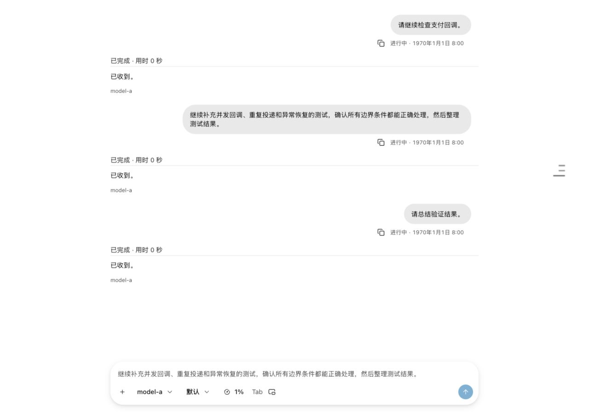
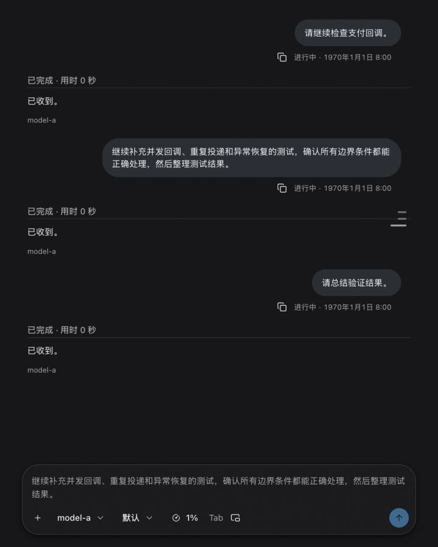
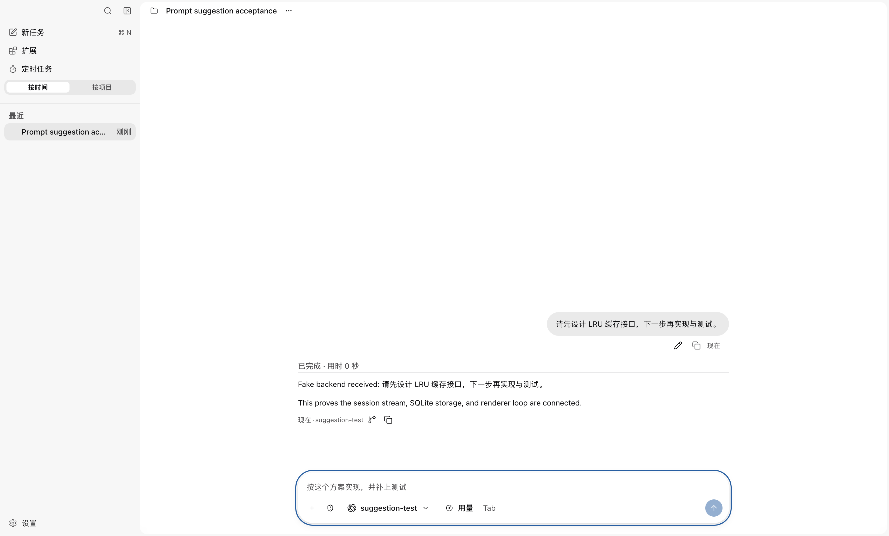
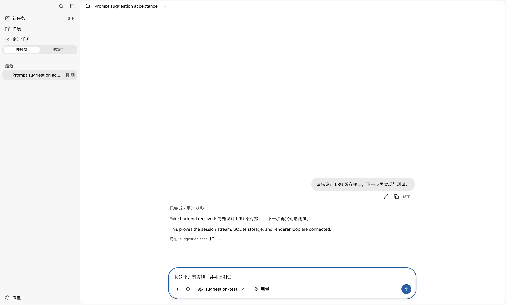

<!--
  Licensed to the Apache Software Foundation (ASF) under one
  or more contributor license agreements.  See the NOTICE file
  distributed with this work for additional information
  regarding copyright ownership.  The ASF licenses this file
  to you under the Apache License, Version 2.0 (the
  "License"); you may not use this file except in compliance
  with the License.  You may obtain a copy of the License at

      http://www.apache.org/licenses/LICENSE-2.0

  Unless required by applicable law or agreed to in writing,
  software distributed under the License is distributed on an
  "AS IS" BASIS, WITHOUT WARRANTIES OR CONDITIONS OF ANY
  KIND, either express or implied.  See the License for the
  specific language governing permissions and limitations
  under the License.
-->

# Prompt-suggestion UI evidence

Validated on 2026-09-23. Suggestions share normal input typography, position and wrapping. Tab or click accepts an editable draft; Enter sends; Esc dismisses.

## WorkHub Storybook

`Product/WorkHub/NextPromptSuggestion` mounts the production WorkHubRoot, controller and Composer with fixture service transport. All four Chromium plays passed at 1280/720px × light/dark, checking exact glyph geometry and typography before/after Tab, no send on acceptance, Enter and Esc. Injecting the previous 12px overlay padding makes the geometry assertion fail. This story is included in the CI smoke catalog; the full catalog was not run locally.

Screenshots below came from the built Storybook in the in-app browser. Assertions ran in Ego Chromium; its screenshot calls timed out.





## Native Electron

The retained [ordinary conversation harness](../prompt-suggestion-smoke/smoke.mjs) and [WorkHub harness](../prompt-suggestion-smoke/workhub-check.mjs) passed through real renderer → preload → main → Runtime Host → controlled HTTP prediction endpoint. Checks cover generation, Tab without sending, native Undo, Enter in the durable transcript, Esc and delayed-result draft preservation. Ordinary conversation checks also cover disabling, deduplication and exact single-line/wrapped text alignment. Replies use FakeBackend; paid-model suggestion quality and other operating systems remain unvalidated.





After building desktop and dependencies:

```sh
node docs/reports/prompt-suggestion-smoke/smoke.mjs
MAKA_SMOKE_MULTILINE=1 node docs/reports/prompt-suggestion-smoke/smoke.mjs
node docs/reports/prompt-suggestion-smoke/workhub-check.mjs
npm --workspace @maka/desktop run build-storybook
```

Native harness output goes to a temporary directory and is not committed. The separate historical React 185 investigation did not reproduce the crash in 2,040 natural cases; this PR does not claim to fix that historical crash.
