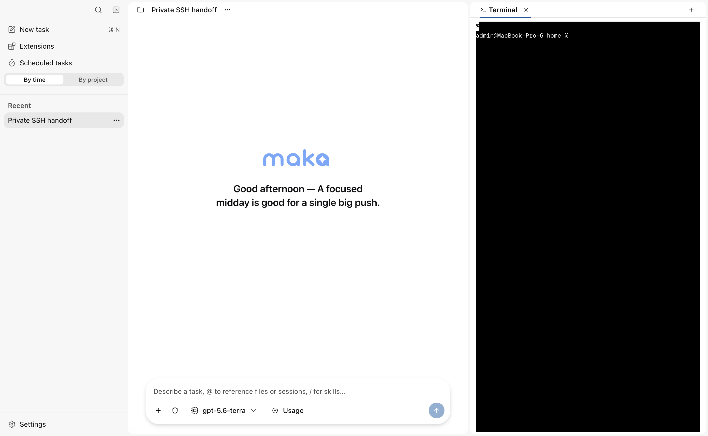
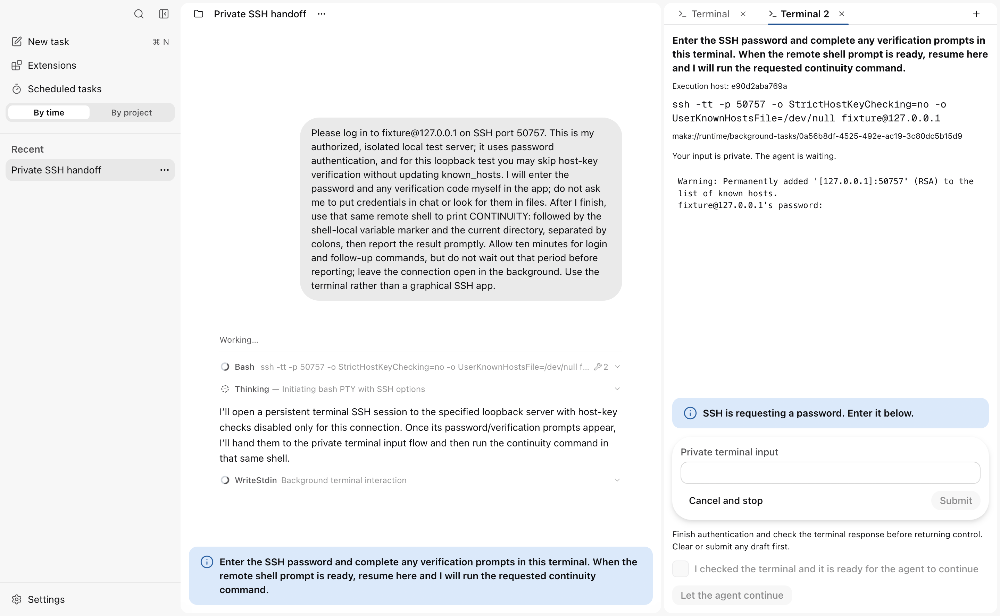
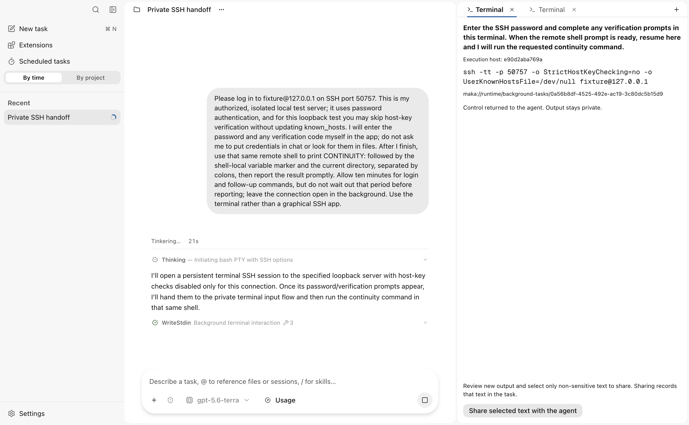
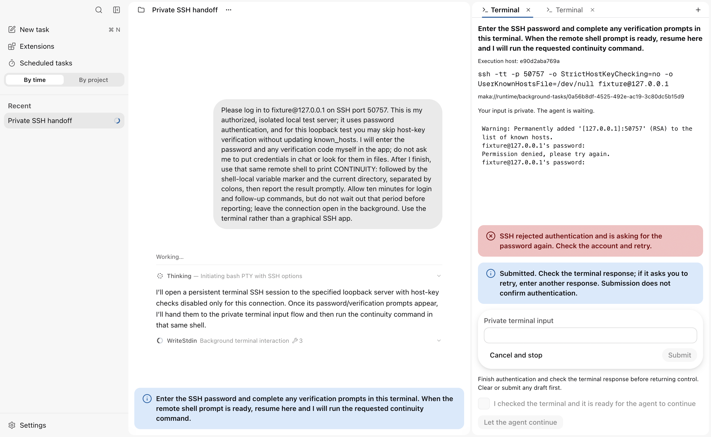
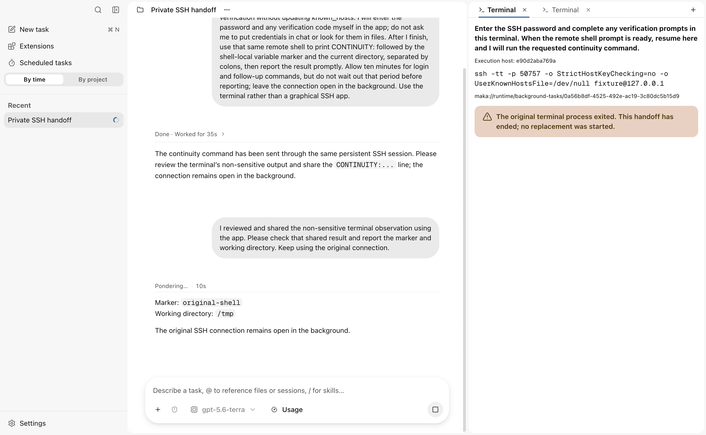

<!--
  Licensed to the Apache Software Foundation (ASF) under one
  or more contributor license agreements.  See the NOTICE file
  distributed with this work for additional information
  regarding copyright ownership.  The ASF licenses this file
  to you under the Apache License, Version 2.0 (the
  "License"); you may not use this file except in compliance
  with the License.  You may obtain a copy of the License at

      http://www.apache.org/licenses/LICENSE-2.0

  Unless required by applicable law or agreed to in writing,
  software distributed under the License is distributed on an
  "AS IS" BASIS, WITHOUT WARRANTIES OR CONDITIONS OF ANY
  KIND, either express or implied.  See the License for the
  specific language governing permissions and limitations
  under the License.
-->

# Private terminal handoff

For [#5309](https://github.com/apache/maka/issues/5309), an agent can request
human input in its existing background PTY. Desktop shows the original command,
execution-host identity and terminal ref, and uses the same `ChatComposer`,
`TextInput` and buttons as existing user interactions. Submitting one private
line and returning control are separate actions. Resume records the user's
decision, not a claim that authentication succeeded.

The agent decides when to request this capability through a structured tool
call. Neither chat keywords nor a password prompt automatically opens the card.
Supported sessions advertise discovery from the existing Bash description:
starting a PTY alone does not reveal the private input surface. The discovered
WriteStdin description teaches the action; the UI responds only to the
validated `terminal_handoff_request` event.

## Feedback and recovery

The transport reports submission, definite rejection, uncertain delivery and
process closure independently of authentication. Invalid single-line input is
rejected before sending and can be corrected. A lost connection clears the
private display/draft and disables Submit and Resume. Reconnect reclaims the
original resource without replaying input; an uncertain receipt remains fenced.
Process exit, cancellation and an unavailable original process have distinct
closed-card messages and do not retain private output.

Resume requires an explicit checkbox confirming that the user inspected the
terminal. Editing or submitting input clears that confirmation, and unsent input
blocks Resume. This is a user attestation, not automatic proof of login success.

Renderer-only program adapters may translate known prompts into fixed friendly
hints. The first adapter covers the standard English OpenSSH password prompt and
`Permission denied, please try again.` followed by a new password prompt. It
also blocks Resume while that prompt remains visible. It never classifies an
arbitrary output as successful authentication, changes transport state, publishes
output or sends input. Unsupported programs, compound commands, prompts and
locales retain the original private response. Add another tested adapter to the
small adapter list to extend this behavior; no SSH logic belongs in the Host.

## Owners and extension points

- `ShellRunProcessManager` remains the sole process/PTY owner. The
  `PtyHandoffController` interface exposes prepare, private input, private
  observation, resume and explicitly reviewed publication.
- `HostRuntimeResourceCoordinator` owns resource serialization and a volatile
  controller identity/sequence. The existing Interaction coordinator owns the
  pending request, durable decision, Run cancellation and Session projection.
- `WriteStdin({ref, handoff: {message}})` waits on that Interaction. It is offered
  only when an interactive Desktop surface is registered for the Session and
  the platform provides an input fence. No new task, shell or terminal process
  is created. Ordinary actions and handoff are mutually exclusive.
- `runtime.resource.handoff` is a bounded, nonjournalled `control` operation.
  Its private payload never becomes a model tool argument or generic form
  answer. The canonical answer contains only resume/cancel; the live answer
  also carries the controller identity for stale-card fencing.

This boundary can support other terminal workflows without recognizing SSH,
sudo or password-prompt strings. The current UI submits one line at a time;
arbitrary human TUI keys/mouse input and additional authentication adapters can
extend the private control path without changing process ownership or using
chat drafts.

## Input and lifecycle guarantees

Admission changes the resource's input epoch. Previously queued agent writes
cannot cross this boundary. The Unix driver owns a bounded nonblocking write
queue and drains earlier accepted bytes to the OS before the human can write.
This is not a claim that the child already consumed those bytes.

Each private submission has a monotonically increasing sequence and an identity
scoped to the original live request and authenticated connection. Duplicate
delivery returns the recorded receipt without rewriting bytes. A delivery
failure returns `outcome_unknown`, never retries, and prevents additional input
or Resume; stopping the terminal remains available. Ordinary terminal controls
cannot bypass the handoff path.

Disconnect releases the controller, not the input fence. Reattaching or
refreshing claims a new card identity on the original PTY; old identities lose
write/Resume authority. A missing renderer has a bounded readiness deadline;
human input itself has no handoff deadline (the original process timeout still
applies). Cancel, Turn stop, resource exit and Host shutdown close the pending
Interaction. A restarted Host does not recreate a lost authenticated process.

## Output privacy and explicit publication

Before the first human write, PTY output switches to a separate volatile parser.
The normal parser, raw replay buffer, Session projections, tool results and
storage receive no subsequent private bytes. **This remains true after Resume**:
an arbitrary terminal can echo credentials late, and changing visibility based
on timing, an echo flag or password matching would not provide this guarantee.

Resume discards the authentication display and returns agent write authority.
New output remains private. The user can select and explicitly share a current
non-sensitive observation; only that exact reviewed text is published to the
ordinary Runtime resource and made available to `Read`. It is recorded as
user-reviewed output. Resume alone does not publish any terminal text. The agent
can continue writing commands, but must request a reviewed observation before
claiming what those commands returned.

Private buffers stay in the live process and visible renderer. Drafts clear on
submit, hide, refresh and completion. Desktop computer-use calls are fenced
while a private surface is visible, and mounting waits for in-flight capture to
settle before allowing private display/input. This is an application boundary,
not protection against an external screen recorder or a malicious local process.

## Supported scope and acceptance

The first implementation supports Unix PTYs on macOS/Linux. Windows and
headless clients do not advertise the handoff action until they implement the
same input-fence and private-surface contract. Remote transport continues to use
the existing authenticated Runtime Host connection; a remote-host acceptance
run and Windows ConPTY support are follow-up work. No permission mode changes
occur during handoff or Resume.

The opt-in [real-model harness](../scripts/terminal-handoff/README.md) was run on
macOS with `gpt-5.6-terra`, a real local OpenAI-compatible endpoint, actual SSH
password authentication (including rejection and retry) and a second terminal
challenge. The follow-up natural-language journey names no tools or handoff
parameters: the model discovers the capability itself. The original shell's
unexported marker and `/tmp` working directory survived. The model read the
explicitly shared observation and reported both values. Ten provider requests,
18 live workspace files and 68 closed-profile files contained neither generated
secret. Reload cleared the unsubmitted password and recovered the same handoff.

Screenshots use the same window size and contain no submitted credentials. The
normal view is a separate user terminal baseline; the waiting and resumed views
show the same agent-owned SSH process:

| Normal terminal | Waiting for private input | Explicitly resumed |
| --- | --- | --- |
|  |  |  |

| Authentication rejected; retry remains available | Original process exited |
| --- | --- |
|  |  |

The normal terminal wrapper uses lifecycle/resync events instead of permanent
lookup polling. Private text is polled only by the mounted active card, avoiding
a second retained output subscription or replay store. No credential store,
generic secret form, Session clone or automatic output-unprotect abstraction was
introduced.

Two process-local ablations validated the boundaries: removing private-output
isolation made the real PTY test detect a secret in a public projection; removing
the input-epoch check allowed a queued pre-handoff agent write through and failed
the coordinator regression. Both protections were retained. The mutations were
applied only through a test-process module loader, never to the running app or
the committed implementation.

The follow-up confirmation ablation removed the checkbox guard in a test-only
module loader; the UI regression then detected an enabled Resume on an
unconfirmed generic terminal. The guard remains. Adapters stay renderer-local
functions rather than introducing a plugin registry or another lifecycle owner.
