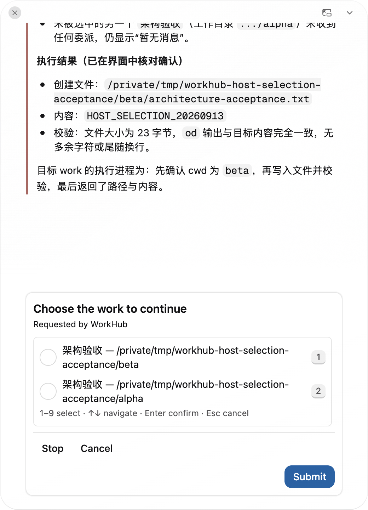

<!--
  Licensed to the Apache Software Foundation (ASF) under one
  or more contributor license agreements.  See the NOTICE file
  distributed with this work for additional information
  regarding copyright ownership.  The ASF licenses this file
  to you under the Apache License, Version 2.0 (the
  "License"); you may not use this file except in compliance
  with the License.  You may obtain a copy of the License at

      http://www.apache.org/licenses/LICENSE-2.0

  Unless required by applicable law or agreed to in writing,
  software distributed under the License is distributed on an
  "AS IS" BASIS, WITHOUT WARRANTIES OR CONDITIONS OF ANY
  KIND, either express or implied.  See the License for the
  specific language governing permissions and limitations
  under the License.
-->

# WorkHub Host 选择交互：架构变更与真实验收

本轮将目标选择从发送前的 renderer 等待流程迁入现有 Host 交互生命周期。生产默认路由策略保持不变，没有注入实验性的 `workHubRoutingModel`。

## 实现边界

- `tasks.select_and_delegate` 接受候选引用和任务内容；Host 从已接收的 Coordination Turn 读取原始用户请求，发布持久化单选 Form。
- 选项的 opaque value 绑定候选引用、Session 和 workspace。Host 接收确切选项后直接交给 Action Gate，模型不再解释答案并二次选目标。
- 交互请求身份包括 Turn、Run、完整操作输入和原始用户内容。重复请求/回应复用同一交互；已派发动作重放既有结果。
- 选择期间其他 work 更新不改变选定身份。选中 work 被移除、归档或移动时拒绝派发。最后一次校验在现有目标 admission 锁内完成。
- Cancel、Stop、Host 关闭走已有交互关闭规则。重启关闭孤立的等待，不重建已丢失的本地 continuation。
- Main 完成进度浮窗到对话窗的完整迁移，renderer 只报告交互展示需求。新发送/明确拒绝后的重试触发提交可见性规则；unknown reconcile 与只读刷新保持独立。
- 删除旧 `targetSelection` 返回值、renderer Promise、Root admission 重载和旧专用 selector 组件。保留普通提问、现有 Form、Action Gate 与不可变路由决定。

## 真实模型与原生应用

macOS、构建后的 Electron/preload/Main/Runtime Host，真实 `deepseek-v4-flash`；没有 `MAKA_E2E`、模型替身、候选注入或窗口状态替身。

独立 profile：`/private/tmp/maka-workhub-host-selection-20260913`。只复用本机连接配置，测试数据在 `/private/tmp/workhub-host-selection-acceptance`。应用已在验收结束后关闭。

| 用例 | 结果 | 可核查事实 |
| --- | --- | --- |
| 默认生产策略触发 Host 选择器 | 通过 | 模型先发现两个同名 work，再调用 `select_and_delegate`；Host 发布 `form_request` |
| renderer 重载保留选择请求 | 通过 | 重载前后 request id 均为 `8707240dd7f79c9d2f1650fa771783afd499e2127b3782cb2cc422b768b870d3` |
| 快捷键选择并执行精确目标 | 通过 | `1`、Enter 选择 beta；beta 的文件内容为 `HOST_SELECTION_20260913`，alpha 文件不存在 |
| 原生进度窗展开显示选择器 | 通过 | 主窗口离开 WorkHub 后，control observe 触发进度展示；待选 Form 显示时浮窗为 520×720、visible=true、focused=false |
| 浮窗中重载 | 通过 | request id `e68fbe45f2d9e25b4568db985b655641baaa3b1860124211442232a738474e4e` 保持不变 |
| Esc 取消后不派发 | 通过 | 模型收到 cancelled 后结束；alpha、beta 均没有 `native-cancelled.txt` |

第一条真实输入：

> 继续“架构验收”这个 work，在选中的工作目录创建 architecture-acceptance.txt，内容严格为 HOST_SELECTION_20260913。现在有两个同名 work，请先让我选择目标，确认后只在选定的 work 中执行。

目标 beta 的 Session 为 `ef15d125-5b12-46fc-adb9-70d2ba5cd30b`；未选中的 alpha 为 `154b395e-ede3-46d7-b424-b8797c88e1c9`。文件为 23 字节，没有尾随换行。

窗口/取消输入：

> 这是一项只读窗口验收。先使用 control observe 观察 Maka，不修改界面。然后准备在“架构验收” work 中创建 native-cancelled.txt，内容为 SHOULD_NOT_EXIST；两个同名 work 必须先让我选择。选择前绝对不要创建文件。如果我取消选择，就结束这次请求，不要重新提问或派发。

这两次真实模型运行也出现了可恢复的工具调用错误：第一次给 tasks 额外传入 status，第二次把 control 与 tasks 并发调用。工具边界拒绝后，模型按正确 schema/顺序重试；没有把它们写作“所有模型工具调用一次通过”。

## Rebase 后复验

最终实现重放到 main `a9f5f6790dc72253ffa3c0d1282f38b2fd58453a`，保留 main 的 Side Conversation 临时消息分组与模型配置变更，协议 epoch 为 151。原有逐轮修复历史保存在本地备份分支，PR 整理为最终实现。

再次启动同一独立 profile 和真实模型，输入：

> 继续“架构验收”这个 work，在选中的目录创建 rebase-acceptance.txt，内容严格为 HOST_SELECTION_REBASED。两个同名 work 必须先让我选择，再只派发到选中的 work。派发成功后简短确认即可。

**通过**：默认生产路径再次发布 Host 单选 Form；按 `2`、Enter 选择 alpha。alpha 的 `rebase-acceptance.txt` 内容严格为 `HOST_SELECTION_REBASED`，beta 同名文件不存在。模型确认派发后结束，测试另外读取实际文件验证了执行结果。证据保存在本地验收目录的 `rebase-result.json` 与 `rebase-transcript.txt`。

合并后的全量构建、Desktop typecheck、Desktop 2,584 项测试、UI 438 项测试、Host 199 项相关测试、WorkHub Storybook 交互和六项原生 Electron 用例通过。Host 的既有 Resume/Stop 测试曾在并行构建时出现目标先完成的竞争；测试后端改为等待显式 Stop，保留 `stop_delivered` 和终态断言，没有修改生产停止逻辑或增加超时。

## 自动化保护

Host 测试覆盖默认生产装配、同身份重放、候选变化、取消、Stop、伪造选项、并发请求，以及容量拒绝时所有等待者均结束。共享 UI 测试覆盖初始 prompt 的状态投影；WorkHub stories 验证数字键/方向键/Enter/Esc 与回应失败重试。

Main 测试验证进度绘制先到/交互先到都收敛到同一窗口状态，以及旧绘制确认、被动显示和用户隐藏。现有六项 Electron 用例继续验证 preload/Main、持久化重建及原生窗口/焦点边界，没有新增 Electron 测试声明。

验收中发现的首条临时 prompt 状态遗漏已接入既有状态投影；Form 的 Esc 文案改为取消。另将一个使用固定 2026-09-13 日期的 scheduled-task 测试冻结时钟，避免当天过后因机器时间漂移而失败；没有改变其生产调度逻辑。
