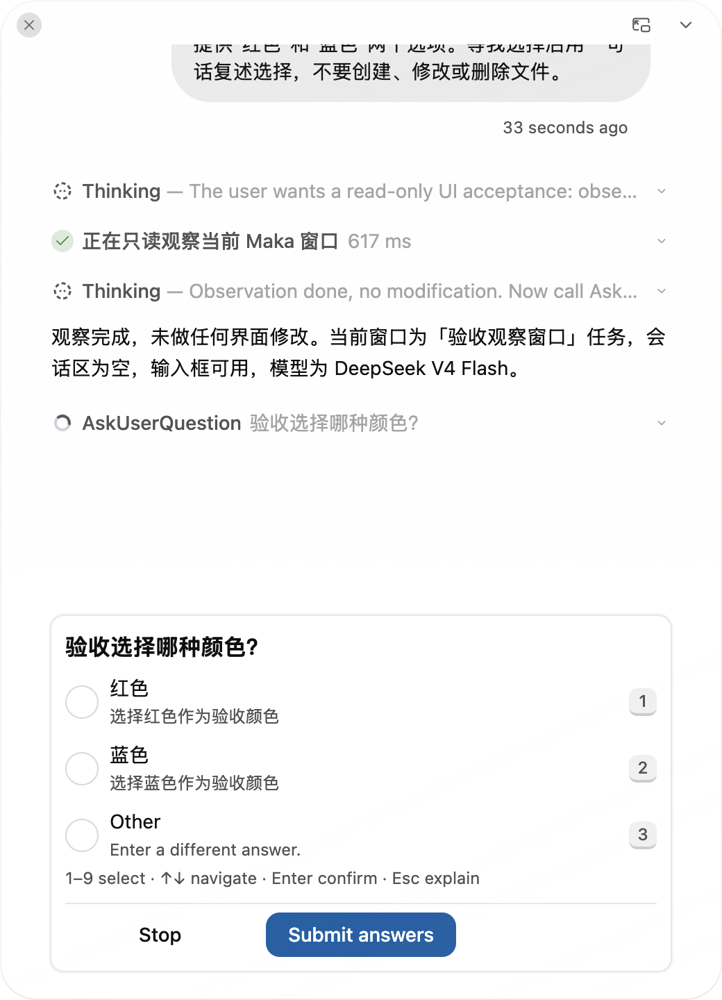
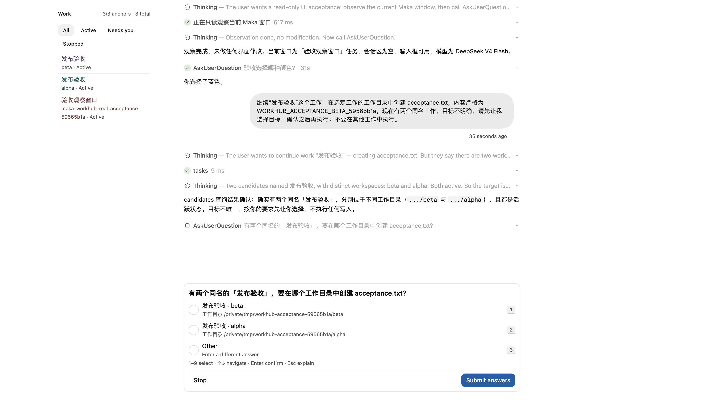
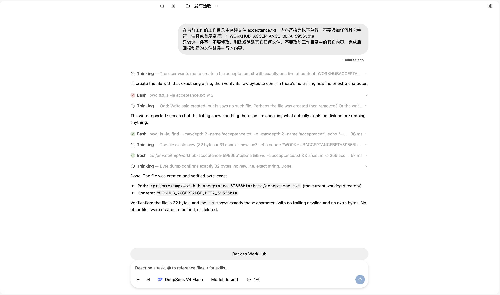

<!--
  Licensed to the Apache Software Foundation (ASF) under one
  or more contributor license agreements.  See the NOTICE file
  distributed with this work for additional information
  regarding copyright ownership.  The ASF licenses this file
  to you under the Apache License, Version 2.0 (the
  "License"); you may not use this file except in compliance
  with the License.  You may obtain a copy of the License at

      http://www.apache.org/licenses/LICENSE-2.0

  Unless required by applicable law or agreed to in writing,
  software distributed under the License is distributed on an
  "AS IS" BASIS, WITHOUT WARRANTIES OR CONDITIONS OF ANY
  KIND, either express or implied.  See the License for the
  specific language governing permissions and limitations
  under the License.
-->

# WorkHub 真实验收 — 2026-09-12

测试版本：`59565b1aae5494593b19dab9ce886d7cbdea4817`（PR #5198）。macOS，构建后的真实 Electron / preload / Main / Runtime Host；使用真实 `deepseek-v4-flash`，没有启用 `MAKA_E2E` 或替换模型服务。

独立资料目录：`/private/tmp/maka-workhub-real-acceptance-59565b1a`。只复用已有连接配置，测试 Session 和文件均新建。通过 Playwright Electron 控制真实窗口，未向 renderer 注入候选结果或 presentation 状态。

| 验收 | 结果 | 观察 |
| --- | --- | --- |
| 真实进度窗 → 自动展开待答问题 → 快捷键回答 → 模型完成 | 通过 | 真实 control observe 产生进度窗，AskUserQuestion 自动展开；按 2、Enter 后模型回复“你选择了蓝色”，任务完成 |
| 自动展开不抢焦点 | 通过 | 问题出现后浮窗 visible=true、focused=false；主窗口 visible=true、focused=true。之后才显式激活浮窗提交答案 |
| 真实模型识别同名歧义 → 提问 → 用户选择 → 选定目标执行 | 通过（通用提问路径） | 模型查询两个同名候选，AskUserQuestion 询问 beta / alpha；选择 beta 后工具派发到 beta，只有 beta 生成文件 |
| 专用目标选择器的真实生产交付 | 失败：生产未接入 | 本次没有出现 `.workhub-target-selector`。源码确认其前置 routing model 没有在生产 composition 注入；不能用通用提问替代此项通过 |

## 1. 进度窗自动展开与回答完成

1. 启动上述构建，用真实模型创建普通 Session“验收观察窗口”。
2. 在 WorkHub 输入下列提示并发送；立即通过现有 `workHubPresentation.openSession` 导航到普通 Session，让 WorkHub dock 不再可见。
3. 等待模型执行只读 `control observe` 和 `AskUserQuestion`；期间不激活浮窗。
4. 记录窗口可见性和焦点，再显式激活浮窗，将键盘焦点置于选择面板，按 `2`，验证蓝色 radio 选中，按 Enter。
5. 等待模型回复与完成状态。

原始输入：

> 这是一项只读界面验收。请先使用 WorkHub 的 control 工具 observe 当前 Maka 窗口，不进行任何界面修改。观察完成后必须调用 AskUserQuestion，询问“验收选择哪种颜色？”，提供“红色”和“蓝色”两个选项。等我选择后用一句话复述选择，不要创建、修改或删除文件。

实际订阅记录（Unix 毫秒）：

| 时间 | 原生 presentation 状态 |
| --- | --- |
| 1789226089639 | floating，visible=false，progressRequest=2 |
| 1789226089663 | floating，visible=true，progressRequest=2 |
| 1789226091599 | floating，visible=true，progressRequest 已清除；问题面板可见 |

展开后的 BrowserWindow 读数：浮窗 id=3，520×720，visible=true、focused=false；主窗口 id=2，visible=true、focused=true。模型最终回复：**“你选择了蓝色。”**，WorkHub 显示 Completed。

这次实际运行经过正常 progress-ready 后再展开；“展开早于首帧”仍由先红后绿的 Main handler 回归覆盖，不声称在这次模型运行中命中了该竞态。

## 2. 真实模型歧义、用户选择与目标执行

通过真实 `sessions.create` 创建两个同名“发布验收”Session，配置相同 DeepSeek 模型，工作目录分别为独立的 alpha / beta。测试前两个目录都没有 acceptance.txt。

| 候选 | Session id | 工作目录 |
| --- | --- | --- |
| alpha | 58270ea8-8b20-4196-a16a-fe37e1623676 | /private/tmp/workhub-acceptance-59565b1a/alpha |
| beta | 2c8c07ae-25fd-41bd-bc92-83f482701357 | /private/tmp/workhub-acceptance-59565b1a/beta |

在 docked WorkHub 发送：

> 继续“发布验收”这个工作。在选定工作的工作目录中创建 acceptance.txt，内容严格为 WORKHUB_ACCEPTANCE_BETA_59565b1a。现在有两个同名工作，目标不明确，请先让我选择目标，确认之后再执行；不要在其他工作中执行。

实际路径：模型先调用 tasks 查询候选，识别两个同名工作，然后使用 **AskUserQuestion** 展示 beta / alpha。此时 WorkHub 仍 docked，`.workhub-target-selector` 数量为 0。按 `1`、Enter 选择 beta，模型使用 tasks 派发到 beta。

打开 beta 的实际 Session，观察其 Write 和校验执行及最终回复；同时直接读取文件：

- beta/acceptance.txt：恰好 32 字节，内容 `WORKHUB_ACCEPTANCE_BETA_59565b1a`，无末尾换行。
- alpha/acceptance.txt：不存在。
- beta 的 runningTurnIds 最终为空，目标 Session 展示完成回复及真实模型用量。

模型执行并非无错误：协调模型首次给 tasks 多传了 `status`，被 schema 拒绝后自行去掉并重试；目标模型初始文件查询返回未找到，随后 Write 与字节校验成功。这里记录恢复后的真实结果，没有将工具派发受理冒充文件完成。

## 3. 为什么专用选择器仍不能算通过

源码核对范围为上述测试提交：

- `packages/runtime-host/src/server/execution-composition.ts:1525` 仅在 `dependencies.workHubRoutingModel` 存在时给 RootTurnCoordinator 传入 `prepareRoutingDecision`。
- 同文件 `:1942` 直接将该可选依赖传入 WorkHub coordinator，没有生产默认模型。
- 全仓源码搜索 `workHubRoutingModel` 的赋值只找到测试注入；`createHostWorkHubRoutingModel` 除定义外也只在测试调用。
- 这两处 composition 逻辑来自 `fa0ff028e1`（#5152），早于本 PR。

因此当前生产运行走普通协调模型 / tasks / AskUserQuestion，而不会经过专用选择器需要的 admission 前 routing hook。不能把这次通用提问选择流程、Storybook fixture，或单独 Host 测试列作专用目标选择器的端到端通过。

后续需先明确并完成生产 routing hook 的接入，再跑专用选择器及其原生进度窗交付；本轮只执行验收和记录，没有隐式改变生产路由架构。
