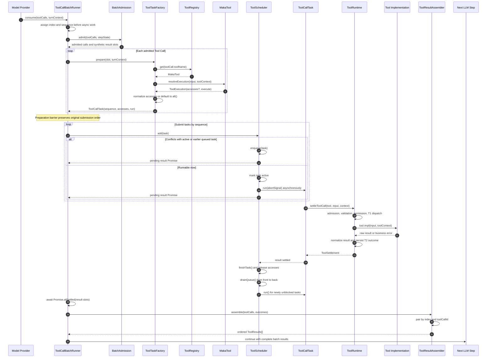

<!--
  Licensed to the Apache Software Foundation (ASF) under one
  or more contributor license agreements.  See the NOTICE file
  distributed with this work for additional information
  regarding copyright ownership.  The ASF licenses this file
  to you under the Apache License, Version 2.0 (the
  "License"); you may not use this file except in compliance
  with the License.  You may obtain a copy of the License at

      http://www.apache.org/licenses/LICENSE-2.0

  Unless required by applicable law or agreed to in writing,
  software distributed under the License is distributed on an
  "AS IS" BASIS, WITHOUT WARRANTIES OR CONDITIONS OF ANY
  KIND, either express or implied.  See the License for the
  specific language governing permissions and limitations
  under the License.
-->

# ToolRuntime 基于 Task 与 Access 的资源感知调度架构

## 1. 文档状态

- 状态：架构设计提案
- 范围：同一个 assistant step 返回的本地 Tool Call batch
- 目标：在保留无冲突工具并发能力的同时，避免共享资源上的读写竞态，并确保 Tool Result 按原始 Tool Call 顺序返回
- 关联 Issue：[`apache/maka#4487`](https://github.com/apache/maka/issues/4487)

## 2. 背景

当前 Runtime 使用 `Promise.allSettled()` 并发消费一个 assistant step 中的本地 Tool Call：

```text
ToolCalls
    ↓
returnedToolCalls.map(settleToolCall)
    ↓
Promise.allSettled
    ↓
下一次 LLM step
```

该模型能够实现 fan-out/fan-in，但除 `exclusive_step` 外，Runtime 不理解不同调用访问的共享资源。两个不依赖彼此返回值的 Tool Call，仍可能竞争同一文件、Session 状态、终端、浏览器标签页或远端服务。

本方案把每个 Tool Call 封装成一个 `ToolCallTask`。工具负责根据本次调用参数声明 `accesses`，Scheduler 根据资源冲突关系决定 Task 的启动时间，Batch Runner 最后按 Tool Call 原始顺序组装 Tool Results。

## 3. 设计目标

1. 每个 Tool Call 对应一个可独立调度、且最多启动一次的 Task。
2. 资源不冲突的 Task 尽早并发执行。
3. 资源冲突的 Task 按模型生成顺序执行。
4. 后到的非冲突 Task 可以越过正在等待的 Task。
5. 防止持续到来的只读 Task 越过已经排队的写 Task。
6. Task 的调度顺序、完成顺序和 Tool Result 返回顺序相互解耦。
7. 工具未声明资源范围时采用保守的 fail-closed 策略。
8. 保留现有 durable settlement、事件发布、取消和 Turn 级错误边界。

## 4. 非目标

第一阶段不解决以下问题：

- 不推导 Bash 命令的精确副作用集合。
- 不保证不同 Turn、Session、Agent 或 Runtime 进程之间的资源互斥。
- 不为整个 batch 构建静态 DAG。
- 不改变模型侧 Tool Call/Tool Result 协议。
- 不用 Scheduler 替代参数校验、权限判断、sandbox 或持久化逻辑。

## 5. 核心设计决策

### 5.1 Access 是调用级数据

Access 由工具根据本次 Tool Call 的参数生成，而不是 Tool 的静态属性，也不由模型直接生成。

```text
Write({ path: "a.ts" }) → writeFile(a.ts)
Write({ path: "b.ts" }) → writeFile(b.ts)
```

### 5.2 一个 Task 包含多个 Access

字段使用 `accesses` 而不是单数 `access`。一个 Task 可能同时访问多个资源，例如：

```text
Copy(source, target)
    → read(source)
    → write(target)
```

Task 只有在全部 accesses 都可用时才能启动，不允许先占用部分资源、再等待其余资源。

### 5.3 Scheduler 不理解具体 Tool

领域层 Task 可以保存 Tool 对象用于执行和诊断，但 Scheduler 只能依赖：

- Task 顺序号；
- 标准化后的 accesses；
- 唯一的执行入口 `run()`。

Scheduler 不允许根据 `tool.name` 或原始参数编写特殊分支。

### 5.4 未声明 Access 时默认 `all`

只有能够证明资源范围的工具才能声明精确 access；只有能够证明不访问 Scheduler 管理资源的工具才能声明 `none`。

```text
显式声明 accesses → 使用声明值
未声明 accesses   → all
不执行真实副作用   → none
```

### 5.5 `exclusive_step` 独立于资源调度

`exclusive_step` 是控制面和因果边界；`all` 是数据面资源互斥：

- `all` 可以在当前 batch 内等待并执行；
- `exclusive_step` 要求独占 assistant step，冲突调用应保持现有 admission rejection/synthetic result 语义。

因此不能把 `exclusive_step` 简化为 `accesses: all()`。

## 6. 总体架构

```text
LLM 返回有序 ToolCalls
          │
          ▼
┌─────────────────────────────┐
│ ToolCallBatchRunner         │
│ 分配固定 index/sequence     │
└──────────────┬──────────────┘
               ▼
┌─────────────────────────────┐
│ BatchAdmission              │
│ exclusive_step / step 边界  │
└──────────────┬──────────────┘
               ▼
┌─────────────────────────────┐
│ ToolTaskFactory             │
│ 查找 Tool                   │
│ 校验并规范化参数            │
│ resolveExecution()          │
│ 生成 accesses 与 run()      │
└──────────────┬──────────────┘
               ▼
┌─────────────────────────────┐
│ ToolScheduler               │
│ 无冲突 Task 并发            │
│ 冲突 Task 按 sequence 排队  │
└──────────────┬──────────────┘
               ▼
       Task 可以乱序完成
               │
               ▼
┌─────────────────────────────┐
│ ToolResultAssembler         │
│ 按原始 index 回填结果       │
└──────────────┬──────────────┘
               ▼
       有序 ToolResults[]
```

### 6.1 对象调用图

下面的时序图描述新方案中各对象的调用关系。实线表示调用，虚线表示返回；Task 的实际完成顺序可以与提交顺序不同。



关键对象调用链：

```text
ToolCallBatchRunner
  → BatchAdmission
  → ToolTaskFactory
      → ToolRegistry
      → MakaTool.resolveExecution()
  → ToolScheduler.add()
      → ToolCallTask.run()
          → ToolRuntime.settleToolCall()
              → Tool implementation
      → finishTask()
      → drainQueue()
  → ToolResultAssembler.assemble()
  → Next LLM Step
```

其中，`ToolScheduler.add()` 返回的是与原始 result slot 绑定的 Promise。Scheduler 只控制 `run()` 何时被调用；`ToolResultAssembler` 不读取 Scheduler 的完成顺序，只按照预先分配的 `index/sequence` 回填结果。

## 7. 组件职责

### 7.1 ToolCallBatchRunner

负责一个 Tool Call batch 的完整生命周期：

1. 保存 Provider 返回的 Tool Call 顺序。
2. 在任何异步工作之前分配 `index` 和 `sequence`。
3. 执行 step admission。
4. 调用 `ToolTaskFactory` 准备 Task。
5. 按原始顺序向 Scheduler 提交 Task。
6. 等待整批 Task settle。
7. 调用 `ToolResultAssembler` 生成有序结果。

### 7.2 ToolTaskFactory

负责把一个具体 Tool Call 转换成执行计划：

1. 根据名称查找 Tool。
2. 校验和解析参数。
3. 把路径、Session ID、Tab ID 等转换为稳定资源标识。
4. 调用 Tool 的 `resolveExecution()`。
5. 对未声明的 accesses 补充 `all()`。
6. 构造只允许启动一次的 `run()`。
7. 对工具不存在、参数错误、hook 阻止等情况创建 resolved Task。

### 7.3 ToolScheduler

只回答一个问题：一个已经准备完成的 Task 现在能否启动？

它不负责：

- Tool 参数校验；
- 权限审批；
- sandbox；
- Tool Result 格式化；
- RuntimeEvent 持久化；
- Tool Result 的最终返回顺序。

### 7.4 ToolRuntime

保留单次调用的可靠执行边界：

```text
run()
  → executeTool()/settleToolCall()
  → 权限与可用性检查
  → T1 durable dispatch
  → tool_start
  → tool.impl()
  → 结果归一化
  → T2 durable outcome
  → tool_result
  → ToolSettlement
```

Scheduler 调度的是整个 settlement，而不是绕过 ToolRuntime 直接调用 `tool.impl()`。

### 7.5 ToolResultAssembler

负责把 Task outcome 转换成模型协议需要的 Tool Result，并保证：

- 每个原始 Tool Call 恰好对应一个结果槽位；
- 最终数组按原始 Tool Call 顺序排列；
- Tool Call ID 与 Tool Result ID 正确配对；
- 基础设施级失败不会被误包装成普通业务错误。

## 8. 领域模型

### 8.1 ToolCallTask

```ts
interface ToolCallTask<Result = ToolSettlement> {
  readonly id: string;
  readonly sequence: number;
  readonly toolCall: ToolCallPart;
  readonly tool: MakaTool;
  readonly input: unknown;
  readonly accesses: ToolAccesses;
  readonly run: (signal: AbortSignal) => Promise<Result>;
}
```

`tool` 可以被 Task 保存，但 Scheduler 不直接读取它。

### 8.2 SchedulerTask

```ts
interface SchedulerTask<Result> {
  readonly id: string;
  readonly sequence: number;
  readonly accesses: ToolAccesses;
  readonly run: () => Promise<Result>;
}

interface ScheduledTask<Result> extends SchedulerTask<Result> {
  state: "queued" | "active" | "finished";
  readonly result: Promise<Result>;
}
```

合法状态转换：

```text
new → queued → active → finished
new → active → finished
```

禁止：

- `active → queued`；
- `finished → active`；
- 同一个 Task 同时存在于 active 和 queued；
- 同一个 Task 多次调用 `run()`。

## 9. Resource Access 模型

### 9.1 类型定义

```ts
type ToolAccesses = readonly ResourceAccess[];

type ResourceAccess =
  | {
      readonly kind: "file";
      readonly path: string;
      readonly operation: "read" | "search" | "write" | "readwrite";
      readonly recursive?: boolean;
    }
  | {
      readonly kind: "key";
      readonly key: string;
      readonly operation: "read" | "write";
    }
  | {
      readonly kind: "all";
    };
```

### 9.2 特殊集合

```ts
ToolAccesses.none() // []
ToolAccesses.all()  // [{ kind: "all" }]
```

- `none`：不访问当前 Scheduler 建模的共享资源。
- `all`：资源范围未知，与任意非空 accesses 冲突。
- `all` 与 `none` 不冲突，因为 `none` 不占用资源。

`none` 不等于“工具没有任何外部副作用”，只表示它不访问当前 Scheduler 管理的资源。Web 请求的连接数、QPS 和预算应由独立的容量控制处理。

### 9.3 文件路径规范化

文件 access 进入 Scheduler 前必须完成：

- 转换为绝对路径；
- 消解 `.` 和 `..`；
- 统一路径分隔符；
- 去除无意义的尾部分隔符；
- 按平台决定大小写敏感性；
- 明确单文件或递归目录范围。

Scheduler 的冲突判断不得执行文件系统 I/O。符号链接和 junction 如需归并，应在 Task 准备阶段生成 canonical resource identity。

### 9.4 逻辑资源 Key

非文件资源使用带命名空间的稳定 key：

```text
session:{sessionId}:todo
session:{sessionId}:goal
execution:{executionId}:plan
terminal:{sessionId}:{ref}
browser:{browserSessionId}:tab:{tabId}
computer:{deviceId}:window:{windowId}
mcp:{serverId}:session:{sessionId}
```

Key 的生成属于 ToolTaskFactory 或具体 Tool，不属于 Scheduler。

## 10. 冲突模型

### 10.1 Task 级冲突

两个 Task 的 accesses 做笛卡尔积比较，只要存在一对资源 access 冲突，两个 Task 就冲突：

```ts
function tasksConflict(left: ToolAccesses, right: ToolAccesses): boolean {
  return left.some(a => right.some(b => accessesConflict(a, b)));
}
```

### 10.2 读写冲突

| 左 / 右 | read | search | write | readwrite |
|---|---:|---:|---:|---:|
| read | 否 | 否 | 是 | 是 |
| search | 否 | 否 | 是 | 是 |
| write | 是 | 是 | 是 | 是 |
| readwrite | 是 | 是 | 是 | 是 |

只有操作类型可能冲突且资源范围重叠时，才构成实际冲突。

### 10.3 文件范围重叠

以下任一条件成立即为重叠：

1. 两个标准化路径完全相同。
2. 左侧为递归访问，右侧位于左侧目录树内。
3. 右侧为递归访问，左侧位于右侧目录树内。

父子关系必须按照路径分段判断：

```text
/repo/src  是 /repo/src/a.ts 的父目录
/repo/src  不是 /repo/src2/a.ts 的父目录
```

冲突函数必须满足对称性：

```text
conflict(A, B) == conflict(B, A)
```

## 11. Access 生成协议

建议扩展 Tool contract：

```ts
interface ToolExecution<Result> {
  readonly accesses?: ToolAccesses;
  readonly execute: () => Promise<Result>;
}

interface MakaTool<Input, Result> {
  resolveExecution(
    input: Input,
    context: ToolContext,
  ): ToolExecution<Result> | Promise<ToolExecution<Result>>;
}
```

Task Factory 的兜底规则：

```ts
const execution = await tool.resolveExecution(input, context);
const accesses = execution.accesses ?? ToolAccesses.all();
```

工具不存在、参数校验失败、被 hook 阻止、admission 拒绝或已经产生 synthetic result 时，不会执行真实副作用，应创建 `none()` Task 或直接创建 resolved result slot。

## 12. 推荐的工具映射

| 工具类别 | 建议 Access |
|---|---|
| `Read` / `ReadMediaFile` | `readFile(resolvedPath)` |
| `Write` | `writeFile(resolvedPath)` |
| `Edit` / `FormatJson` | `readWriteFile(resolvedPath)` |
| `Glob` / `Grep` | `searchTree(resolvedRootOrWorkspace)` |
| `apply_patch` | 补丁涉及的所有文件 `writeFile` |
| `Bash` | 默认 `all()`；后续允许调用方声明精确资源 |
| `todo_read` | `read(session:{id}:todo)` |
| `todo_write` | `write(session:{id}:todo)` |
| Goal 查询 | `read(session:{id}:goal)` |
| Goal 修改 | `write(session:{id}:goal)` |
| Plan 查询 | `read(execution:{id}:plan)` |
| Plan 修改 | `write(execution:{id}:plan)` |
| Terminal mutation | `write(terminal:{sessionId}:{ref})` |
| Browser mutation | `write(browser:{sessionId}:tab:{tabId})` |
| Computer mutation | `write(computer:{deviceId}:window:{windowId})` |
| WebSearch / WebFetch | `none()`，另设 provider 容量限制 |
| MCP read-only | server 容量限制内的 read key |
| MCP unknown/mutation | server/session/resource write key，无法确定则 `all()` |
| synthetic result | `none()` |

## 13. Scheduler 算法

### 13.1 状态

```ts
activeTasks: ScheduledTask[];
queuedTasks: ScheduledTask[];
nextSequence: number;
```

### 13.2 阻塞条件

```ts
function isBlocked(
  task: ScheduledTask,
  active: readonly ScheduledTask[],
  queuedBefore: readonly ScheduledTask[],
): boolean {
  return (
    conflictsWithAny(task, active) ||
    conflictsWithAny(task, queuedBefore)
  );
}
```

检查 active 保证资源安全；检查前序 queued 保证冲突顺序和 writer 公平性。

示例：

```text
active: R1 = read(a)
queued: W  = write(a)
new:    R2 = read(a)
```

虽然 R2 不与 R1 冲突，但它与更早排队的 W 冲突，所以 R2 必须排在 W 后面。否则持续到来的 reader 会导致 writer starvation。

### 13.3 添加 Task

```ts
function add<Result>(task: SchedulerTask<Result>): Promise<Result> {
  const scheduled = createScheduledTask(task);

  if (isBlocked(scheduled, activeTasks, queuedTasks)) {
    queuedTasks.push(scheduled);
  } else {
    startTask(scheduled);
  }

  return scheduled.result;
}
```

新 Task 可以越过前序 queued Task，但前提是二者不存在资源冲突。

### 13.4 启动 Task

启动前必须先将 Task 放入 active，确保同步到来的下一次 `add()` 能观察到资源已经被占用：

```ts
function startTask(task: ScheduledTask): void {
  assert(task.state === "queued");
  task.state = "active";
  activeTasks.push(task);

  let started: Promise<unknown>;
  try {
    started = Promise.resolve(task.run());
  } catch (error) {
    started = Promise.reject(error);
  }

  void started
    .then(task.resolve, task.reject)
    .finally(() => finishTask(task));
}
```

同步抛错也必须进入统一的异步完成路径，避免同步重入导致队列状态损坏。

### 13.5 完成和重扫

```ts
function finishTask(task: ScheduledTask): void {
  if (task.state !== "active") return;

  remove(activeTasks, task);
  task.state = "finished";
  drainQueue();
}
```

队列从前向后重扫：

```ts
function drainQueue(): void {
  const stillQueued: ScheduledTask[] = [];

  for (const task of queuedTasks) {
    if (isBlocked(task, activeTasks, stillQueued)) {
      stillQueued.push(task);
    } else {
      startTask(task);
    }
  }

  queuedTasks = stillQueued;
}
```

一次重扫可以启动多个互不冲突的 Task，不应只消费队头一个 Task。

### 13.6 调度示例

按顺序提交：

```text
T1 = read(a)
T2 = write(a)
T3 = read(a)
T4 = write(b)
```

提交后：

```text
T1：启动
T2：与 T1 冲突，排队
T3：与前序 queued T2 冲突，排队
T4：与 active 和 queued 均不冲突，启动

active = [T1, T4]
queued = [T2, T3]
```

T1 完成后：

```text
T2：启动
T3：与刚启动的 T2 冲突，继续等待
```

T2 完成后，T3 启动。

## 14. 顺序保证

必须区分三种顺序：

```text
模型生成顺序 ≠ Task 完成顺序 ≠ 实时事件顺序
```

### 14.1 Sequence 分配

`sequence` 必须在任何异步准备工作之前，按照 Provider 返回数组的 index 分配：

```ts
const slots = toolCalls.map((toolCall, index) => ({
  index,
  sequence: index,
  toolCall,
}));
```

如果 `resolveExecution()` 是异步的，不能按照“准备完成顺序”提交 Scheduler，否则资源冲突 Task 的先后关系会偏离模型生成顺序。

第一版采用 preparation barrier：

1. 先创建所有有固定 index 的 slot。
2. 可以并发准备 execution plan。
3. 等所有 plan 准备完成。
4. 严格按 index 调用 `scheduler.add()`。

### 14.2 Result Slot

每个原始 Tool Call 始终保留一个 pending result slot：

```ts
const pendingResults = preparedSlots.map(slot => {
  if (slot.syntheticResult) {
    return Promise.resolve(slot.syntheticResult);
  }

  return scheduler.add(slot.task);
});
```

### 14.3 有序组装

```ts
const outcomes = await Promise.allSettled(pendingResults);

const toolResults = outcomes.map((outcome, index) =>
  toToolResult(toolCalls[index], outcome),
);
```

`Promise.allSettled()` 允许 Task 乱序完成，但返回数组仍与输入 Promise 保持相同索引。

实时 `tool_start`、`tool_result` 事件可以按实际发生顺序发布；事件必须携带 `toolCallId` 和 `sequence`，不能依赖事件抵达顺序完成配对。

## 15. `exclusive_step` Admission

资源调度前保留现有 step admission：

```text
ToolCalls
    ↓
exclusive_step admission
    ├─ admitted → 准备并执行
    └─ rejected → synthetic Tool Result
```

建议第一阶段保持既有行为，避免把资源调度改造与控制面语义变更混在一起：

- `exclusive_step` 作为首个被接纳调用时执行，后续冲突调用被拒绝；
- 普通调用已经被接纳后遇到 `exclusive_step`，该 exclusive 调用被拒绝；
- admission rejection 不执行真实副作用，使用 `none()` 或直接 resolved slot；
- `AskUserQuestion`、权限请求和 `SubmitPlan` 等控制工具继续通过此机制形成明确的 step 边界。

## 16. 失败语义

### 16.1 模型可见失败

以下失败应归一化为正常 Tool Result，Task Promise 可以 fulfilled：

- 参数错误；
- 工具不存在；
- 权限被拒绝；
- admission 被拒绝；
- Tool 业务错误；
- 可确认没有产生不确定副作用的执行失败。

### 16.2 Turn 级失败

以下失败不得伪装成普通 Tool Result：

- T1/T2 durable commit 失败；
- 无法判断外部副作用是否已经发生；
- Runtime ledger 或事件一致性被破坏；
- Scheduler 内部不变量被破坏。

Batch Runner 使用 `Promise.allSettled()` 等待全部 Task 进入终态后，再把基础设施级 rejection 提升为 Turn 级错误。

一个普通 Tool 失败不会自动取消同批其他 Task。

## 17. 取消和超时

所有 Task 共享 Turn 的 abort signal，但 queued 和 active Task 的处理不同：

### 17.1 Queued Task

- abort 后不得调用 `run()`；
- 必须从 queued 中移除；
- result Promise 必须 settle，不能永久悬挂；
- 根据 Turn 协议转换为 cancellation result 或 rejection。

### 17.2 Active Task

- 把 abort signal 传递给 ToolRuntime 和 Tool 实现；
- Tool 实现应尽快终止可取消操作；
- 无论成功、失败还是取消，最终都必须释放 active 状态并触发 `drainQueue()`。

## 18. 容量限制

资源冲突和容量限制是两个不同问题：

- 资源冲突回答“两个 Task 能否安全地同时运行”；
- 容量限制回答“系统当前最多允许多少个 Task 同时运行”。

不要通过伪造资源冲突表达 API QPS、进程数或连接数限制。建议为 Scheduler 或外围 Coordinator 增加独立 capacity policy：

```ts
interface CapacityRequest {
  readonly key: string;
  readonly units?: number;
}
```

典型 key：

```text
provider:web-search
mcp-server:{serverId}
subagent-spawn
process:workspace:{workspaceId}
```

第一阶段可以只实现资源冲突，容量限制作为后续扩展。

## 19. Scheduler 生命周期和协调范围

第一阶段采用 batch-local Scheduler：

```text
一个 assistant step
    → 一个 Tool Call batch
    → 一个 ToolScheduler
    → batch 完成后销毁
```

它能够解决同一 batch 内的竞态，但不能阻止以下跨边界冲突：

- 两个并行 Turn 修改同一 workspace 文件；
- 父 Agent 与子 Agent 修改同一资源；
- 不同 Runtime 进程操作同一终端或浏览器会话。

如果未来需要跨 batch 保证，应抽取共享 `ResourceCoordinator`：

```text
Batch ToolScheduler
        ↓
Workspace/Session ResourceCoordinator
        ↓
Runtime Host
```

共享 Coordinator 可以复用相同的 `ResourceAccess` 和冲突模型，但它需要额外处理租约、进程退出、恢复和跨进程一致性，不属于第一阶段范围。

## 20. 可观察性

建议为每个 Task 记录：

- `toolCallId`；
- `sequence`；
- Tool 名称；
- accesses 摘要；
- `queuedAt`；
- `startedAt`；
- `finishedAt`；
- queue wait duration；
- execution duration；
- blocking task/resource；
- settlement 类型。

推荐事件：

```text
tool_task_prepared
tool_task_queued
tool_task_started
tool_task_finished
tool_task_cancelled
```

`queued` 是调度状态，不应被包装成最终 Tool Result。模型最终只应看到执行结果、业务失败、admission rejection 或取消结果。

## 21. 必须保持的不变量

1. `activeTasks` 中任意两个 Task 都不冲突。
2. 同一个 Task 最多调用一次 `run()`。
3. 同一个 Task 不会同时存在于 active 和 queued。
4. finished Task 不再存在于 active 或 queued。
5. 后到的 Task 不会越过与它冲突的前序 queued Task。
6. 非冲突 Task 不会仅因为队列非空而等待。
7. Task 成功、失败、取消或同步抛错后都会释放 active 状态。
8. 一次资源释放后，所有当前满足条件的 Task 都会被启动。
9. Task result Promise 最终只 settle 一次。
10. Scheduler 内部不会产生 detached unhandled rejection。
11. 每个原始 Tool Call 恰好对应一个最终 result slot。
12. ToolResults 的最终顺序与原始 Tool Calls 顺序一致。

## 22. 验收测试

### 22.1 冲突关系

- 同路径 read/read 并发。
- 同路径 read/write 串行。
- 同路径 write/write 串行。
- 不同路径 write/write 并发。
- 递归目录访问与子文件正确冲突。
- 相似前缀目录不会误判为父子目录。
- 多 accesses Task 任意一项冲突时整体等待。
- `all` 与任意非空 accesses 冲突。
- `none` 不阻塞任何 Task。

### 22.2 队列公平性

- 后到的独立 Task 可以越过前面的 queued Task。
- 后到的冲突 Task 不能越过前面的 queued Task。
- writer 排队后，新 reader 不能继续越过 writer。
- 一次 drain 可以启动多个互不冲突的 Task。

### 22.3 生命周期

- active Task resolve 后释放资源。
- active Task reject 后释放资源。
- `run()` 同步抛错时正确 reject 并推进队列。
- queued Task 取消后不会启动。
- active Task 取消后最终释放资源。
- Task 不会重复 start、finish 或 settle。

### 22.4 结果顺序

- Task 可以按照 B、C、A 的顺序完成。
- 最终 ToolResults 仍按照 A、B、C 返回。
- synthetic result 和真实执行结果混合时，结果槽位仍与原始 Tool Call 一一对应。
- 单个业务失败不会阻断其他 Task。
- 基础设施级 rejection 在整批 settle 后升级为 Turn 级错误。

### 22.5 Admission

- `exclusive_step` 不会被普通资源队列语义替代。
- admission rejection 不执行 Tool 副作用。
- 被拒绝调用仍产生与 Tool Call 配对的 synthetic result。

## 23. 演进计划

### 第一阶段：核心骨架

1. 引入 `ToolCallTask`、`ToolAccesses` 和 `ToolScheduler`。
2. 保持现有 `exclusive_step` admission。
3. Batch Runner 为 Tool Call 预分配固定 sequence。
4. 使用 Scheduler 替换直接 `map(settleToolCall)` 启动方式。
5. 使用有序 result slot 和 `Promise.allSettled()` 聚合。
6. 优先覆盖 `Read`、`Write`、`Edit`、`Glob`、`Grep` 和 `apply_patch`。

### 第二阶段：逻辑资源

1. Todo、Goal、Plan 使用 Session/execution key。
2. Terminal 使用 `(sessionId, ref)` key。
3. Browser 使用 session/tab key。
4. Computer Use 使用 device/window key。
5. 为队列等待和阻塞原因增加观测指标。

### 第三阶段：外部系统与容量

1. Web provider 并发上限。
2. MCP server/session/resource 策略。
3. Agent spawn 并发上限。
4. 评估跨 batch、跨 Agent 的共享 `ResourceCoordinator`。

## 24. 最终职责边界

```text
ToolTaskFactory
    决定“本次调用会访问什么资源”

ToolScheduler
    决定“本次调用什么时候可以启动”

ToolRuntime
    决定“本次调用如何可靠执行和持久化”

ToolResultAssembler
    决定“结果以什么顺序交给模型”
```

## 25. 一句话定义

> 每个 Tool Call 被转换成一个携带完整 accesses 和固定 sequence 的 Task；新 Task 与任意 active Task 或前序 queued Task 冲突时排队，否则立即执行；整批 Task settle 后，Batch Runner 按原始 Tool Call 顺序组装 ToolResults。

## 26. 参考材料

- [`apache/maka#4487`](https://github.com/apache/maka/issues/4487)
